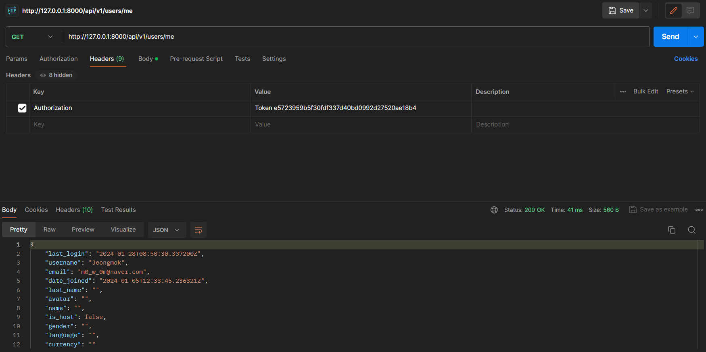

[mokugyo.biz](mokugyo.biz)

1. [SET UP](#set-up)
2. [DJANGO BASICS](#django-basics)
   <br>
   2.1 [Run Server](#run-server)
   <br>
   2.2 [Migrations](#migrations)
   <br>
   2.3 [Super User](#super-user)
   <br>
3. [DANGO APPS](#django-apps)
   <br>
   3.1 [Models](#models)
   <br>
   3.2 [Migrations](#migrations-1)
   <br>
   3.3 [Admin](#admin)
   <br>
   3.4 [Documentation](#documentation)
   <br>
4. [USERS APP](#users-app)
   <br>
   4.1 [Introduction](#introduction)
   <br>
   4.2 [Custom Model](#custom-model)
   <br>
   4.3 [Custom Fields](#custom-fields)
   <br>
   4.4 [Defaults](#defaults)
   <br>
   4.5 [Custom Adin](#custom-admin)
   <br>
   4.6 [Foreign Keys](#foreign-keys)
   <br>
5. [MODELS AND ADMIN](#models-and-admin)
   <br>
   5.1 [User Model](#user-model)
   <br>
   5.2 [Room Model](#room-model)
   <br>
   5.2 [Many to Many](#many-to-many)
   <br>
   5.3 [Rooms Admin](#rooms-admin)
   <br>
   5.4 [Experiences](#experiences)
   <br>
   5.5 [Categories](#categories)
   <br>
   5.6 [Reviews](#reviews)
   <br>
   5.7 [Wishlists](#wishlists)
   <br>
   5.8 [Bookings](#bookings)
   <br>
   5.9 [Direct Messages](#direct-messages)
   <br>
6. [ORM](#orm)
   <br>
   6.1 [Introduction](#introduction-1)
   <br>
   6.2 [filter, get, create, delete](#filter-get-create-delete)
   <br>
   6.3 [QuerySets](#querysets)
   <br>
   6.4 [Admin Methods](#admin-methods)
   <br>
   6.5 [ForeignKey Filter](#foreignkey-filter)
   <br>
   6.6 [Reverse Accessors](#reverse-accessors)
   <br>
   6.7 [related_name](#related_name)
   <br>
7. [POWER ADMIN](#power-admin)
   <br>
   7.1 [Methods](#methods)
   <Br>
   7.2 [Search Fields](#search-fields)
   <br>
   7.3 [Admin Actions](#admin-actions)
   <br>
   7.4 [Custom Filters](#custom-filters)
   <Br>
8. [URLS AND VIEWS](#urls-and-views)
   <br>
   8.1 [Views](#views)
   <br>
   8.2 [Include](#include)
   <br>
   8.3 [URL Arguments](#url-arguments)
   <br>
   8.4 [render](#render)
   <br>
   8.5 [Django Templates](#django-templates)
   <br>
   8.6 [DoesNotExist](#doesnotexist)
   <br>
   8.7 [Django vs React](#django-vs-react)
   <br>
9. [DJANGO REST FRAMEWORK](#django-rest-framework)
   <br>
   9.1 [Introduction](#introduction-2)
   <br>
   9.2 [JsonResponse](#jsonresponse)
   <br>
   9.3 [api_view](#api_view)
   <br>
   9.4 [Serializer](#serializer)
   <br>
   9.5 [POST Requests](#post-requests)
   <br>
   9.6 [is_valid()](#is_valid)
   <br>
   9.7 [save()](#save)
   <br>
   9.8 [update()](#update)
   <br>
   9.9 [DELETE](#delete)
   <br>
   9.10 [APIView](#apiview)
   <br>
   9.11 [ModelSerializer](#modelserializer)
   <br>
   9.12 [ModelViewSet](#modelviewset)
   <br>
10. [REST API](#rest-api)
    <br>
    10.1 [All Amenities](#all-amenities)
    <br>
    10.2 [Amenity Detail](#amenity-detail)
    <br>
    10.3 [Perks and PerkDetail](#perks-and-perkdetail)
    <br>
    10.4 [Rooms](#rooms)
    <br>
    10.5 [Room Detail](#room-detail)
    <br>
    10.6 [Create Room](#create-room)
    <br>
    10.7 [Room Owner](#room-owner)
    <br>
    10.8 [Room Category](#room-category)
    <br>
    10.9 [Room Amenities](#room-amenities)
    <br>
    10.10 [Transactions](#transactions)
    <br>
    10.11 [Delete Rooms](#delete-rooms)
    <br>
    10.12 [SerializerMethodField](#serializermethodfield)
    <br>
    10.13 [Serializer Context](#serializer-context)
    <br>
    10.14 [Reverse Serializers](#reverse-serializers)
    <br>
    10.15 [Pagination](#pagination)
    <br>
    10.16 [File Uploads](#file-uploads)
    <br>
    10.17 [Upload Photo](#upload-photo)
    <br>
    10.18 [permission_classes](#permission_classes)
    <br>
    10.19 [Reviews](#reviews-1)
    <br>
    10.20 [Wishlists](#wishlists-1)
    <br>
    10.21 [Wishlist](#wishlist)
    <br>
    10.22 [is_liked](#is_liked)
    <br>
    10.23 [Bookings](#bookings-2)
    <br>
    10.24 [Create a Booking](#create-a-booking)
    <br>
    10.25 [Validate Booking](#validate-booking)
    <br>
    10.26 [Booking Completed](#booking-completed)
    <br>
11. [USERS API](#users-api)
    <br>
    11.1 [User Profile](#user-profile)
    <br>
    11.2 [Create User](#create-user)
    <br>
    11.3 [Change Password](#change-password)
    <br>
    11.4 [Log In and Log Out](#log-in-and-log-out)
    <br>
12. [CHECKPOINT](#checkpoint)
    <br>
    12.1 [Code Challenge](#code-challenge)
    <br>
13. [GRAPHQL API](#graphql-api)
14. [AUTHENTICATION](#authentication)
    <br>
    14.1 [Introduction](#introduction-3)
    <br>
    14.2 [Custom Authentication](#custom-authentication)
    <br>
    14.3 [Token Authentication](#token-authentication)
    <br>
    14.4 [JWT Econde](#jwt-encode)
    <br>
    14.5 [JWT Decode](#jwt-decode)
    <br>
    14.6 [Environment Files](#environment-files)
    <br>
15. [API TESTING](#api-testing)
    <br>
    15.1 [Introduction](#introduction-4)
    <br>
    15.2 [Our First Test](#our-first-test)
    <br>
    15.3 [Amenities Test](#amenities-test)
    <br>
    15.4 [Create Amenity Test](#create-amenity-test)
    <br>
    15.5 [Amenity Detail Test](#amenity-detail-test)
    <br>
    15.6 [Test Authentication](#test-authentication)
    <br>

<br>

## SET UP

- `python`

  - 터미널에서 `python`을 입력했을 때 `python 2.x`일 경우 python3.x를 다운받는다.
  - clone coding을 진행할 장소를 만든다.

    ```python
    git init    # 새로운 git 저장소를 초기화 시킴
    ```

- `poetry`

  - `python-poetry.org` 사이트에서 자신의 환경에 맞는 명령어를 터미널에 입력한다.
    `(Invoke-WebRequest -Uri https://install.python-poetry.org -UseBasicParsing).Content | py -`
    ([windows 오류 해결방안](https://takeknowledge.tistory.com/145))

  - `poetry init`을 통해 poetry 패키지를 만든다.(라이센스: MIT)

    ```python
    poetry add django   # django 설치
    ```

- start project

  - `poetry shell`을 통해 가상 환경으로 접속해준다.

    ```python
    django-admin startproject config .  # 현재 위치한 폴더에 생성
    ```

  - `gitignore` 익스텐션 설치 후 `python` 프로젝트에 대한 gitignore를 만들어 준다.

---

## DJANGO BASICS

### Run Server

- `poetry shell`로 버블 안에 들어가준 다음

  ```python
  python manage.py runserver  # 서버 실행
  ```

위의 명령어를 작성하면 
18개의 `migration`이 적용되지 않았다고 뜨지만 `http://127.0.0.1:8000`의 주소로 서버를 작동시켰다.(`Ctrl + C: 서버 끄기`)
<br>

- `/admin`으로 접속했을 때 원래는

  ```python
  OperationalError at /admin/
  no such table: django_session
  ...
  ```

  위의 오류가 떠야 정상이지만

  어째서인지 오류가 발생하지 않는다.(당연히 로그인은 안된다.)

<br>

### Migrations

- admin 접속이 안되는 이유는 데이터베이스에 `django_session`이라는 테이블이 없기 때문.
- 현재 `db.sqlite3` 데이터베이스 파일은 비어있음.
  > DB에 `django_session` 이라는 테이블을 생성하는 `migration`을 실행해야 한다.
- migration은 데이터베이스의 state를 수정하는 것이다.

- Django는 18개의 어딘가에 어떤 파일(Migration)들을 가지고 있다. 이는 DB의 state를 변경할 파일들이다. 그 파일을 실행하면 파일이 DB를 변경할 것이다.

- 서버를 끄고`python manage.py migrate` 입력하면 됨.

  

- 다시 `/admin`으로 들어가보면

  

  - `Django administration`이 나온다.
    <br>

    1. 이 페이지를 얻기 위해 어느 코드도 작성하지 않았다.
    2. 자동으로 `validation`을 해준다.

       

<br>

### Super user

- `Django`가 돌아가고 있는 터미널 외에 추가로 터미널을 하나 열어준다.

  > 한 터미널에서는 `Django` 서버를 실행해야 하고, 다른 터미널에서는 명령어를 실행해야 하기 때문

- 다음 명령어를 작성한다.
  <br>
  `python manage.py createsuperuser`
  
  - `Django`는 비밀번호 유효성 검사를 내포하고 있는 것을 알 수 있다.
- 일단 우회하고 `Superuser`를 생성할 수 있다.
  - 로그인 해보면
    
    - `admin` 패널을 볼 수 있다.

---

## DJANGO APPS

### Models

- 첫 번째 어플리케이션을 아래 명령어를 이용해 만들어보자.

  - `python manage.py startapp houses`

    > `houses`는 어플리케이션의 이름

  - `houses`라는 폴더가 생기고 여러 파일들이 생긴다.

    

    - 장고는 프레임워크이기 때문에 이 파일들이 꼭 필요하다.

    - `models.py`

      ```python
      from django.db import models

      # Create your models here.
      ```

      - `model`이 뭔지는 모르겠지만 `models.py`에 `model`을 생성해야 하는 것은 알 수 있다.

    - `admin.py`

      ```python
      from django.contrib import admin

      # Register your models here.
      ```

      - `model`이 뭔지는 모르겠지만 `admin.py`에 `model`을 등록해야 하는 것은 알 수 있다.

- `model`은 어플리케이션에서 데이터의 모양을 묘사하는 것이다.

  - 여기서는 `houses` 어플리케이션이 가지는 `house`가 될 수 있다.

  - `house`는 주소, 사진, 이름, 가격 등의 데이터가 존재할 것이다. 데이터를 설명하고 데이터의 `type`을 정해야 한다.

- 첫 `model`을 생성해보자.

  ```python
  from django.db import models

  class House(model.Model):    # 모델이기 때문에 model을 상속받음

    """ Model Definition for Houses """

    name = models.CharField(max_length=140)
    price = models.PositiveIntegerField()
    description = models.TextField()
    address = models.CharField(max_length=140)
  ```

  > 예를 들어, `name`은 내 데이터베이스에 있는 House는 name을 가지고, 형식은 CharField가 될거다. 최대길이는 140이다. 를 알려주는 것임

- 하지만 이렇게 작성만 해서는 `Django`가 알지 못한다. 이유는 `Houses` 어플리케이션을 설치하지 않았기 때문이다.

  - `config/settings.py`

    ```python
    # Application definition

    INSTALLED_APPS = [
        'django.contrib.admin',
        'django.contrib.auth',
        'django.contrib.contenttypes',
        'django.contrib.sessions',
        'django.contrib.messages',
        'django.contrib.staticfiles',
        'houses.apps.HousesConfig', # 추가해야 함
    ]
    ```

    - 어플리케이션을 작성하면 `Django`에게 직접 알려주어야 한다.
      `houses.apps.HousesConfig` 추가

<br>

### Migrations

- 왜 이런 식으로 `Django`에게 데이터를 설명해야 하는가?

  ```python
  class House(models.Model):

      """ Model Definition for Houses """

      name = models.CharField(max_length=140)
      price = models.PositiveIntegerField()
      description = models.TextField()
      address = models.CharField(max_length=140)
  ```

  - 데이터베이스는 `SQL` 코드로 소통한다. 하지만 이런 식으로 작성해도 `Django`는 데이터가 어떻게 생겼는지 이해할 수 있다. 즉, `python` 코드를 작성하면 `Django`는 `SQL` 코드로 번역할 것이다.
  - `Django`는 데이터의 형식을 알고 있기 때문에, 데이터에 대한 관리 패널을 자동으로 생성할 수 있다.

    - `houses/admin.py`

      ```python
      from django.contrib import admin
      from .models import House # House model import

      @admin.register(House)  # admin 패널에 House라는 model을 등록하겠다.
      class HouseAdmin(admin.ModelAdmin): # HouseAdmin이라는 class는 model을 위한 admin 패널을 만들어주는 ModelAdmin을 전체 상속받는다.
          pass # 별로 수정하지 않거나 아예 수정하지 않을 때 pass 사용
      ```

      > class HouseAdmin은 ModelAdmin(admin 패널)의 모든 것을 상속받는다. 그리고 이 class가 House model을 통제할 것이다.

      

      - `admin` 패널을 얻을 수 있다.

- `Django`에게 데이터가 어떻게 생겼는지 알려주었지만, 데이터베이스는 아직 `House model`에 대해 모르는 상태이다.

  - 데이터베이스의 형태를 수정해야 한다는 말이다.
    <br>
    -> `migration`([migrations](#migrations))

- `migration`을 직접 생성한 후 적용해볼 것이다.

  `python manage.py makemigrations`

  

  - `Django`가 `houses/migrations` 내부 폴더에 파일을 만들었다.

    - `houses/migrations/0001_initial.py`

      ```python
      # Generated by Django 4.2.5 on 2023-12-24 07:28

      from django.db import migrations, models


      class Migration(migrations.Migration):

          initial = True

          dependencies = [
          ]

          operations = [
              migrations.CreateModel(
                  name='House',
                  fields=[
                      ('id', models.BigAutoField(auto_created=True, primary_key=True, serialize=False, verbose_name='ID')),
                      ('name', models.CharField(max_length=140)),
                      ('price', models.PositiveIntegerField()),
                      ('description', models.TextField()),
                      ('address', models.CharField(max_length=140)),
                  ],
              ),
          ]

      ```

      - 이 `migration`을 적용시키면 데이터베이스의 상태가 변경될 것이다.

- `migration` 적용시키기

  - `python manage.py migrate`

    > 데이터베이스의 모양을 업데이트하면(model 안의 어떤 것을 수정하면) `migration`을 생성한 후 `migrate`하면 된다.

    

    

    - 아까 작성했던 `field`가 `form`에 반영되었다.

<br>

### Admin

- `ADD HOUSE`를 통해 집을 하나 생성해보면

  

  > `House object`라는 이름으로 하나 생성된다.

- 어차피 `models.py`는 하나의 `class`로 작성되었으므로, `class`의 `Magic Method`를 작성할 수 있다.

  - `houses/models.py`

    ```python
    from django.db import models

    class House(models.Model):

        """ Model Definition for Houses """

        ...

        def __str__(self):
            return self.name
    ```

    

    > 직접 설정한 이름으로 보여지게 된다.

- `HOUSE`의 `admin` 패널에 기능을 추가할 수 있다.

  - `houses/admin.py`

    ```python
    from django.contrib import admin
    from .models import House


    @admin.register(House)
    class HouseAdmin(admin.ModelAdmin):
        list_display = (  # column 추가
            "name",
            "price_per_night",
            "address",
            "pets_allowed",
        )
        list_filter = (   # filter 추가
            "price_per_night",
            "pets_allowed",
        )
        search_fields = ("address",)  # address search 추가
    ```

    

<br>

### Documentation

- [장고 공식 문서 사이트](https://docs.djangoproject.com/en/5.0/)

---

## USERS APP

### Introduction

- 이미 `User`에는 많은 기능을 제공하지만, 만들 페이지에 따라 기능을 제거하거나 추가할 상황이 생긴다.

  > `Custom Model`을 만들자.

  - 첫 번째 방법

    - `Django`의 `User`를 사용하면서 추가적인 기능은 `Profile`을 만들어 `User`에 추가하는 것

  - 두 번째 방법
    - `User` 모델을 `Custom Model`로 교체하는 방법
      - `User application`을 만들고 `User Model`을 만들면 된다.
        > 공식 문서에서 적극 추천하는 방식

> 인터프리터에서 `poetry`에 있는 인터프리터 적용하기
> `poetry env info --path`

<br>

### Custom Model

- `python manage.py startapp users` 명령어로 `users` 어플리케이션을 만든다.

  - `Django`의 `user`를 상속받고 기능을 추가해보자.

    - `users/models.py`

      ```python
      from django.db import models
      from django.contrib.auth.models import AbstractUser


      class User(AbstractUser):
          pass
      ```

- 다음은 `Django`에게 기본 `user`를 사용하지 않고 `user` 모델을 사용한다고 얘기해야 한다.

  - `config/settings.py`에서

    `AUTH_USER_MODEL = 'myapp.MyUser'`와 같은 형태로 설정하면 된다.

- 하지만 이미 데이터베이스에 `user`가 있는 상황에서 `custom model`을 만드는 것은 오류를 계속 발생시킨다. 따라서 프로젝트를 다시 시작해보자.

- `db.sqlite3` 지우기, `migrations(0001~00003)` 지우기

  - 서버 실행 전 `makemigrations`
    
  - 이후 `migrate` 수행

- 다음은 `user` 모델을 관리자 페이지에 추가해야 한다.

  - 기존 `user` 모델을 그대로 사용하지 않고 `Custom` 모델을 등록하기 때문에 `import` 해와야 한다.

  - `users/admin.py`

    ```python
    from django.contrib import admin
    from django.contrib.auth.admin import UserAdmin
    from .models import User


    @admin.register(User)
    class CustomUserAdmin(UserAdmin):
        pass
    ```

- 데이터베이스를 삭제했기 때문에 `superuser`를 다시 생성하고 로그인 해야 한다.

- `user`에 들어가면 전에 있던 기능은 다 남았지만 다른 점은 `user admin` 패널을 조작할 수 있게 되었다는 점이다.

<br>

### Custom Fields

- `User` 모델을 `Custom` 하기 위해 먼저 `AbstractUser` 소스코드를 살펴보면

  ```python
  class AbstractUser(AbstractBaseUser, PermissionsMixin):
      """
      An abstract base class implementing a fully featured User model with
      admin-compliant permissions.

      Username and password are required. Other fields are optional.
      """

      ...

      username = models.CharField(
        _("username"),
        max_length=150,
        unique=True,
        help_text=_(
            "Required. 150 characters or fewer. Letters, digits and @/./+/-/_ only."
        ),
        validators=[username_validator],
        error_messages={
            "unique": _("A user with that username already exists."),
        },
      )
      first_name = models.CharField(_("first name"), max_length=150, blank=True)
      last_name = models.CharField(_("last name"), max_length=150, blank=True)
      email = models.EmailField(_("email address"), blank=True)

      ...

  ```

  - `username`, `first_name`, `last_name` 등이 있다.
    - 만약 `first_name`과 `last_name`을 원하지 않는다면 소스코드는 건들지 않고 `modles.py`에서 overriding` 해야 한다.
      > `editable`을 `False`로 설정하면 `admin` 패널에 보이지 않는다.

- `AbstractUser`에 `username`과 `email`이 있는데, 어플리케이션에 `username`인 `email`이 없는 경우가 있다.
- 현재 어플리케이션에는 `username`이 없으므로 새로운 `user`를 만들 때 이메일을 받아서 `email`로 지정하고 `username` 또한 받은 이메일로 설정해야 한다.
- 다른 방법은 `AbstarctUser`의 `username`을 `overriding`할 수 있다.

- `users/models.py`

  ```python
  from django.db import models
  from django.contrib.auth.models import AbstractUser


  class User(AbstractUser):
      first_name = models.CharField(
          max_length=150,
          editable=False,
      )
      last_name = models.CharField(
          max_length=150,
          editable=False,
      )
      name = models.CharField(
          max_length=150,
      )
      is_host = models.BooleanField() # 방을 빌려주는 사용자인지 방을 빌리려는 사용자인지
  ```

- `models.py`를 수정한 후 `makemigrations`를 하면 다음과 같은 오류를 볼 수 있다.
  

<br>

### Defaults

- 위와 같은 에러가 발생한 이유는 `non-nullable field`인 `is_host`에 `null`값이 들어가있기 때문이다.

  - 이미 데이터베이스는 `user`를 가지고 있는데 데이터베이스에 `is_host`를 추가하게 된다면 기존 `user`에는 `is_host`가 정의되어 있지 않기 때문에 `null`값이 들어가게 될 것이다.

- 따라서 `is_host` `column`을 추가하는데 기존 `user`를 어떻게 할 것인지 두 가지 옵션을 준다.

  - `default` 값을 추가할 것인가
    - `default=True`, `default=False`
  - `null`값으로 데이터를 처리할 것인가

    - `null=True`

  - 첫 번째 방법으로 `default=False`를 부여해보자.

    - `name`에도 `default=""`를 부여해주자.

  - `migrations`을 정상적으로 만들고 `migrate` 해주면 잘 작동한다.

<br>

### Custom Admin

- `admin.py`에서는 `UserAdmin`을 전체 상속 받고 있는데, `UserAdmin`의 소스코드에서는 `first_name`과 `last_name`을 수정하려고 하고 있다.

  - 하지만, `users`의 `models.py`에서 `first_name`과 `last_name`을 `editable=False`로 설정했기 때문에 수정할 수 없는 상태이다.

- 따라서 `Admin class`를 수정하거나 `overriding`해야 한다.

  - `UserAdmin`
    ```python
    @admin.register(User)
    class UserAdmin(admin.ModelAdmin):
        add_form_template = "admin/auth/user/add_form.html"
        change_user_password_template = None
        fieldsets = (
            (None, {"fields": ("username", "password")}),
            (_("Personal info"), {"fields": ("first_name", "last_name", "email")}),
            (
                _("Permissions"),
                {
                    "fields": (
                        "is_active",
                        "is_staff",
                        "is_superuser",
                        "groups",
                        "user_permissions",
                    ),
                },
            ),
            (_("Important dates"), {"fields": ("last_login", "date_joined")}),
        )
    ```
    - `field set`은 `admin` 패널에서 `model`의 `field`가 보이는 순서를 설정할 수 있게 해준다.
    - 또한, `field`를 일종의 섹션 안에 넣고 제목을 붙일 수 있다.

- `users.admin.py`

  ```python
  from django.contrib import admin
  from django.contrib.auth.admin import UserAdmin
  from .models import User


  @admin.register(User)
  class CustomUserAdmin(UserAdmin):
      fieldsets = (
          (
              "Profile",
              {
                  "fields": ("username", "password", "name", "email", "is_host"),
              },
          ),
      )
  ```

  - 이렇게 `Profile` 섹션 안에 `field`를 넣을 수 있다.

    

- `UserAdmin`에서 `Permissions`과 `Important Dates`를 복사해서 붙여넣자.

  > 사용할 예정이기 때문

  - `users/admin.py`

    ```python
    from django.contrib import admin
    from django.contrib.auth.admin import UserAdmin
    from .models import User


    @admin.register(User)
    class CustomUserAdmin(UserAdmin):
        fieldsets = (
            (
                "Profile",
                {
                    "fields": ("username", "password", "name", "email", "is_host"),
                },
            ),
            (
                "Permissions",
                {
                    "fields": (
                        "is_active",
                        "is_staff",
                        "is_superuser",
                        "groups",
                        "user_permissions",
                    ),
                },
            ),
            (
                "Important Dates",
                {
                    "fields": ("last_login", "date_joined"),
                },
            ),
        )
    ```

    - `"classes": ("collapse",),`를 추가하면 숨기기 기능을 추가할 수 있다.

- `admin` 패널에서 보이는 `column`을 조정해보자.
  ```python
  list_display = (
    "username",
    "email",
    "name",
    "is_host",
  )
  ```

<br>

### Foreign Keys

- `house`와 `user`를 `Foreign Key`를 통해 연결해보자.

  - `houses/models.py`

    ```python
    class House(models.Model):

        ...

        pets_allowed = models.BooleanField(
            verbose_name="Pets Allowed?",
            default=True,
            help_text="Does this house allow pets?",
        )

        owner = models.ForeignKey("users.User", on_delete=models.CASCADE)

        def __str__(self):
            return self.name
    ```

    > `Django`에게 `house`가 `user`의 `ForeignKey`를 가지고 있다고 한 것

- `owner = models.ForeignKey("users.User", on_delete=models.CASCADE)` 코드를 추가한 다음 `migrations`를 지우고 다시 `migration`을 만든 다음 `migrate` 해주면

  

  - `house`를 생성할 때 `user`를 정할 수 있다.

- 다음 섹션으로 가기 전에 데이터베이스를 지우고 `houses` 어플리케이션도 지우고 `settings.py`에서 `houses` 어플리케이션을 지우자. `users`에 있는 `migrations` 파일도 지우자.

> `VS Code`에서 `SQLite Viewer Extension`을 설치하면 데이터베이스를 시각화하여 보여준다.

---

## MODELS AND ADMIN

### User Model

- `user` 모델을 확장해보자.

  - `user`가 프로필을 가지도록 해보자.

    - `users/models.py`

      ```python
      class User(AbstractUser):
          first_name = models.CharField(
            max_length=150,
            editable=False,
          )
          last_name = models.CharField(
            max_length=150,
            editable=False,
          )
          avatar = models.ImageField()

          ...
      ```

      - `ImageField`를 사용하기 위해서는 `Pillow`를 설치해주어야 한다.
        > `poetry` 안에 있으므로 `poetry add Pillow`와 같은 형식으로 적어야 함

- `admin` 패널에서 옵션을 선택할 수 있는 기능을 만들어보자.

  - `User` 클래스 안에 다른 클래스를 만들고 필드의 옵션에 `choices=` 옵션을 추가해주면 된다.

    ```python
    class User(AbstractUser):
        class GenderChoices(models.TextChoices):
            MALE = ("male", "Male")
            FEMALE = ("female", "Female")

        class LanguageChoices(models.TextChoices):
            KR = ("kr", "Korean")
            EN = ("en", "English")

        class CurrencyChoices(models.TextChoices):
            WON = ("won", "Korean Won")
            USD = ("usd", "Dollar")

        ...

        avatar = models.ImageField(blank=True)  # 이미지 선택 안해도 됨
        gender = models.CharField(
            max_length=10,
            choices=GenderChoices.choices,
        )
        language = models.CharField(
            max_length=2,
            choices=LanguageChoices.choices,
        )
        currency = models.CharField(
            max_length=5,
            choices=CurrencyChoices.choices,
        )
    ```

    > `MALE = ("male", "Male")`에서 `"male"`은 데이터베이스에 들어가고 `"Male"`은 `admin` 패널에서 볼 `label`이다.

- 프로필 이미지 넣기, 성별 선택, 언어 선택, 화폐 선택을 할 수 있는 `field`가 생겼다.

  

<br>

### Room Model

`python manage.py startapp rooms` 코드를 통해 `room` 어플리케이션을 만들고 `config/settings.py`에 추가해주자.

- `room` 모델을 만들고 필드를 만들어보자.

  - `rooms/models.py`

    ```python
    from django.db import models


    class Room(models.Model):

        """Room Model Definition"""

        class RoomKindChoices(models.TextChoices):
            ENTIRE_PLACE = ("entire_place", "Entire Place")
            PRIVATE_ROOM = ("private_room", "Private Room")
            SHARED_ROOM = ("shared_room", "Shared Room")

        country = models.CharField(
            max_length=50,
            default="한국",
        )
        city = models.CharField(
            max_length=80,
            default="서울",
        )
        price = models.PositiveIntegerField()
        rooms = models.PositiveIntegerField()
        toilets = models.PositiveIntegerField()
        description = models.TextField()
        address = models.CharField(
            max_length=250,
        )
        pet_friendly = models.BooleanField(
            default=True,
        )
        kind = models.CharField(
            max_length=20,
            choices=RoomKindChoices.choices,
        )
        owner = models.ForeignKey(
            "users.User",
            on_delete=models.CASCADE,
        )


    class Amenity(models.Model):

        """Amenity Definition"""

        name = models.CharField(
            max_length=150,
        )
        description = models.CharField(
            max_length=150,
            null=True,
        )

    ```

<br>

### Many to Many

- `many to many`의 관계를 알아보자.

  - 그 전에 `many to one`, `one to many`의 의미를 알아야 한다.
  - 각 `room`에는 `owner`가 있다.

    - 여러 `room`이 한 `owner`의 것일 수 있다.(`many to one`)

      > `[Room1, Room2, Room3] => owner1`

    - 한 `onwer`가 여러 `room`을 가질 수 있다.(`one to many`)

      > `owner1 => [Room1, Room2, Room3]`

- 그렇다면 `many to many` 관계는 무엇일까.

  - 예를 들어 `rooms/models.py`의 `Amenity`가 여러 개 있다고 해보자.
  - 즉 여러 `room`이 여러 `amenity`를 가질 수 있다는 것이다.

    > `[Amenity1, Amenity2, Amenity3] => [Room1, Room2, Room3]`

- `rooms/models.py`

  ```python
  from django.db import models
  from common.models import CommonModel

  class Room(CommonModel):

      """Room Model Definition"""

      ...

      owner = models.ForeignKey(
          "users.User",
          on_delete=models.CASCADE,
      )
      amenities = models.ManyToManyField(
          "rooms.Amenity",
      )


  class Amenity(CommonModel):

      """Amenity Definition"""

      name = models.CharField(
          max_length=150,
      )
      description = models.CharField(
          max_length=150,
          null=True,
      )
  ```

  - `amenities = models.ManyToManyField()`를 추가해 `many to many` 관계를 추가해주었다. 그리고 `room`과 `amenity`에 만든 날짜, 업데이트 날짜 필드를 넣었다.

    - 매번 같은 코드를 복붙하지 않고 `common` 어플리케이션을 만들어 모델을 만들 때 상속받게 하였다.

  - `common/models.py`

    ```python
    from django.db import models


    class CommonModel(models.Model):

        """Common Model Definition"""

        created_at = models.DateTimeField(
            auto_now_add=True,
        )
        updated_at = models.DateTimeField(
            auto_now=True,
        )

        class Meta:
            abstract = True

    ```

    - `class Meta`에서 `abstarct=True`로 설정하면 `CommonModel` 모델을 데이터베이스에 넣지 않는다.

- `rooms/admin.py` 에서 `room`과 `amenity`를 보여줄 `admin` 패널을 간단히 만들면

  ```python
  from django.contrib import admin
  from .models import Room, Amenity


  @admin.register(Room)
  class RoomAdmin(admin.ModelAdmin):
      pass


  @admin.register(Amenity)
  class AmenityAdmin(admin.ModelAdmin):
      pass
  ```

  - 방을 만들 때 `ameinty`를 추가할 수 있게 된다.

    

<br>

### Rooms Admin

- `rooms/models.py`와 `rooms/admin.py`에 코드를 추가해보자.

  - `rooms/models.py`

    ```python
    from django.db import models
    from common.models import CommonModel


    class Room(CommonModel):

        """Room Model Definition"""

        ...

        name = models.CharField(
            max_length=180,
            default=" ",
        )

        ...

        amenities = models.ManyToManyField(
            "rooms.Amenity",
        )

        def __str__(self) -> str:
            return self.name


    class Amenity(CommonModel):

        """Amenity Definition"""

        name = models.CharField(
            max_length=150,
        )
        description = models.CharField(
            max_length=150,
            null=True,
            blank=True,
        )

        def __str__(self) -> str:
            return self.name

        class Meta:
            verbose_name_plural = "Amenities"


    ```

    - `__str__` 매직 메서드를 활용해 이름 지은 그대로 화면에 보이도록 하고
    - `class Meta`에 `verbose_name_plural="Amenities"`를 추가함으로써 제대로 된 복수형으로 나타낸다.

  - `rooms/admin.py`

    ```python
    from django.contrib import admin
    from .models import Room, Amenity


    @admin.register(Room)
    class RoomAdmin(admin.ModelAdmin):
        list_display = (
            "name",
            "price",
            "kind",
            "owner",
            "created_at",
            "updated_at",
        )
        list_filter = (
            "country",
            "city",
            "pet_friendly",
            "kind",
            "amenities",
            "created_at",
            "updated_at",
        )


    @admin.register(Amenity)
    class AmenityAdmin(admin.ModelAdmin):
        list_display = (
            "name",
            "description",
            "created_at",
            "updated_at",
        )
        readonly_fields = (
            "created_at",
            "updated_at",
        )

    ```

### Experiences

- `experiences` 어플리케이션과 `experience` 모델을 만들어보자.

  - `python manage.py startapp experiences`

  - `config/settings.py`에 설치

- `experiences/models.py`와 `experiences/admin.py`에 코드를 추가해보자.

  - `experiences/models.py`

    ```python
    from django.db import models
    from common.models import CommonModel


    class Experience(CommonModel):

        """Experience Model Description"""

        country = models.CharField(
            max_length=50,
            default="한국",
        )
        city = models.CharField(
            max_length=80,
            default="서울",
        )
        name = models.CharField(
            max_length=250,
        )
        host = models.ForeignKey(
            "users.User",
            on_delete=models.CASCADE,
        )
        price = models.PositiveIntegerField()
        address = models.CharField(
            max_length=250,
        )
        start = models.TimeField()
        end = models.TimeField()
        description = models.TextField()
        perks = models.ManyToManyField(
            "experiences.Perk",
        )

        def __str__(self):
            return self.name


    class Perk(CommonModel):

        """What is included on an Experience"""

        name = models.CharField(
            max_length=100,
        )
        detail = models.CharField(
            max_length=250,
            blank=True,
            default="",
        )
        explanation = models.TextField(
            blank=True,
            default="",
        )

        def __str__(self):
            return self.name

    ```

  - `experiences/admin.py`

    ```python
    from django.contrib import admin
    from .models import Experience, Perk


    @admin.register(Experience)
    class ExperienceAdmin(admin.ModelAdmin):
        list_display = (
            "name",
            "price",
            "price",
            "start",
            "end",
        )


    @admin.register(Perk)
    class PerkAdmin(admin.ModelAdmin):
        list_display = (
            "name",
            "detail",
            "explanation",
        )

    ```

<br>

### Categories

- `experiences`와 `houses`를 위한 카테고리를 만들어보자.

  - `experiences` 모델에 `category` 모델을 만들고, `rooms` 모델에 `category` 모델을 각각 만드는 방법이 있다.
  - 하지만 이 방법은 복붙이 많기 때문에 `category`만 포함할 어플리케이션을 하나 만드는 방법을 써보자.

- `python manage.py startapp categories`

  - `config/settings.py`에 설치

- `category` 모델 만들기

  - `categories/models.py`

    ```python
    from django.db import models
    from common.models import CommonModel


    class Category(CommonModel):

        """Room or Experience Category"""

        class CategoryKindChoices(models.TextChoices):
            ROOMS = ("rooms", "Rooms")
            EXPERIENCES = ("experiences", "Experiences")

        name = models.CharField(
            max_length=50,
        )
        kind = models.CharField(
            max_length=15,
            choices=CategoryKindChoices.choices,
        )

        def __str__(self):
            return f"{self.kind.title()}: {self.name}"

        class Meta:
            verbose_name_plural = "Categories"

    ```

    - 카테고리 종류를 `kind`로 선택할 수 있게 해준다.

- 이 `category` 모델을 다른 모델들(`experience`, `rooms` 모델)에게 사용해보자.

  - `experiences/models.py`

    ```python

    ...

    perks = models.ManyToManyField(
        "experiences.Perk",
    )
    category = models.ForeignKey(
        "categories.Category",
        blank=True,
        null=True,
        on_delete=models.SET_NULL,
    )

    ...

    def __str__(self):
      return self.name
    ```

    - `on_delete=models.CASCADE`로 설정하면 `experience`의 `category`가 삭제되면 `experience`도 삭제된다는 의미이다. 이는 부적절하기 때문에 `on_delete=models.SET_NULL`로 설정한다.(`experience`의 `category`가 삭제되면 `category`만 삭제됨)

- `rooms`에도 똑같이 해주자.

  - 이후 `migrations`를 만들고 `migrate` 해준다.
    - `python manage.py makemigrations`
      - `python manage.py migrate`

- `category`의 `admin` 패널에서 `category`를 등록하고 확인해보자.

  - `categories/admin.py`

    ```python
    from django.contrib import admin
    from .models import Category


    @admin.register(Category)
    class CategoryAdmin(admin.ModelAdmin):
        list_display = (
            "name",
            "kind",
        )
        list_filter = ("kind",)
    ```

- `experiences`를 `category`별로 정렬할 수 있다.

- `experiences/admin.py`
  ```python
  @admin.register(Experience)
  class ExperienceAdmin(admin.ModelAdmin):
      list_display = (
          "name",
          "price",
          "price",
          "start",
          "end",
      )
      list_filter = ("category",)
  ```
  - `foreign key` 설정을 했기 때문에 가능하다.

<br>

### Reviews

- `review` 어플리케이션과 모델을 만들어보자.

  - `python manage.py startapp reviews`

  - `config/settings.py`에 설치

- `reviews/models.py`

  ```python
  from django.db import models
  from common.models import CommonModel


  class Review(CommonModel):

      """Review from a User to a Room or Experience"""

      user = models.ForeignKey(
          "users.User",
          on_delete=models.CASCADE,
      )
      room = models.ForeignKey(
          "rooms.Room",
          null=True,
          blank=True,
          on_delete=models.CASCADE,
      )
      experience = models.ForeignKey(
          "experiences.Experience",
          null=True,
          blank=True,
          on_delete=models.CASCADE,
      )
      payload = models.TextField()
      rating = models.PositiveIntegerField()

      def __str__(self):
          return f"{self.user} / {self.rating*'⭐'}"

  ```

  - `room`에 대한 리뷰이면 `experience`는 공백이고 ,`experience`에 대한 리뷰이면 `room`은 공백이기 때문에 `null=True`, `blank=True`를 해줘야 함

- `reviews/admin.py`

  ```python
  from django.contrib import admin
  from .models import Review


  @admin.register(Review)
  class ReviewAdmin(admin.ModelAdmin):
      list_display = (
          "__str__",
          "payload",
      )
      list_filter = ("rating",)

  ```

<br>

### Wishlists

- `wishlist` 어플리케이션과 모델을 만들어보자.

  - `python manage.py startapp wishlists`

  - `config/settings.py`에 설치

- `wishlists/models.py`

  ```python
  from django.db import models
  from common.models import CommonModel


  class Wishlist(CommonModel):
      """Wishlist Model Definition"""

      name = models.CharField(
          max_length=150,
      )
      rooms = models.ManyToManyField(
          "rooms.Room",
      )
      experiences = models.ManyToManyField(
        "experiences.Experience",
      )
      user = models.ForeignKey(
          "users.User",
          on_delete=models.CASCADE,
      )

      def __str__(self):
          return self.name

  ```

  - `[room1, room2, room3] -> [wishlist1, wishlist2, wishlist2, wishlist3]:`
    - `many-to-many`
  - `[experience1, experience2, experience3] -> [wishlist1, wishlist2, wishlist3]`
    - `many-to-many`
  - `[user1] -> [wishlist1, wishlist2, wishlist3]`
    - `one-to-many, many-to-one`

- `wishlists/admin.py`

  ```python
  from django.contrib import admin
  from .models import Wishlist


  @admin.register(Wishlist)
  class WishlistAdmin(admin.ModelAdmin):
      list_display = (
          "name",
          "user",
          "created_at",
          "updated_at",
      )

  ```

<br>

### Bookings

- `bookings` 어플리케이션과 모델을 만들어보자.

  - `python manage.py startapp bookings`

  - `config/settings.py`에 설치

- `bookings/models.py`

  ```python
  from django.db import models
  from common.models import CommonModel


  class Booking(CommonModel):

      """Booking Model Definition"""

      class BookingKindChoices(models.TextChoices):
          ROOM = ("room", "Room")
          EXPERIENCE = ("experience", "Experience")

      kind = models.CharField(
          max_length=15,
          choices=BookingKindChoices.choices,
      )
      user = models.ForeignKey(
          "users.User",
          on_delete=models.CASCADE,
      )
      room = models.ForeignKey(
          "rooms.Room",
          null=True,
          blank=True,
          on_delete=models.SET_NULL,
      )
      experience = models.ForeignKey(
          "experiences.Experience",
          null=True,
          blank=True,
          on_delete=models.SET_NULL,
      )
      check_in = models.DateField(
          null=True,
          blank=True,
      )
      check_out = models.DateField(
          null=True,
          blank=True,
      )
      experience_time = models.DateTimeField(
          null=True,
          blank=True,
      )
      guests = models.PositiveIntegerField()

      def __str__(self):
          return f"{self.kind.title()} booking for: {self.user}"

  ```

- `bookings/admin.py`

  ```python
  from django.contrib import admin
  from .models import Booking


  @admin.register(Booking)
  class Booking(admin.ModelAdmin):
      list_display = (
          "kind",
          "user",
          "room",
          "experience",
          "check_in",
          "check_out",
          "experience_time",
          "guests",
      )
      list_filter = ("kind",)

  ```

  <br>

### Bookings

- `medias`의 어플리케이션과 그 안에 `Photo`와 `Video` 모델을 만들어보자.

  - `python manage.py startapp medias`

  - `config/settings.py`에 설치

- `medias/models.py`

  ```python
  from django.db import models
  from common.models import CommonModel


  class Photo(CommonModel):
      file = models.ImageField()
      description = models.CharField(
          max_length=140,
      )
      room = models.ForeignKey(
          "rooms.Room",
          null=True,
          blank=True,
          on_delete=models.CASCADE,
      )
      experience = models.ForeignKey(
          "experiences.Experience",
          null=True,
          blank=True,
          on_delete=models.CASCADE,
      )

      def __str__(self):
          return "Photo File"


  class Video(CommonModel):
      file = models.FileField()
      experience = models.OneToOneField(
          "experiences.Experience",
          on_delete=models.CASCADE,
      )

      def __str__(self):
          return "Video File"

  ```

  - `Photo`와 `Video` 두 개의 모델을 만들어준다.

  - `Video`의 `experience`에서 `OneToOneField`는 `ForeignKey`와 같지만 고유한 관계를 생성한다. 즉, 한 `Video`가 그 `experience`에 종속된다는 뜻이다. 그리고 똑같은 `experience`에 두 번째 `Video`는 만들 수 없다.

<br>

### Direct Messages

- `direct_messages` 어플리케이션과 그 안에 `ChattingRoom`과 `Message` 모델을 만들어보자.

  - `python manage.py startapp direct_messages`

  - `config/settings.py`에 설치

- `direct_messages/models.py`

  ```python
  from django.db import models
  from common.models import CommonModel


  class ChattingRoom(CommonModel):
      """Room Model Definition"""

      users = models.ManyToManyField(
          "users.User",
      )

      def __str__(self):
          return "Chatting Room"


  class Message(CommonModel):
      """Message Model Definition"""

      text = models.TextField()
      user = models.ForeignKey(
          "users.User",
          null=True,
          blank=True,
          on_delete=models.SET_NULL,
      )
      room = models.ForeignKey(
          "direct_messages.ChattingRoom",
          on_delete=models.CASCADE,
      )

      def __str__(self):
          return f"{self.user} says: {self.text}"

  ```

- `direct_messages/admin.py`

  ```python
  from django.contrib import admin
  from .models import ChattingRoom, Message


  @admin.register(ChattingRoom)
  class ChattingRoomAdmin(admin.ModelAdmin):
      list_display = (
          "__str__",
          "created_at",
          "updated_at",
      )
      list_filter = ("created_at",)


  @admin.register(Message)
  class MessageADmin(admin.ModelAdmin):
      list_display = (
          "text",
          "user",
          "room",
          "created_at",
      )

      list_filter = ("created_at",)

  ```

---

## ORM

<details>
<summary>Making queries</summary>
<div markdown="1">
데이터 모델을 생성하면, Django는 자동으로 데이터베이스-추상화 API를 제공한다. 이 API는 객체를 생성하고, 찾아오고, 갱신하고, 삭제할 수 있게 한다.

</div>
</details>

### Introduction

- `ORM(Object Related Mapping) 객체 관계 매핑`이란,

  - 객체와 관계형 데이터베이스의 데이터를 자동으로 매핑해주는 것이다.

- 먼저, `Django`의 `shell`을 시작해주어야 한다.

  - 터미널에서 `poetry shell` 이후
  - `python manage.py shell` 명령어를 실행해준다.
    - 이 터미널에는 `Django`가 구성될 것이다. 이때 `config` 폴더의 `settings.py`가 같이 쓰여 작성했던 모든 어플리케이션들이 설치된다.

- 데이터베이스에 있는 모든 `room`을 찾으려면 어떻게 해야할까?

  ```
  >>> from rooms.models import Room
  ```

  - `Room` 모델에 `objects`라는 `property`는 작성하지 않았다. 하지만, 모델을 생성할 때 `Django`가 `Room` 클래스에 `object` `property`를 주었고 이를 사용할 수 있다.
    - 이 `obejcts`에 있는 메서드들을 사용해 데이터베이스가 `Room` 모델에 있는 데이터를 꺼내올 수 있다.

- `all()`

  - `all()` 메서드는 `Room` 모델의 데이터베이스에 가서 모든 `rooms`를 가져올 것이다.

    ```
    >>> Room.objects.all()
    <QuerySet [<Room: Beautiful Tent>, <Room: My House>]>
    ```

- `get()`

  - `get()` 메서드는 `Room` 모델에 있는 모든 속성을 찾아올 수 있다.

    ```
    >>> Room.objects.get(name="Beautiful Tent")
    <Room: Beautiful Tent>
    ```

- 이 결과를 `python` 변수로 저장해 데이터 변환을 할 수 있다.

  ```
  >>> room = Room.objects.get(name="Beautiful Tent")
  >>> room.pk
  2
  >>> room.id
  2
  >>> room.name
  'Beautiful Tent'
  >>> room.owner
  <User: Jeongmok>
  >>> room.owner.email
  'm0_w_0m@naver.com'
  ```

  - 데이터베이스와 소통하는 것을 볼 수 있다.

- 이 데이터를 갱신해보자.
  ```
  >>> room.price
  20
  >>> room.price = 10
  >>> room.save()
  >>> room.price
  10
  ```
  - `room.save`도 `Django`가 제공한 메서드이다.

<br>

### filter, get, create, delete

- `get()`은 하나의 값을 찾을 때 사용한다.

  - 만약, 두 개 이상의 값을 반환시킨다면,
    ```
    Traceback (most recent call last):
      File "<console>", line 1, in <module>
      File "C:\Users\82102\AppData\Local\pypoetry\Cache\virtualenvs\backend-hFL9qklk-py3.11\Lib\site-packages\django\db\models\manager.py", line 87, in manager_method
        return getattr(self.get_queryset(), name)(*args, **kwargs)                         ^^^^^^^^^^^^^^^^^^^^^^^^^^^^^^^^^^^^^^^^^^^^^^^^^^^
      File "C:\Users\82102\AppData\Local\pypoetry\Cache\virtualenvs\backend-hFL9qklk-py3.11\Lib\site-packages\django\db\models\query.py", line 640, in get
        raise self.model.MultipleObjectsReturned(
    rooms.models.Room.MultipleObjectsReturned: get() returned more than one Room -- it returned 2!
    ```
    - 위와 같은 오류가 발생한다.
  - 또한, `get()`을 썼을 때 반환값이 없다면 에러가 발생한다.
    ```
    >>> Room.objects.get(pk=5)
    Traceback (most recent call last):
      File "<console>", line 1, in <module>
      File "C:\Users\82102\AppData\Local\pypoetry\Cache\virtualenvs\backend-hFL9qklk-py3.11\Lib\site-packages\django\db\models\manager.py", line 87, in manager_method
        return getattr(self.get_queryset(), name)(*args, **kwargs)
              ^^^^^^^^^^^^^^^^^^^^^^^^^^^^^^^^^^^^^^^^^^^^^^^^^^^
      File "C:\Users\82102\AppData\Local\pypoetry\Cache\virtualenvs\backend-hFL9qklk-py3.11\Lib\site-packages\django\db\models\query.py", line 637, in get
        raise self.model.DoesNotExist(
    rooms.models.Room.DoesNotExist: Room matching query does not exist.
    ```

- `filter()`는 여러 개의 값을 찾을 때 사용한다.

  ```
  >>> Room.objects.filter(pet_friendly=True)
  <QuerySet [<Room: Beautiful Tent>, <Room: My House>]>
  >>> Room.objects.filter(pet_friendly=False)
  <QuerySet []>
  ```

  - 당연히, `filter()` 안에는 이미 있는 `property`만 넣을 수 있다.

  - `filter()`를 다양하게 사용할 수 있다.
    - 1박에 `price`가 15달러 이상인 방을 찾고 싶다고 하자.
      ```
      >>> Room.objects.filter(price__gt=15)
      <QuerySet [<Room: Beautiful Tent>]>
      ```
    - "House"라는 단어가 들어간 집을 찾는다고 하자.
      ```
      >>> Room.objects.filter(name__contains="House")
      <QuerySet [<Room: My House>]>
      ```
    - "Beautiful"로 시작하는 집을 찾는다고 하자.
      ```
      >>> Room.objects.filter(name__startswith="Beautiful")
      <QuerySet [<Room: Beautiful Tent>]>
      ```

- `create()`는 데이터를 생성한다.

  - `rooms`의 `amenitiy`를 만들어보자.
    ```
    >>> from rooms.models import Amenity
    >>> Amenity.objects.all()
    <QuerySet [<Amenity: Shower>, <Amenity: Bathroom>]>
    ```
  - `Amenity.objects.create()` 라고 하면 빈 `Amenity`가 생성된다.

    - 어떻게 여기에 데이터를 넣을 수 있을까?

      - `create()` 안에 `Amenity model`에 존재하는 `property`를 추가하는 것이다.
        ```
        >>> Amenity.objects.create(name="Amenity from the console", description="How cool is this!")
        <Amenity: Amenity from the console>
        ```

- `delete()`를 활용해 방금 만든 `amenity`를 삭제해보자.
  ```
  >>> to_delete = Amenity.objects.get(pk=3)
  >>> to_delete
  <Amenity: Amenity from the console>
  >>> to_delete.delete()
  (1, {'rooms.Amenity': 1})
  ```
  - 삭제할 `amenity`를 변수로 저장한 후 `delete()` 메서드를 사용해주면 된다.

<br>

### QuerySets

- `all()`, `filter()`를 호출할 때마다 `QuerySet`을 받았는데 `QuerySet`이 무엇일까

  ```
  >>> Room.objects.filter(pet_friendly=True)
  <QuerySet [<Room: Beautiful Tent>, <Room: My House>]>
  ```

- `filter()` 결과를 `QuerySet`으로 받지 않고 배열로만 받았다면 다른 메서드를 사용할 수 없다.

  ```
  >>> Room.objects.filter(pet_friendly=True).exclude(price__gt=15).filter(name__contains="House")
  <QuerySet [<Room: My House>]>
  ```

  ```
  >>> Room.objects.filter(pet_friendly=True, price__lt=15, name__contains="House")
  <QuerySet [<Room: My House>]>
  ```

  - 이런식으로 `QuerySet`은 여러 메서드를 연결시켜 사용할 수 있다.
    > 둘 중에 편한 방법으로 사용하면 된다.

- `QuerySet`의 다른 특징은 `QuerySet`은 게으르기 때문에 구체적인 내용을 요청할 때 데이터를 준다는 것이다.

  - 아직 `room`에 대한 데이터는 모른다.

    ```
    >>> Room.objects.all()
    <QuerySet [<Room: Beautiful Tent>, <Room: My House>]>
    ```

  - 이런 식으로 요청하면 그제서야 데이터를 준다.

    ```
    >>> for room in Room.objects.all():
    ...     print(room.name)
    ...
    Beautiful Tent
    My House
    ```

<br>

### Admin Methods

- 데이터베이스를 다룰 수 있게 되었으니 `admin` 패널에 더 괜찮은 내용을 적어보자.

  - `room`에 얼마나 많은 `amenity`가 존재하는지 `admin` 패널에 표시해보자.

  - `rooms/admin.py`의 `list_display`에 `total_amenities`를 추가하면 에러가 뜬다.

    ```python
    @admin.register(Room)
    class RoomAdmin(admin.ModelAdmin):
        list_display = (
            "name",
            "price",
            "kind",
            "total_amenities",  # 추가
            "owner",
            "created_at",
        )
    ```

    ```
    ERRORS:
    <class 'rooms.admin.RoomAdmin'>: (admin.E108) The value of 'list_display[3]' refers to 'total_amenities', which is not a callable, an attribute of 'RoomAdmin', or an attribute or method on 'rooms.Room'.
    ```

    - 이는 `Django`가 모델 뿐만 아니라 `admin` 내부의 메서드, 모델 자체의 내부까지 확인하고 있다는 것을 알 수 있다.

- `rooms` 모델 안에 새로운 메서드를 만들어보자.

  ```python
  class Room(CommonModel):

      """Room Model Definition"""

      ...

      def __str__(self) -> str:
          return self.name

      def total_amenities(self):
          return self.amenities.count()
  ```

  

  - 잘 나오는 것을 볼 수 있다.

- 메서드를 추가하는 방법에는 두 가지가 있다.

  - 첫 번째는 위처럼 메서드를 모델에 추가하는 방법이 있다.
    - 이렇게 하면 `shell`에서도 위 메서드를 사용할 수 있다.
      ```
      >>> from rooms.models import Room
      >>> Room.objects.get(pk=2).total_amenities()
      Beautiful Tent
      'hello'
      ```
  - 두 번째는 메서드를 `admin` 패널에 직접 넣는 것이다.

    ```py
    @admin.register(Room)
    class RoomAdmin(admin.ModelAdmin):
        list_display = (
            "name",
            "price",
            "kind",
            "total_amenities",
            "owner",
            "created_at",
        )
        list_filter = (
            "country",
            "city",
            "pet_friendly",
            "kind",
            "amenities",
            "created_at",
            "updated_at",
        )

        def total_amenities(self, room):
            return room.amenities.count()
    ```

<br>

### ForeignKey Filter

- `shell`에서 `foreign key`와 `__`를 같이 사용하면 `foreign key`로부터 어떤 필드에도 접근할 수 있다.

  ```
  >>> from rooms.models import Room
  >>> room = Room.objects.get(pk=2)
  >>> room
  <Room: Beautiful Tent>
  >>> room.owner
  <User: Jeongmok>
  ```

  - `room`의 `owner`에 접근할 수 있다. 이때 `Room` 모델의 `owner`는 `User` 모델의 `user`와 `foreign key`로 설정해놓았기 때문에, `filter()`안에 작성할 수 있다.

    ```
    >>> Room.objects.filter(owner__username="Jeongmok")
    <QuerySet [<Room: Beautiful Tent>, <Room: My House>]>
    ```

<br>

### Reverse Accessors

- `filter()`를 이용해 특정 `user`가 만든 `room`들에 대해 접근할 수 있었다. 하지만 이는 필터링을 반복적으로 해야 하기 때문에 별로였다.

  - 이미 `user` 모델에 필터링 기능이 설계되어 있는데, 이를 알아보자.

- `Room` 모델에서 `room` 클래스를 `import` 했듯이 `User` 모델에서 `user` 클래스를 `import` 해올 수 있다.

  ```
  >>> from users.models import User
  >>> me = User.objects.get(pk=1)
  >>> me
  <User: Jeongmok>
  ```

  - `dir(me)`를 호출하면 `user`가 가진 모든 메서드와 속성을 보여준다.
    - 여기에서 중요한 것은 **\_set**이다.
      ```
      >>> me.room_set.all()
      <QuerySet [<Room: Beautiful Tent>, <Room: My House>]>
      ```
      - `me.room_set.all()`을 호출하면 `user`가 가지고 있는 `room`들을 출력한다.

- 모델을 생성할 때 `user`와 `foreign key` 설정을 하면 그 모델은 매번 `_set()` `property`를 받을 것이다.

  - 예를 들어, `bookings/models.py` 에서

    ```python
    class Booking(CommonModel):

        ...

        user = models.ForeignKey(
            "users.User",
            on_delete=models.CASCADE,
        )
    )
    ```

    - 이 `booking` 모델은 `user`와 `foreign key` 설정을 했기 때문에 특정 유저가 가지고 있는 `booking`에 대해 접근할 수 있다.
      ```
      >>> me.booking_set.all()
      <QuerySet [<Booking: Room booking for: Jeongmok>, <Booking: Experience booking for: Jeongmok>]>
      ```

<br>

### related_name

- `reverse accessors(역접근자)`의 이름을 커스텀해보자.

  - 모델 A가 모델 B에 `foreign key`를 가지고 있을 때, 자동적으로 모델 B는 `'모델A_set'`을 받게 된다.
  - 여기서 `user.room_set.all()` 말고 `user.rooms.all()` 과 같이 이름을 커스텀할 수 있다.

- `rooms/models.py`

  ```python
  class Room(CommonModel):

      """Room Model Definition"""

      ...

      owner = models.ForeignKey(
          "users.User",
          on_delete=models.CASCADE,
          related_name="rooms",
      )
  ```

  - `related_name=""`을 추가해주면 `user`는 더이상 `room_set`을 가지지 않게 된다. 대신 `rooms`로 가진다.

- `amenities`의 `ManyToManyField`에도 똑같이 적용할 수 있다.

  - 어떤 `amenity`가 자신에게 해당되는 `room`이 어떤 것인지 알고 싶다면 `related_name="rooms"`를 추가해주면 된다.

    ```python
    class Room(CommonModel):

        """Room Model Definition"""

        ...

        owner = models.ForeignKey(
            "users.User",
            on_delete=models.CASCADE,
            related_name="rooms",
        )
        amenities = models.ManyToManyField(
            "rooms.Amenity",
            related_name="rooms",
        )
    ```

    - `makemigrations` 해주고 `migrate` 해주자.

- `rooms`만 사용해도 결과가 출력된다.

  ```
  >>> from users.models import User
  >>> me = User.objects.get(pk=1)
  >>> me.rooms.all()
  <QuerySet [<Room: My House>]>
  ```

- 다른 모델에도 똑같이 적용해주자.

---

## POWER ADMIN

### Methods

- `review`에 대한 평점을 `admin` 패널에 표시해보자.

  - `room/admin.py`에서 `rating`이라는 속성을 추가하자.
    ```python
    @admin.register(Room)
    class RoomAdmin(admin.ModelAdmin):
        list_display = (
            "name",
            "price",
            "kind",
            "total_amenities",
            "rating",
            "owner",
            "created_at",
        )
    ```
  - `room`의 `model`에 `rating`을 정의해주자.

    - `room/models.py`

      ```python
      class Room(CommonModel):

          """Room Model Definition"""

          ...

          def rating(room):
              count = room.reviews.count()
              if count == 0:
                  return "No Reviews"
              else:
                  total_rating = 0
                  for review in room.reviews.all().values("rating"):
                      total_rating += review["rating"]
                  return round(total_rating / count, 2)

          ...

      ```

- `room.reviews.all()`은 `reivew`에 대한 모든 정보를 가져오지만, `room.reviews.all().values("rating")`은 `rating`에 대한 정보만 가져오기 때문에 최적화를 더 할 수 있다.

  ```
  >>> room.reviews.all()
  <QuerySet [<Review: Jeongmok / ⭐⭐>, <Review: Jeongmok / ⭐⭐⭐⭐>, <Review: admin / ⭐⭐⭐⭐⭐>]>

  >>> room.reviews.all().values("rating")
  <QuerySet [{'rating': 2}, {'rating': 4}, {'rating': 5}]>
  ```

<br>

### Search Fields

- `admin` 패널에 검색 창을 만들어보자.

  - `models/admin.py`

    ```python
    @admin.register(Room)
    class RoomAdmin(admin.ModelAdmin):
        list_display = (
            ...
        )
        list_filter = (
            ...
        )
        search_fields = (
            "name",
            "price",
        )
    ```

    - `admin` 패널에 `search_fields`를 추가해주면 검색 창이 뜬다.
      - `contain = "name"`
      - `startswith = "^name"`
      - `exact = "=name"`

- `foreign key`를 활용할 수도 있다.
  ```python
  search_fields = ("owner__username", )
  ```

<br>

### Admin Actions

- `room`의 가격을 전부 0으로 만들어버리는 액션을 만들어보자.

  - `rooms/admin.py`

    ```python
    from django.contrib import admin
    from .models import Room, Amenity


    @admin.action(description="Set all prices to 0")
    def reset_prices(model_admin, request, rooms):
        for room in rooms.all():
            room.price = 0
            room.save()


    @admin.register(Room)
    class RoomAdmin(admin.ModelAdmin):
        actions = (reset_prices,)

        list_display = (
            ...
        )

        ...

    ```

    - 함수를 하나 만들고 `@admin.action`에 설명을 넣어준 다음 이 함수를 `admin` 클래스 안의 `actions`에 추가해주면 된다.

- 이 함수는 세 개의 매개변수를 요구하는데, 순서대로
  - `model_admin, request, queryset`이다.
    - 첫 번째는 이 액션을 호출한 클래스인 `model_admin`이다.
    - 두 번째는 이 액션을 호출한 유저 정보를 가지고 있는 `request` 객체이다.
    - 세 번째는 선택한 모든 객체의 리스트인 `queryset`이다.

<br>

### Custom Filters

- `review`에서 특정 단어를 포함하는 `review`를 필터링해보자.
  - 직접 필터를 만들려면 `admin.SimpleListFilter`를 상속받는 클래스를 만들어야 한다.
- 먼저, `admin` 패널에 나타나는 `title`, `url`에 나타나는 `parameter_name`을 정의해야 한다.
- 그 다음 `lookups`와 `queryset`이라는 메서드를 만들어야 한다.

  - `lookups`는 튜플의 리스트를 리턴해야 하는 함수이다.
    - 튜플의 첫 번째 요소는 `url`에 나타나고, 두 번째 요소는 `admin` 패널에 나타난다.
  - `queryset`은 필터링된 객체를 리턴해야 하는 메서드이다.
    - `url`에 있는 값을 가져오기 위해서 `self.value()`를 호출하기만 하면 된다.

- 특정 단어를 포함하는 필터링과, 리뷰 점수에 따른 필터링을 구현할 수 있다.

  - `reviews/admin.py`

    ```python
    from django.contrib import admin
    from .models import Review


    class WordFilter(admin.SimpleListFilter):
        title = "Filter by words"
        parameter_name = "word"

        def lookups(self, request, model_admin):
            return [
                ("good", "Good"),
                ("great", "Great"),
                ("awesome", "Awesome"),
            ]

        def queryset(self, request, reviews):
            word = self.value()

            if word:
                return reviews.filter(payload__contains=word)
            else:
                return reviews


    class RatingFilter(admin.SimpleListFilter):
        title = "Filter by ratings"
        parameter_name = "rating"

        def lookups(self, request, model_admin):
            return [
                ("good", "Good"),
                ("bad", "Bad"),
            ]

        def queryset(self, request, reviews):
            rating = self.value()

            if rating == "good":
                return reviews.filter(rating__gte=3)
            elif rating == "bad":
                return reviews.filter(rating__lt=3)
            else:
                return reviews


    @admin.register(Review)
    class ReviewAdmin(admin.ModelAdmin):
        list_display = (
            "__str__",
            "payload",
        )
        list_filter = (
            WordFilter,
            RatingFilter,
            "rating",
            "user__is_host",
            "room__category",
            "room__pet_friendly",
        )

    ```

---

## URLS AND VIEWS

### Views

- `config/urls.py`에는 유저가 특정 `url`로 접근했을 때 `Django`가 해야 할 행동들이 적혀있다.

  - `config/urls.py`

    ```python
    from django.contrib import admin
    from django.urls import path

    urlpatterns = [
        path('admin/', admin.site.urls),
    ]
    ```

- 유저가 `/rooms` `url`로 갔을 때를 해보자.

  - `rooms` 어플리케이션에서 `views.py`를 생성해보자.

    - `view`는 유저가 특정 `url`에 접근했을 때 작동하게 되는 함수이다.

      - `rooms/views.py`

        ```python
        from django.shortcuts import render
        from django.http import HttpResponse  # import


        def say_hello(request):
            return HttpResponse("hello")
        ```

        - `django.http`에서 `HttpRespone`를 `import` 해준 다음,이를 리턴해주는 함수를 하나 만들면 된다.

- `config/urls.py`의 `path`에 추가해주면 된다.

  - `config/urls.py`

    ```python
    from django.contrib import admin
    from django.urls import path
    from rooms import views

    urlpatterns = [
        path("admin/", admin.site.urls),
        path("rooms", views.say_hello),
    ]
    ```

<br>

### Include

- `rooms`의 `url`을 분리된 파일로 옮겨보자(분할정복).

  - `rooms` 어플리케이션에 `urls.py`를 만들고 `urlpatterns`를 추가하면 된다.

    - `rooms/urls.py`

      ```python
      from django.urls import path
      from . import views

      urlpatterns = [
          path("", views.say_hello),
      ]
      ```

- `config/urls.py`에는 `include`를 사용해 `rooms/`에 접근했을 때 이동할 파일의 위치를 `rooms.urls`로 설정해주면 된다.

  ```python
  from django.contrib import admin
  from django.urls import path, include

  urlpatterns = [
      path("admin/", admin.site.urls),
      path("rooms/", include("rooms.urls")),
  ]
  ```

<br>

### URL Arguments

- `URL`에서 변수를 받는 방법을 알아보자.

  - `rooms/urls.py`

    ```python
    from django.urls import path
    from . import views

    urlpatterns = [
        path("", views.see_all_rooms),
        path("<int:room_id>", views.see_one_room),
    ]
    ```

    - 꺽쇠(`<>`) 안에 매개변수의 자료형과 이름을 정해주면, `views.see_one_room` 함수로 가서 이를 인수로 넘겨준다.

  - `rooms/views.py`

    ```python
    from django.shortcuts import render
    from django.http import HttpResponse


    def see_all_rooms(request):
        return HttpResponse("see all rooms")


    def see_one_room(request, room_id):
        return HttpResponse(f"see room with id: {room_id}")
    ```

<br>

### render

- 현재 `see_all_rooms`과 `see_one_room` 총 두 개의 함수가 있는데, 이 기능을 구현해보자.

  - `see_all_rooms`는 모든 방을 보는 기능이 필요하다. 이를 위해 모든 방의 정보를 구해오고 랜더링까지 해보자.

    - `rooms/views.py`

      ```python
      from django.shortcuts import render
      from django.http import HttpResponse
      from .models import Room

      def see_all_rooms(request):
          rooms = Room.objects.all()
          return render(
              request,
              "all_rooms.html",
              {
                  "rooms": rooms,
                  "title": "this title comes from django",
              },
          )
      ```

      1. `Room` 클래스를 `import` 해준 다음, `rooms = Room.objects.all()`과 같이 `rooms` 변수에 방의 정보를 전부 불러온다.
      2. `HTML` 랜더링은 `render(request, 템플릿 이름)`을 리턴해주면 된다.
      3. `rooms` 데이터를 `HTML` 템플릿으로 보내야하는데, 세 번째 `argument`로 `context data({"key": "value"})`를 보내주면 된다.

         > 템플릿은 `rooms`에 `templates` 폴더를 만든 후 `html` 형식으로 파일을 하나 만들면 된다.

         - `rooms/templates/all_rooms.html`
           ```html
           <h1>{{title}}</h1>
           ```

<br>

### Django Templates

- 템플릿에서 각 방을 표시해보자.

  - `rooms/templates/all_rooms.html`

    ```html
    <h1>{{title}}</h1>

    <ul>
      
      <li>
        <a href="/rooms/{{room.pk}}">
          {{room.name}}<br />
          
          <span>- {{amenity.name}}<br /></span>
          </a
        >
      </li>
      
    </ul>
    ```

    

    

    - 링크를 누르면 `/rooms/room.pk`로 이동한다.

<br>

### DoesNotExist

- 한 개의 방만 보이도록 해보자.

  - `room.pk`를 넘겨주었는데 이 `pk`를 가진 방을 데이터베이스에서 찾고 템플릿으로 랜더링 해주어야 한다.

    - `rooms/views.py`
      ```python
      def see_one_room(request, room_pk):
          try:
              room = Room.objects.get(pk=room_pk)
              return render(
                  request,
                  "room_detail.html",
                  {
                      "room": room,
                  },
              )
          except Room.DoesNotExist:
              return render(
                  request,
                  "room_detail.html",
                  {
                      "not_found": True,
                  },
              )
      ```
      - `try except`를 사용해 `room_pk`가 존재하지 않는다면 `404 not found`를 띄울 것이다.
    - `rooms/templates/room_detail.html`

      ```html
      
      <h1>{{room.name}}</h1>
      <h3>{{room.country}}/{{room.city}}</h3>
      <h4>{{room.price}}</h4>
      <p>{{room.description}}</p>
      <h5>{{room.category.name}}</h5>
      
      <h1>404 not found</h1>
      
      ```

      

      

<br>

### Django vs React

- 더이상 템플릿을 사용하지 않는 이유를 알아보자.
  - `Django`의 템플릿으로는 다이나믹한 웹사이트를 만들기 어렵기 때문이다.
  - 대신에 `Django Rest Framework`를 사용할 것이다.
    > 작성했던 코드는 전부 지워주자.

---

## DJANGO REST FRAMEWORK

### Introduction

- `django rest framework`를 설치해보자.

  ```
  poetry shell
  poetry add djangorestframework
  ```

  - 이후 `config/settings.py`에 `THRID_PARTY_APPS`를 추가한 후 `"rest_framework"`를 적어주자.

    > 이름을 절대 바꾸면 안됨

    - `config/settings.py`

      ```python
      # Application definition
      THIRD_PARTY_APPS = [
          "rest_framework",
      ]


      CUSTOM_APPS = [
          ...
      ]

      SYSTEM_APPS = [
          ...
      ]

      INSTALLED_APPS = SYSTEM_APPS + THIRD_PARTY_APPS + CUSTOM_APPS

      ...

      ```

- 먼저, `Django REST Framework`를 사용하지 않고 `API`를 만들어보자.

<br>

### JsonResponse

- `category`에 대한 `API`를 만들어보자.

  - `categories`에 `urls.py`를 만든 다음, `config/urls.py`에 이 파일을 포함시키자.

    - `categories/urls.py`

      ```python
      from django.urls import path
      from . import views


      urlpatterns = [
          path("", views.categories),
      ]
      ```

    - `config/urls.py`

      ```python
      from django.contrib import admin
      from django.urls import path, include

      urlpatterns = [
          path("admin/", admin.site.urls),
          path("rooms/", include("rooms.urls")),
          path("categories/", include("categories.urls")),
      ]
      ```

    - 유저가 `/categories`만 있는 주소로 이동했을 때 `categories.urls` 파일을 확인해 `categories/urls.py`에 있는 `path`에 따라 `views.categoreis`로 보낼 것이다.

- `categories/views.py`

  ```python
  from django.http import JsonResponse
  from .models import Category


  def categories(request):
      all_categories = Category.objects.all()

      return JsonResponse(
          {
              "ok": True,
              "categories": all_categories,
          },
      )
  ```

  - `user`에게 `HTTP`를 전달하지 않고 `JSON`을 전달할 것이기 때문에 `JsonResponse`로 전달하자.

- `Category.objects.all()`을 변수로 할당해 이를 랜더링 하면 `Django`가 알아서 `HTML`로 바꿔줬었다. 하지만 `Category.objects.all()`은 `Queryset` 형태이기 때문에 `Object of type QuerySet is not Json serializable` 에러가 발생한다.

<br>

### api_view

- `Queryset`을 `JSON`으로 번역해보자.

  - 이를 위해 `Django serialization Framework`를 사용해보자.

    > 지금만 사용하고 나중에는 `Django REST Framework`를 사용할 예정

    - `categories/views.py`

      ```python
      from django.http import JsonResponse
      from django.core import serializers
      from .models import Category


      def categories(request):
          all_categories = Category.objects.all()

          return JsonResponse(
              {
                  "ok": True,
                  "categories": serializers.serialize("json", all_categories),
              },
          )
      ```

      - `Django serialization Framework`는 커스터마이징을 위한 기능이 없다. 따라서 `Django REST Framework`를 사용할 것이다.

- 그렇다면 `url`에서 `Django REST Framework`를 발동시키는 방법이 무엇일까

  - `decorator`를 이용해 어떤 게 `Django REST Framework API view`가 될지 설정해야 한다.

    - `categories/views.py`

      ```python
      from rest_framework.decorators import api_view
      from rest_framework.response import Response
      from .models import Category


      @api_view()
      def categories(request):
          return Response(
              {
                  "ok": True,
              },
          )

      ```

- `serialization`

  

- `Django REST Framework API view`

  

<br>

### Serializer

- `categories/views.py`

  ```python
  from rest_framework.decorators import api_view
  from rest_framework.response import Response
  from .models import Category


  @api_view()
  def categories(request):
      return Response(
          {
              "ok": True,
              "categories": Category.objects.all(),
          },
      )
  ```

  - `Object of type Category is no JSON serializable` 오류가 생겼었다.
    - 이번에는 `Django REST Framework`와 함께 제공되는 `serializer`를 사용해보자.

- `categories` 어플리케이션에 `serializers.py`라는 파일을 만들자.

  - `categories/serializers.py`

    ```python
    from rest_framework import serializers


    class CategorySerializer(serializers.Serializer):
        pk = serializers.IntegerField()
        name = serializers.CharField(
            required=True,
        )
        kind = serializers.CharField()
        created_at = serializers.DateTimeField()
    ```

  - `categories/views.py`

    ```python
    from rest_framework.decorators import api_view
    from rest_framework.response import Response
    from .models import Category
    from .serializers import CategorySerializer


    @api_view()
    def categories(request):
        all_categories = Category.objects.all()
        serializer = CategorySerializer(
            all_categories,
            many=True,
        )
        return Response(
            {
                "ok": True,
                "categories": serializer.data,
            },
        )
    ```

    - `serializer`에게 무엇을 어떻게 번역할지 알려줄 수 있다.

      

    - 하지만 이렇게 작성하면 `model`의 내용을 반복하게 된다.

<br>

### POST Requests

- 현재 `GET /categories` `url`을 가지고 있다. 일단 지금까지 배운 것을 연습하기 위해 `categories/1`과 같은 `url`을 만들어보자.

  - `categories/urls.py`

    ```python
    from django.urls import path
    from . import views


    urlpatterns = [
        path("", views.categories),
        path("<int:pk>", views.category),
    ]
    ```

  - `categories/views.py`
    ```python
    @api_view()
    def category(request, pk):
        category = Category.objects.get(pk=pk)
        serializer = CategorySerializer(category)
        return Response(
            serializer.data,
        )
    ```

- `GET` 요청 말고 `POST` 요청은 어떻게 받을까

  - `Django REST Framework`는 허용되지 않은 요청으로부터 막아주고 있다.

    - 따라서, `Django REST Framework`에게 이 `view`가 `GET`과 `POST` 요청을 받는다고 알려주어야 한다.
      - `@api_view(["GET", "POST"])`처럼 리스트 안에 `GET`과 `POST`를 허용한다고 하면 된다.

  - `categories/views.py`

    ```python
    from rest_framework.decorators import api_view
    from rest_framework.response import Response
    from .models import Category
    from .serializers import CategorySerializer


    @api_view(["GET", "POST"])
    def categories(request):
        if request.method == "GET":
            all_categories = Category.objects.all()
            serializer = CategorySerializer(
                all_categories,
                many=True,
            )
            return Response(
                serializer.data,
            )
        elif request.method == "POST":
            print(request.data)
            return Response(
                {"created": True},
            )
    ```

    - `GET` 요청이든 `POST` 요청이든 데이터를 불러오기 때문에 `if elif`로 `GET` 요청일 때만 데이터를 불러오게 하는 것이 좋다.

- `user`가 아래와 같은 코드로 `POST` 요청을 했다고 하면

  ```
  {
  "name": "Category from DRF",
  "kind": "rooms"
  }
  ```

  - `request.data`를 통해 `user`가 보낸 데이터를 가져다 쓸 수 있다.
    ```python
    {'name': 'Category from DRF', 'kind': 'rooms'}
    ```
    > `print(request.data)`를 하면 터미널에서 결과가 출력됨

- 이때 `elif`문(=`POST` 요청)에서 데이터를 가져올 수 있으니 데이터베이스에 카테고리를 만들 수 있겠지만,
  ```python
  elif request.method == "POST":
    Category.objects.create(
        name = request.data["name"]
        kind = request.data["kind"]
    )
    return Response(
        {"created": True},
    )
  ```
  - 이는 데이터에 대한 검증을 전혀 하지 않기 때문에 데이터베이스에 오류가 발생할 수도 있다.

<br>

### is_valid()

- `serializer`는 `Django` 모델을 `JSON`으로 바꿔주는 역할도 하지만 `user`로부터 데이터를 받아 `Django` 모델을 만드는 역할도 한다.

  - `Django`에서 `JSON`으로 번역하고 싶을 땐
    ```python
    serializer = CategorySerializer(cateogry)
    ```
    - `CategorySerializer`에 `category`를 넘기고
  - `user`로부터 데이터를 가져오고 싶을 땐
    ```python
    serializer = CategorySerializer(data=request.data)
    ```
    - `CategorySerializer`에 `data`를 넘기면 된다.

- 이 데이터가 유효한지 `is_valid()`를 통해 확인할 수 있다.

  ```python
  elif request.method == "POST":
      serializer = CategorySerializer(data=request.data)
      print(serializer.is_valid())
      print(serializer.errors)
      return Response({"created": True})
  ```

  - 아래 코드를 `POST` 요청을 하면

    ```
    {
    "name": "Category from DRF",
    "kind": "rooms"
    }
    ```

  - `pk`와 `created_at`을 `required` 설정을 하지 않았는데 필수 항목이라며 유효하지 않은 데이터라고 한다.

    ```
    False
    {'pk': [ErrorDetail(string='이 필드는 필수 항목입니다.', code='required')], 'created_at': [ErrorDetail(string='이 필드는 필수 항목입니다.', code='required')]}
    ```

- `serializer`에게 `user`가 `pk`와 `created_at`는 보내지 않는다는 것을 알려줘야 한다.

  - `serializer`에 보내지 않을 필드에 `read_only=True`를 추가해주면 된다.

    - `categories/serializers.py`

      ```python
      from rest_framework import serializers


      class CategorySerializer(serializers.Serializer):
          pk = serializers.IntegerField(
              read_only=True,
          )
          name = serializers.CharField(
              required=True,
              max_length=50,
          )
          kind = serializers.CharField(
              max_length=15,
          )
          created_at = serializers.DateTimeField(
              read_only=True,
          )
      ```

- `is_valid()` 부분을 고치고 `POST` 요청을 다시 해보자.

  - `categories/views.py`

    ```python
    @api_view(["GET", "POST"])
    def categories(request):
        if request.method == "GET":
            all_categories = Category.objects.all()
            serializer = CategorySerializer(
                all_categories,
                many=True,
            )
            return Response(serializer.data)
        elif request.method == "POST":
            serializer = CategorySerializer(data=request.data)
            if serializer.is_valid():
                return Response({"created": True})
            else:
                return Response(serializer.errors)
    ```

    - 아래 코드를 `POST` 요청하면

      ```python
      {
      "name": "Category from DRF",
      "kind": "roooooooooooooooooooooooooooms"
      }
      ```

      .png>)

      - 필드가 형식에 맞는지 검출해준다.

<br>

### save()

- `category` 모델의 `kind`는 두 가지 옵션(`experiences` or `kinds`)을 선택할 수 있지만 지금은 `kind`에 아무거나 적어서 `POST` 할 수 있다. 여기에 제약을 걸어보자.

  - `categories/serializers.py`

    ```python
    from rest_framework import serializers
    from .models import Category


    class CategorySerializer(serializers.Serializer):
        pk = serializers.IntegerField(
            read_only=True,
        )
        name = serializers.CharField(
            required=True,
            max_length=50,
        )
        kind = serializers.ChoiceField(
            chocies=Category.CategoryKindChoices.choices,
        )
        created_at = serializers.DateTimeField(
            read_only=True,
        )
    ```

- `serializer`가 데이터를 검증해주는 것을 알고 있다.

  - `if serializer.is_valid()`부분의 코드는 데이터가 유효한 것을 알고 있다.
    - 그렇지만 카테고리를 만들기 위해 아래와 같이 `Category.objects.create()`를 하면 안된다.
      ```python
      if serializer.is_valid():
          Category.objects.create(
              ...
          )
      ```

- 왜냐하면 `serializer`는 `save()`라는 메서드를 가지고 있기 때문이다.

  - 만약 `serializer.save()`를 호출하면 아무 일도 일어나지 않을 것이다.
    > 데이터베이스에 어떤 `category`도 생성되지 않는다.
    - 이유는 `serializer.save()` 메서드가 아직 작성하지 않은 또 다른 메서드를 호출하기 때문이다.

- `serializer`를 `user`에게서 넘어온 데이터만으로 만든 후(`serializer = CategorySerializer(data=request.data)`) `serializer.save()`를 호출하면, `serializer`는 자동으로 `create`라는 메서드를 찾는다.

  - `create` 메서드에 객체를 직접 만들어주어야 한다.

    > `serializer`가 해주지 않음

    - `categories/serializers.py`

      ```python
      from rest_framework import serializers
      from .models import Category


      class CategorySerializer(serializers.Serializer):

          ...

          def create(self, validated_data):
              print(validated_data)
      ```

      - `validated_data`는 `serializer`로부터 넘어오는데, 이를 출력해보자.

- `create`는 객체를 리턴하거나 에러를 발생시켜야 하는데 어떤 객체도 리턴하지 않았기 때문에 에러가 발생한다.

  - 하지만 `validated_data`는 출력되었다.
    ```
    {'name': 'Category from DRF', 'kind': 'rooms'}
    ```
  - `serializer.save()`를 하는 것만으로도 `serializer`는 `serializer` 안에 있던 `validated_data`로 `create` 메서드를 호출한다.

- `validated_data`를 이용해 새로운 `category`를 만들어보자.

  ```python
  def create(self, validated_data):
      Category.objects.create(
          name=validated_data["name"],
          kind=validated_data["kind"],
      )
  ```

  - 이렇게 쓸 수 있는데 이는 매우 비생산적이므로, `**`를 이용해 `unpacking` 해주자.

  ```python
  def create(self, validated_data):
      Category.objects.create(**validated_data)
  ```

  > `**`는 `{'name': 'Category from DRF', 'kind': 'rooms'}`의 `Dictionary`를 `name='Category from DRF', kind='rooms'`로 자동으로 바꿔준다.

- 이제 `serializer.save()`는 `category`를 반환하고 있기 때문에 아래와 같이 적을 수 있다.

  - `categories/views.py`

    ```python
    @api_view(["GET", "POST"])
    def categories(request):
        if request.method == "GET":
            all_categories = Category.objects.all()
            serializer = CategorySerializer(
                all_categories,
                many=True,
            )
            return Response(serializer.data)
        elif request.method == "POST":
            serializer = CategorySerializer(data=request.data)
            if serializer.is_valid():
                new_category = serializer.save()
                return Response(
                    CategorySerializer(new_category).data,
                )
            else:
                return Response(serializer.errors)
    ```

    - `serializer.save()`가 반환하는 `category`를 `new_category` 변수에 저장하고 이 변수는 `Django` 모델, 즉 `Python` 객체이므로 `serializer`로 이를 `JSON`으로 번역한 것을 `Response`해주자.

    - `pk`가 3인 `category`가 추가된 것을 볼 수 있다.

      

<br>

### update()

- `categories/(category의 id)` 부분을 처리해보자.

  - `categories/views.py`

    ```python
    from rest_framework.decorators import api_view
    from rest_framework.exceptions import NotFound  # import
    from rest_framework.response import Response
    from .models import Category
    from .serializers import CategorySerializer


    @api_view(["GET", "POST"])
    def categories(request):
        ...


    @api_view(["GET", "PUT"])
    def category(request, pk):
        try:
            category = Category.objects.get(pk=pk)
        except Category.DoesNotExist:
            raise NotFound

        if request.method == "GET":
            serializer = CategorySerializer(category)
            return Response(serializer.data)
        elif request.method == "PUT":
            serializer = CategorySerializer(
                category,
                data=request.data,
                partial=True,
            )
            if serializer.is_valid():
                updated_category = serializer.save()
                return Response(CategorySerializer(updated_category).data)
            else:
                return Response(serializer.errors)
    ```

    - `try except`를 사용해 데이터베이스에 없는 `category`에 접근하려고 하면 `404 not Found` 에러를 발생시킨다.

    - 만약 `GET` 요청을 하면 요청한 `category`를 받아온다.

    - 만약 `PUT` 요청을 하면 요청한 `category`, `user`가 입력한 데이터를 받아온다.

      > `partial=True`는 `kind`만 바꾸고 싶을 때, `required`인 `name`을 적지 않았을 경우 이를 허용해주는 파라미터 옵션이다.

    - 요청한 `category`가 있고 `user`가 입력한 데이터가 형식에 맞다면,(`if serializer.is_valid()`) `serializer.save()`를 호출한다.

      - 이때, `serializer`는 `user`가 입력한 데이터로만 이루어져 있지 않기 때문에 `category`를 `create`하려는 것이 아닌 `update`하려는 것을 안다. 따라서, `create` 메서드를 자동으로 찾는 것이 아닌 `update` 메서드를 자동으로 찾는다.

        - `categories/serializers.py`

          ```python
          def update(self, instance, validated_data):
              instance.name = validated_data.get("name", instance.name)
              instance.kind = validated_data.get("kind", instance.kind)
              instance.save()
              return instance
          ```

          - `update` 메서드는 `create` 메서드와 좀 다른데, `category` 값인 `instance`가 존재한다.

          - `dictionary`의 `get` 메서드를 활용해 `user`가 작성한 내용이 `category`에 없다면(`update` 안 한다는 뜻) `default` 값을 `category`의 내용으로 설정하고,(`update` 하지 않음) 있다면 `user`가 작성한 내용으로 `update` 해준다.

          - 이를 `save` 해준 다음 리턴 해준다.

    - 업데이트된 `category`의 값을 `serializer`에 넣고 리턴해주면 된다.

<br>

### DELETE

- `DELETE`를 구현해보자.

  - `categories/views.py`

    ```python
    from rest_framework.decorators import api_view
    from rest_framework.exceptions import NotFound
    from rest_framework.response import Response
    from rest_framework.status import HTTP_204_NO_CONTENT # import
    from .models import Category
    from .serializers import CategorySerializer


    @api_view(["GET", "POST"])
    def categories(request):

        ...


    @api_view(["GET", "PUT", "DELETE"])
    def category(request, pk):
        try:
            category = Category.objects.get(pk=pk)
        except Category.DoesNotExist:
            raise NotFound

        if request.method == "GET":
            ...
        elif request.method == "PUT":
            ...
        elif request.method == "DELETE":
            category.delete()
            return Response(status=HTTP_204_NO_CONTENT)
    ```

- `categories/`를 `API URL`처럼 만들자.

  - `config/urls.py`

    ```python
    from django.contrib import admin
    from django.urls import path, include

    urlpatterns = [
        path("admin/", admin.site.urls),
        path("api/v1/rooms/", include("rooms.urls")),
        path("api/v1/categories/", include("categories.urls")),
    ]
    ```

    - `api`의 버전을 항상 표시해두자.

<br>

### APIView

- `views.py` 코드를 `APIView`를 사용해 바꿔보자.

  - `GET`, `POST` 부분

    ```python
    from rest_framework.decorators import api_view
    from rest_framework.exceptions import NotFound
    from rest_framework.response import Response
    from rest_framework.status import HTTP_204_NO_CONTENT
    from rest_framework.views import APIView  # import
    from .models import Category
    from .serializers import CategorySerializer


    class Categorires(APIView):
        def get(self, request):
            all_categories = Category.objects.all()
            serializer = CategorySerializer(
                all_categories,
                many=True,
            )
            return Response(serializer.data)

        def post(self, request):
            serializer = CategorySerializer(data=request.data)
            if serializer.is_valid():
                new_category = serializer.save()
                return Response(
                    CategorySerializer(new_category).data,
                )
            else:
                return Response(serializer.errors)
    ```

    - `Categories`라는 `class`를 만들고 `APIView`를 인자로 받아준다.
      - `get`, `post` 메서드를 정의해주고, 기존의 `if`문 부분을 각각 `GET`과 `POST`에 옮겨준다.

  - `GET`, `PUT`, `DELETE` 부분

    ```python
    class CategoryDetail(APIView):
        def get_object(self, pk):
            try:
                return Category.objects.get(pk=pk)
            except Category.DoesNotExist:
                raise NotFound
            return category

        def get(self, request, pk):
            serializer = CategorySerializer(self.get_object(pk))
            return Response(serializer.data)

        def put(self, request, pk):
            serializer = CategorySerializer(
                self.get_object(pk),
                data=request.data,
                partial=True,
            )
            if serializer.is_valid():
                updated_category = serializer.save()
                return Response(CategorySerializer(updated_category).data)
            else:
                return Response(serializer.errors)

        def delete(self, request, pk):
            self.get_object(pk).delete()
            return Response(status=HTTP_204_NO_CONTENT)
    ```

    - `CategoryDetail` 이라는 `class`를 만들고 `APIView`를 인자로 받아준다.
      - `get`, `put`, `delete` 메서드를 정의해주고 아까와 동일하게 기존의 `if`문 부분을 각각 옮겨준다.
    - 이때, 각 메서드에서 `category`를 필요로 한다.
      - 관례상 `get_object`라는 메서드를 만들고 `pk`와 맞는 `category`를 리턴해준다. 그리고 `get`, `put`, `delete` 메서드는 `self.get_object(pk)`로 값을 받아준다.

- `urls.py`도 바꿔주자.

  - `categories/urls.py`

    ```python
    from django.urls import path
    from . import views


    urlpatterns = [
        path("", views.Categorires.as_view()),
        path("<int:pk>", views.CategoryDetail.as_view()),
    ]
    ```

    - `class`를 가져오기 위해서는 `.as_view()`를 해주어야 한다.
      > `viwes.py`에 `class`로 작성했기 때문에 `class`를 가져와야 함

<br>

### ModelSerializer

- `serializer`를 `ModelSerializer`를 활용해 바꿔보자.

  - `ModelSerializer`는 `model`의 `field`를 이미 알고 있고, 이것을 `Django REST Framework field`로 번역해준다.

- `categories/serializers.py`

  ```python
  from rest_framework import serializers
  from .models import Category


  class CategorySerializer(serializers.ModelSerializer):
      class Meta:
          model = Category
          fields = "__all__"
  ```

  - `class` 이름을 짓고 `ModelSerializer`로부터 상속 받는다.
  - `class Meta` 안에 `model = Category`라고 하면 `serializer`가 `category model`을 위한 `serializer`를 만들고 `create`와 `update` 메서드를 만들어준다.
  - `fields=()`는 포함할 필드를 작성해주고, `exclude=()`는 제외할 필드를 작성해주면 된다.
    > 모든 필드를 포함하려면 `"__all__"`를 적으면 된다.

<br>

### ModelViewSet

- `categories/views.py` 코드를 고쳐보자.

  ```python
  from rest_framework.decorators import api_view
  from rest_framework.exceptions import NotFound
  from rest_framework.response import Response
  from rest_framework.status import HTTP_204_NO_CONTENT
  from rest_framework.views import APIView
  from rest_framework.viewsets import ModelViewSet
  from .models import Category
  from .serializers import CategorySerializer


  class CategoryViewSet(ModelViewSet):
      serializer_class = CategorySerializer
      queryset = Category.objects.all()
  ```

  - `class` 이름을 정한 후 `ModelViewSet`을 상속 받는다.
    - `serializer`를 `CategorySerializer`로 설정한다.
    - `queryset`에 모든 `Category`를 넣어준다.

- `url`을 고쳐보자.

  - `categories/urls.py`

    ```python
    from django.urls import path
    from . import views


    urlpatterns = [
        path(
            "",
            views.CategoryViewSet.as_view(
                {
                    "get": "list",
                    "post": "create",
                }
            ),
        ),
        path(
            "<int:pk>",
            views.CategoryViewSet.as_view(
                {
                    "get": "retrieve",
                    "put": "partial_update",
                    "delete": "destroy",
                }
            ),
        ),
    ]
    ```

    - `url`에 따른 특정 `action`을 명시해준다.

      [](https://www.django-rest-framework.org/api-guide/viewsets/)

      > https://www.django-rest-framework.org/api-guide/viewsets/

---

## REST API

### All Amenities

- `rooms`의 모든 `amenities`를 보여주는 `API`를 만들어보자.

  > `GET, POST /amenities`

- `rooms/views.py`에 `amenity`를 위한 `view`들을 만들어준다.

  - `rooms/views.py`

    ```python
    from rest_framework.views import APIView


    class Amenities(APIView):
        def get(self, request):
            pass

        def post(self, request):
            pass


    class AmenityDetail(APIView):
        def get(self, request, pk):
            pass

        def put(self, request, pk):
            pass

        def delete(self, request, pk):
            pass
    ```

    - `Amenities()`는 `api/v1/rooms/amenities`과 같은 `url`이 될 것이다.

    - `AmenityDetail()`는 `api/v1/rooms/amenities/[id]`과 같은 `url`이 될 것이다.

- 이 `url`들을 `rooms/urls.py`에서 연결시키자.

  - `rooms/urls.py`

    ```python
    from django.urls import path
    from . import views

    urlpatterns = [
        path("amenities/", views.Amenities.as_view()),
        path("amenities/<int:pk>", views.Amenities.as_view()),
    ]

    ```

- 이제 `serializer`를 만들어주자.

  - `rooms` 어플리케이션에 `serializers.py` 파일을 만든다.

    - `rooms/serializers.py`

      ```python
      from rest_framework.serializers import ModelSerializer
      from .models import Amenity

      class AmenitySerializer(ModelSerializer):
          class Meta:
              model = Amenity
              fields = "__all__"
      ```

      - `class` 이름을 `AmenitySerializer`로 정하고 `ModelSerializer`를 상속받는다.

      - `class Meta` 안에 `serializer`와 포함시킬 필드를 설정해준다.
        - `rooms` 모델의 `Amenity`를 `import` 해오고, `Amenity`를 `serializer`로 설정해준다.
          > `model = Amenity`
        - 모든 필드를 포함시킨다.
          > `fields = "__all__"`

  - `serializer`에게 어떤 `field`가 `read-only`인지 알려주어야 했다. 하지만, `ModelSerializer`를 사용하기 때문에 `id`, `created_at`, `updated_at`은 이미 `read-only`인 속성으로 되어 있다.
    <details>
    <summary>id, created_at, updated_at이 read-only 속성으로 되어 있는 이유</summary>
    <div markdown="1">

    - `ModelSerializer`의 `read-only-fields`는 `editable=False`이거나 `AutoField`인 `field`는 자동으로 `read-only`로 세팅되어 있고, `read_only_fields` 옵션에 추가할 필요가 없다.

      [django-rest-framework 공식 문서](https://www.django-rest-framework.org/api-guide/serializers/#modelserializer)

      > 여기서 `id`는 `AutoField`, `created_at`과 `updated_at`은 `editable=False`

    - `created_at`과 `updated_at`

      - `Common Model`

        ```python
        created_at = models.DateTimeField(auto_now_add=True)
        updated_at = models.DateTimeField(auto_now=True)
        ```

        - `DateTimeField` 클래스는 `DateField` 클래스를 상속받는데, `DateField` 클래스의 `__init__()` 메서드 안에 `auto_now_add`, `auto_now`에 대한 설명이 있다.

          ```python
          def __init__(
              self, verbose_name=None, name=None, auto_now=False, auto_now_add=False, **kwargs
          ):
              self.auto_now, self.auto_now_add = auto_now, auto_now_add
              if auto_now or auto_now_add:
                  kwargs["editable"] = False
                  kwargs["blank"] = True
              super().__init__(verbose_name, name, **kwargs)

          ```

          - `auto_now_add`, `auto_now`의 값이 `True`이면 `Model`의 `editable` 속성을 `False`로 설정해준다.

            - `created_at`과 `updated_at` `field`는 `editable=False`이므로 자동으로 `read-only` 속성으로 된다.

    > 노마드코더 [풀스택] 에어비앤비 클론코딩 #11 REST API gkswk117님 댓글 참고

    </div>
    </details>

- `Amenities` 클래스의 `get`과 `post` 메서드를 작성해보자.

  - `rooms/views.py`(`Amenities - get`)

    ```python
    from rest_framework.views import APIView
    from rest_framework.response import Response
    from .models import Amenity
    from .serializers import AmenitySerializer


    class Amenities(APIView):
        def get(self, request):
            all_amenities = Amenity.objects.all()
            serializer = AmenitySerializer(all_amenities, many=True)
            return Response(serializer.data)

        def post(self, request):
            pass
    ```

    - `user`가 모든 `amenity`를 보려 한다면 모든 `amenity`를 찾아야 한다.

      - `all_amenities = Amenity.objects.all()`

    - 이 `all_amenities`는 `queryset` 형태이기 때문에 `serializer`로 `JSON` 형태로 바꿔주어야 한다.
      - `serializer = AmenitySerializer(all_amenities, many=True)`
        > `many=True`는 `AmenitySerializer`가 여러 값을 받기 위해 설정한다.
    - 이를 리턴하기 위해 `rest_framework.response`에서 `Response`를 `import` 하고 `serializer.data`를 리턴해준다.

- `models.views.py`(`Amenities - post`)

  ```python
  from rest_framework.views import APIView
  from rest_framework.response import Response
  from .models import Amenity
  from .serializers import AmenitySerializer


  class Amenities(APIView):
      def get(self, request):
          ...

      def post(self, request):
          serializer = AmenitySerializer(data=request.data)
          if serializer.is_valid():
              amenity = serializer.save()
              return Response(
                  AmenitySerializer(amenity).data,
              )
          else:
              return Response(serializer.errors)
  ```

  - `user`가 데이터와 함께 `post` 요청을 하면 `serializer`를 만들어 준다.

    - `serializer = AmenitySerializer(data=request.data)`

  - 이 `serializer`가 유효하다면

    - `serializer.save()`를 호출해 `ModelSerializer`가 자동으로 새로운 `amenity`를 만들고, `amenity`를 리턴할 것이다. 이를 `amenity` 변수에 저장한다.
    - 이를 `serialize` 해주어 리턴해준다.

  - 유효하지 않다면 오류를 발생시킨다.

<br>

### Amenity Detail

- `AmenityDetail` 클래스의 `get`, `put`, `delete` 메서드를 작성해보자.

  - `rooms/views.py`(`AmenityDetail - get`)

    ```python
    from rest_framework.views import APIView
    from rest_framework.response import Response
    from rest_framework.exceptions import NotFound  # import
    from .models import Amenity
    from .serializers import AmenitySerializer


    class Amenities(APIView):
        ...


    class AmenityDetail(APIView):
        def get_object(self, pk):
            try:
                return Amenity.objects.get(pk=pk)
            except Amenity.DoesNotExist:
                return NotFound

        def get(self, request, pk):
            amenity = self.get_object(pk)
            serializer = AmenitySerializer(amenity)
            return Response(serializer.data)

        def put(self, request, pk):
            pass

        def delete(self, request, pk):
            pass

    ```

    - 각 메서드에는 `pk` 인자가 있다. 이 `pk` 값을 가지는 `amenity`를 보여주거나, `amenity`가 없다면 `404 not Found`를 보여주어야 한다.

      - 이를 위해 각 메서드에 반복해서 작성하기보다 하나의 메서드를 작성해준다.(`get_object()`)

    - `amenity` 변수에 `pk` 값에 맞는 `amenity`의 데이터를 모두 불러온다.
    - 이를 `AmenitySerializer`로 `serialize` 해준다.
    - 데이터를 리턴한다.

  - `rooms/views.py`(`AmenityDetail - put`)

    ```python
    from rest_framework.views import APIView
    from rest_framework.response import Response
    from rest_framework.exceptions import NotFound
    from .models import Amenity
    from .serializers import AmenitySerializer


    class Amenities(APIView):
        ...


    class AmenityDetail(APIView):
        def get_object(self, pk):
            try:
                return Amenity.objects.get(pk=pk)
            except Amenity.DoesNotExist:
                return NotFound

        def get(self, request, pk):
            ...

        def put(self, request, pk):
            amenity = self.get_object(pk)
            serializer = AmenitySerializer(
                amenity,
                data=request.data,
                partial=True,
            )
            if serializer.is_valid():
                updated_amenity = serializer.save()
                return Response(
                    AmenitySerializer(updated_amenity).data,
                )
            else:
                return Response(serializer.errors)

        def delete(self, request, pk):
            pass
    ```

    - `amenity` 변수에 `pk` 값에 맞는 `amenity`의 데이터를 모두 불러온다.
    - `AmenitySerializer`에게 기존의 `amenity`와 `user`가 작성한 데이터를 주어 내용을 업데이트하는 것임을 알려준다.
      > `partial=True`는 부분적 업데이트임을 알려주는 것임
    - `Amenity`의 `post` 메서드에서 작성했던 것처럼 `user`가 작성한 내용이 형식과 유효한가를 검사하고 이를 리턴해준다.

  - `rooms/views.py`(`AmenityDetail - delete`)

    ```python
    from rest_framework.views import APIView
    from rest_framework.status import HTTP_204_NO_CONTENT  # inport
    from rest_framework.response import Response
    from rest_framework.exceptions import NotFound
    from .models import Amenity
    from .serializers import AmenitySerializer


    class Amenities(APIView):
        ...


    class AmenityDetail(APIView):
        def get_object(self, pk):
            try:
                return Amenity.objects.get(pk=pk)
            except Amenity.DoesNotExist:
                return NotFound

        def get(self, request, pk):
            ...

        def put(self, request, pk):
            ...

        def delete(self, request, pk):
            amenity = self.get_object(pk)
            amenity.delete()
            return Response(status=HTTP_204_NO_CONTENT)
    ```

    - `amenity` 변수에 `pk` 값에 맞는 `amenity`의 데이터를 모두 불러온다.
    - 이를 삭제해준다.
    - 데이터가 없으니 `HTTP status 204`를 리턴해준다.

<br>

### Perks and PerkDetail

- `experiences`의 `perk`에 대한 `API`를 작성해보자.

  - `experiences/views.py`

    ```python
    from rest_framework.views import APIView
    from rest_framework.status import HTTP_204_NO_CONTENT
    from rest_framework.response import Response
    from rest_framework.exceptions import NotFound
    from .models import Perk
    from .serializers import PerkSerializer


    class Perks(APIView):
        def get(self, request):
            all_perks = Perk.objects.all()
            serializer = PerkSerializer(all_perks, many=True)
            return Response(serializer.data)

        def post(self, request):
            serializer = PerkSerializer(data=request.data)
            if serializer.is_valid():
                perk = serializer.save()
                return Response(
                    PerkSerializer(perk).data,
                )
            else:
                return Response(serializer.errors)


    class PerkDetail(APIView):
        def get_object(self, pk):
            try:
                return Perk.objects.get(pk=pk)
            except Perk.DoesNotExist:
                raise NotFound

        def get(self, request, pk):
            perk = self.get_object(pk)
            serializer = PerkSerializer(perk)
            return Response(serializer.data)

        def put(self, request, pk):
            perk = self.get_object(pk)
            serializer = PerkSerializer(
                perk,
                data=request.data,
                partial=True,
            )
            if serializer.is_valid():
                updated_perk = serializer.save()
                return Response(
                    PerkSerializer(updated_perk).data,
                )
            else:
                return Response(serializer.errors)

        def delete(self, request, pk):
            perk = self.get_object(pk)
            perk.delete()
            return Response(status=HTTP_204_NO_CONTENT)
    ```

  - `experiences/urls.py`

    ```python
    from django.urls import path
    from .views import PerkDetail, Perks


    urlpatterns = [
        path("perks/", Perks.as_view()),
        path("perks/<int:pk>", PerkDetail.as_view()),
    ]
    ```

  - `experiences/serializers.py`

    ```python
    from rest_framework.serializers import ModelSerializer
    from .models import Perk


    class PerkSerializer(ModelSerializer):
        class Meta:
            model = Perk
            fields = "__all__"
    ```

  - `config/urls.py`

    ```python
    from django.contrib import admin
    from django.urls import path, include

    urlpatterns = [
        path("admin/", admin.site.urls),
        path("api/v1/rooms/", include("rooms.urls")),
        path("api/v1/categories/", include("categories.urls")),
        path("api/v1/experiences/", include("experiences.urls")),
    ]
    ```

<br>

### Rooms

- `room`들에 대한 `API`를 작성해보자.

  - 이미 `rooms`에는 `amenity`를 위한 `views`, `url`, `serializer`를 작성했었다.
  - 같은 파일에 `room`을 위한 `views`, `url`, `serializer`를 작성해주자.

- `rooms/views.py`

  ```python
  from rest_framework.views import APIView
  from rest_framework.status import HTTP_204_NO_CONTENT
  from rest_framework.response import Response
  from rest_framework.exceptions import NotFound
  from .models import Amenity, Room
  from .serializers import AmenitySerializer, RoomSerializer


  class Amenities(APIView):
      ...


  class AmenityDetail(APIView):
      ...


  class Rooms(APIView):
      def get(self, request):
          all_rooms = Room.objects.all()
          serializer = RoomSerializer(all_rooms, many=True)
          return Response(serializer.data)
  ```

  - 이 `view`를 `url`에 연결시켜주자.

- `rooms/urls.py`

  ```python
  from django.urls import path
  from . import views

  urlpatterns = [
      path("", views.Rooms.as_view()),
      path("amenities/", views.Amenities.as_view()),
      path("amenities/<int:pk>", views.AmenityDetail.as_view()),
  ]
  ```

- `rooms/serializers.py`

  ```python
  from rest_framework.serializers import ModelSerializer
  from .models import Amenity, Room


  class RoomSerializer(ModelSerializer):
      class Meta:
          model = Room
          fields = "__all__"


  class AmenitySerializer(ModelSerializer):
      ...
  ```

- `api/v1/rooms/`로 간다면

  ```python
  [
      {
          "id": 2,
          "created_at": "2024-01-08T10:57:04.431957Z",
          "updated_at": "2024-01-20T11:34:40.533167Z",
          "name": "Beautiful Tent",
          "country": "한국",
          "city": "서울",
          "price": 20,
          "rooms": 1,
          "toilets": 1,
          "description": "Beautiful Tent",
          "address": "Seoul Korea",
          "pet_friendly": true,
          "kind": "private_room",
          "owner": 1,
          "category": 1,
          "amenities": [
              1
          ]
      },
      {
          ...
      }
  ]
  ```

  - 위와 같이 방에 대한 모든 정보가 나온다.
    - 여기서 `owner`, `category`, `amenities`는 `id`의 형태로 나오게 되는데, 숫자의 형태가 아니라 객체를 직접 받을 수 있다.

- `serializers.py`의 `RoomSerializer`에 `depth=1`을 추가하면 된다.

  ```python
  from rest_framework.serializers import ModelSerializer
  from .models import Amenity, Room


  class RoomSerializer(ModelSerializer):
      class Meta:
          model = Room
          fields = "__all__"
          depth = 1


  class AmenitySerializer(ModelSerializer):
      ...
  ```

- `Django`와 `Django REST Framwork`가 `owner`, `category`, `amenities`의 `id`를 보고 `serialize` 한 다음, 그 자리에 데이터를 넣을 것이다.

  ```python
  [
      {
          "id": 2,
          "created_at": "2024-01-08T10:57:04.431957Z",
          "updated_at": "2024-01-20T11:34:40.533167Z",
          "name": "Beautiful Tent",
          "country": "한국",
          "city": "서울",
          "price": 20,
          "rooms": 1,
          "toilets": 1,
          "description": "Beautiful Tent",
          "address": "Seoul Korea",
          "pet_friendly": true,
          "kind": "private_room",
          "owner": {
              "id": 1,
              "password": "pbkdf2_sha256$600000$CJUWb3VAA6sgiVMCsuefa2$zjz6r1dNdaXMhVU+DVZZ0cLyGcagGW0J1vHhnBdwams=",
              "last_login": "2024-01-16T07:25:32.768794Z",
              "is_superuser": true,
              "username": "Jeongmok",
              "email": "m0_w_0m@naver.com",
              "is_staff": true,
              "is_active": true,
              "date_joined": "2024-01-05T12:33:45.236321Z",
              "first_name": "",
              "last_name": "",
              "avatar": null,
              "name": "",
              "is_host": false,
              "gender": "",
              "language": "",
              "currency": "",
              "groups": [],
              "user_permissions": []
          },
          "category": {
              "id": 1,
              "created_at": "2024-01-09T06:57:34.082952Z",
              "updated_at": "2024-01-09T06:57:34.082952Z",
              "name": "Tiny Homes",
              "kind": "rooms"
          },
          "amenities": [
              {
                  "id": 1,
                  "created_at": "2024-01-05T14:46:29.112145Z",
                  "updated_at": "2024-01-05T14:46:29.112145Z",
                  "name": "Shower",
                  "description": ""
              }
          ]
      },
      {
          ...
      }
  ]
  ```

  > `serializer`에 `depth=1`을 추가하면 모든 정보가 포함되지만, 유저가 포함되는 정보를 조정할 수 없다.

- 대부분의 상황에서는 모든 데이터가 필요하지 않다.

  - 예를 들어, 방 전체 목록을 볼 때에는 지역, 별점, 가격과 같이 적은 양의 정보만 포함하고 있다.
  - 하나의 방에 대한 정보를 볼 땐 수많은 정보가 포함되어 있다.

<br>

### Room Detail

- 두 개의 `serializer`를 만들어보자.

  - 하나는 방 전체 목록을 보여줄 때, 다른 하나는 한 방의 자세한 내용을 보여줄 때 사용할 `serializer`를 만들자.

- `rooms/views.py`

  ```python
  from rest_framework.views import APIView
  from rest_framework.status import HTTP_204_NO_CONTENT
  from rest_framework.response import Response
  from rest_framework.exceptions import NotFound
  from .models import Amenity, Room
  from .serializers import AmenitySerializer, RoomListSerializer, RoomDetailSerializer


  class Amenities(APIView):
      ...


  class AmenityDetail(APIView):
      ...


  class Rooms(APIView):
      def get(self, request):
          all_rooms = Room.objects.all()
          serializer = RoomListSerializer(all_rooms, many=True)
          return Response(serializer.data)


  class RoomDetail(APIView):
      def get_object(self, pk):
          try:
              return Room.objects.get(pk=pk)
          except Room.DoesNotExist:
              raise NotFound

      def get(self, request, pk):
          room = self.get_object(pk)
          serializer = RoomDetailSerializer(room)
          return Response(serializer.data)
  ```

  - `Rooms`는 특정 정보만 가져올 것이고, `RoomDetail`은 많은 정보를 가져올 것이므로, 각각에 대한 `serializer`를 따로 만들자.

    > `RoomDetail` `view`를 `url`에 연결도 시켜주자. `path("<int:pk>", views.RoomDetail.as_view()),`

- `rooms/serializers.py`

  ```python
  from rest_framework.serializers import ModelSerializer
  from .models import Amenity, Room


  class RoomDetailSerializer(ModelSerializer):
      class Meta:
          model = Room
          fields = "__all__"
          depth = 1


  class RoomListSerializer(ModelSerializer):
      class Meta:
          model = Room
          fields = (
              "pk",
              "name",
              "country",
              "city",
              "price",
          )


  class AmenitySerializer(ModelSerializer):
     ...

  ```

  - `RoomListSerializer`에는 넘겨줄 `fields`를 정하고, `RoomDetailSerializer`에는 `fields = "__all__"`, `depth = 1`을 설정함으로써 모든 정보를 보여주고 관계도 확장시켰다.
    - 하지만 이렇게 하면 `owner`의 모든 관계까지 확장된다는 단점이 있다.

- `model`의 관계를 확장할 때 `serializer`를 어떻게 설정하는지 알아보자.

  - `user` 어플리케이션에 `serializers.py` 파일을 만들고, 공개하고 싶은 정보만 `fields`에 넣어주면 된다.

    - `users/serializers.py`

      ```python
      from rest_framework.serializers import ModelSerializer
      from .models import User


      class TinyUserSerializer(ModelSerializer):
          class Meta:
              model = User
              fields = (
                  "name",
                  "avatar",
                  "username",
              )
      ```

- 이것을 `Django`에게 어떻게 알려줄 수 있을까

  - `rooms/serializers.py`

    ```python
      from rest_framework.serializers import ModelSerializer
      from .models import Amenity, Room
      from users.serializers import TinyUserSerializer  # import


      class RoomDetailSerializer(ModelSerializer):
          owner = TinyUserSerializer()

          class Meta:
              model = Room
              fields = "__all__"


      class RoomListSerializer(ModelSerializer):
          ...


      class AmenitySerializer(ModelSerializer):
          ...
    ```

    - `TinyUserSerializer`를 `import` 해준 다음, `RoomDetailSerializer`에게 `owner`를 가지고 올 때는 `TinyUserSerializer`를 사용하라고 알려주면 된다.

    ```python
    {
        "id": 2,
        "owner": {
            "name": "",
            "avatar": null,
            "username": "Jeongmok"
        },
        "created_at": "2024-01-08T10:57:04.431957Z",
        "updated_at": "2024-01-20T11:34:40.533167Z",
        "name": "Beautiful Tent",
        "country": "한국",
        "city": "서울",
        "price": 20,
        "rooms": 1,
        "toilets": 1,
        "description": "Beautiful Tent",
        "address": "Seoul Korea",
        "pet_friendly": true,
        "kind": "private_room",
        "category": 1,
        "amenities": [
            1
        ]
    }
    ```

- `category`와 `amenities`도 각각 확장해보자.

  - `categories/serializers.py`

    ```python
    from rest_framework import serializers
    from .models import Category


    class CategorySerializer(serializers.ModelSerializer):
        class Meta:
            model = Category
            fields = (
                "name",
                "kind",
            )
    ```

    - `name`과 `kind`만 보이도록 하자.

  - `rooms/serializers.py`

    ```python
    from rest_framework.serializers import ModelSerializer
    from .models import Amenity, Room
    from users.serializers import TinyUserSerializer
    from categories.serializers import CategorySerializer # import


    class AmenitySerializer(ModelSerializer):
        class Meta:
            model = Amenity
            fields = (
                "name",
                "description",
            )


    class RoomDetailSerializer(ModelSerializer):
        owner = TinyUserSerializer()
        amenities = AmenitySerializer(many=True)
        category = CategorySerializer()

        class Meta:
            model = Room
            fields = "__all__"


    class RoomListSerializer(ModelSerializer):
        class Meta:
            model = Room
            fields = (
                "pk",
                "name",
                "country",
                "city",
                "price",
            )
    ```

    - 이미 `amenity`를 위한 `AmenitySerializer`가 있으므로, 내용만 바꿔주고 맨 위로 옮겨서 `RoomDetailSerializer`에서 쓸 수 있게 해준다.
      > `amenities`의 경우 `list`의 형태로 되어있기 때문에 `many=True`를 적어주어야 한다.

<br>

### Create Room

- `rooms`에 `POST` 핸들러를 만들어보자.

  - `rooms/views.py` (`Rooms - post`)

    ```python
    from rest_framework.views import APIView
    from rest_framework.status import HTTP_204_NO_CONTENT
    from rest_framework.response import Response
    from rest_framework.exceptions import NotFound
    from .models import Amenity, Room
    from .serializers import AmenitySerializer, RoomListSerializer, RoomDetailSerializer


    class Amenities(APIView):
        ...


    class AmenityDetail(APIView):
        ...


    class Rooms(APIView):
        def get(self, request):
            ...

        def post(self, request):
            serializer = RoomDetailSerializer(data=request.data)
            if serializer.is_valid():
                room = serializer.save()
                serializer = RoomDetailSerializer(room)
                return Response(serializer.data)
            else:
                return Response(serializer.errors)


    class RoomDetail(APIView):
        ...
    ```

- 여기서 `relationship`과 관련된 `field`를 제외하고 `POST`를 해보면

  ```json
  {
    "name": "House created with DRF",
    "country": "한국",
    "city": "서울",
    "price": 2000,
    "rooms": 2,
    "toilets": 2,
    "description": "DRF is great",
    "address": "Seoul Korea",
    "pet_friendly": true,
    "kind": "private_room"
  }
  ```

  - 아래와 같이 `relationship`과 관련된 에러들만 나온다.
    ```python
    {
        "owner": [
            "이 필드는 필수 항목입니다."
        ],
        "amenities": [
            "이 필드는 필수 항목입니다."
        ],
        "category": [
            "이 필드는 필수 항목입니다."
        ],
    }
    ```

- `owner`에 대한 데이터를 `user`가 보낸 데이터에서 받지 않고 다른 방법을 사용할 것이다.

  - 일단 `serializer`에게 `owner`에 `read_only=True`를 설정한다.

    ```python
    from rest_framework.serializers import ModelSerializer
    from .models import Amenity, Room
    from users.serializers import TinyUserSerializer
    from categories.serializers import CategorySerializer


    class AmenitySerializer(ModelSerializer):
        ...


    class RoomDetailSerializer(ModelSerializer):
        owner = TinyUserSerializer(read_only=True)  # read_only=True 설정
        amenities = AmenitySerializer(many=True)
        category = CategorySerializer()

        class Meta:
            model = Room
            fields = "__all__"


    class RoomListSerializer(ModelSerializer):
        ...
    ```

    - 이렇게 하면 방을 생성할 때 `serializer`는 `owner`에 대한 정보를 요구하지 않을 것이다.

<br>

### Room Owner

- 새로운 `room`을 `POST` 하면 오류가 발생한다.

  - `content`
    ```py
    {
        "name": "House created with DRF",
        "country": "한국",
        "city": "서울",
        "price": 2000,
        "rooms": 2,
        "toilets": 2,
        "category": {"name":"asdf", "kind":"rooms"},
        "amenities": [{"name":"asdf", "description":"asdf"}],
        "description": "DRF is great",
        "address": "Seoul Korea",
        "pet_friendly": true,
        "kind": "private_room"
    }
    ```
  - 오류 내용
    ```
    The `.create()` method does not support writable nested fields by default.
    Write an explicit `.create()` method for serializer `rooms.serializers.RoomDetailSerializer`, or set `read_only=True` on nested serializer fields.
    ```

- 기본적으로 `nested fields`는 읽기 전용이다.

  - `category`와 `amenity` `field`는 `foreign key`로 연결된 모델이다.
    - 두 개 이상의 모델이 중첩된 `serializer`를 이용해 모델을 저장, 수정하려면 `create` 혹은 `update` 메서드를 만들어 `foreign key` 관계를 저장하는 방법을 직접 구현해야 한다.
    - 혹은 `nested fields`를 `read_only`로 설정해야 한다.

- `category`와 `amenity`에 `read_only`를 추가하자.

  - `rooms/serializers.py`

    ```py
    from rest_framework.serializers import ModelSerializer
    from .models import Amenity, Room
    from users.serializers import TinyUserSerializer
    from categories.serializers import CategorySerializer


    class AmenitySerializer(ModelSerializer):
        ...

    class RoomDetailSerializer(ModelSerializer):
        owner = TinyUserSerializer(read_only=True)
        amenities = AmenitySerializer(read_only=True, many=True)
        category = CategorySerializer(read_only=True)

        class Meta:
            model = Room
            fields = "__all__"


    class RoomListSerializer(ModelSerializer):
        ...
    ```

    - `owner` 없이 방을 만드려고 했기 때문에 오류가 발생한다.

- `owner`에 대한 정보를 `user`가 보낸 정보(`request.data`)가 아닌 `request.user`로부터 받을 것이다.

  > `request object`는 누가 `url`을 호출했는지에 대한 정보를 가지고 있음

  - 이 `request`를 보내는 `user`가 로그인 중인지 아닌지를 검증해야 한다.

    > `request.user.is_authenticated`

  - `rooms/views.py`

    ```py
    from rest_framework.views import APIView
    from rest_framework.status import HTTP_204_NO_CONTENT
    from rest_framework.response import Response
    from rest_framework.exceptions import NotFound, NotAuthenticated
    from .models import Amenity, Room
    from .serializers import AmenitySerializer, RoomListSerializer, RoomDetailSerializer


    class Amenities(APIView):
        ...


    class AmenityDetail(APIView):
        ...


    class Rooms(APIView):
        ...

        def post(self, request):
            if request.user.is_authenticated: # 인증 추가
                serializer = RoomDetailSerializer(data=request.data)
                if serializer.is_valid():
                    room = serializer.save(owner=request.user)  # owner=request.user 추가
                    serializer = RoomDetailSerializer(room)
                    return Response(serializer.data)
                else:
                    return Response(serializer.errors)
            else:
                raise NotAuthenticated


    class RoomDetail(APIView):
        ...
    ```

    - `serializer`에게 `owner`에 대한 정보는 `serializer.save()`에 `owner=request.user`를 추가하면 된다.

<br>

### Room Category

- `user`가 `category`를 추가할 수 있게 해보자.

  - `rooms/views.py`

    ```py
    from rest_framework.views import APIView
    from rest_framework.status import HTTP_204_NO_CONTENT
    from rest_framework.response import Response
    from rest_framework.exceptions import NotFound, NotAuthenticated, ParseError
    from .models import Amenity, Room
    from categories.models import Category
    from .serializers import AmenitySerializer, RoomListSerializer, RoomDetailSerializer

    class Amenities(APIView):
        ...


    class AmenityDetail(APIView):
        ...


    class Rooms(APIView):
        ...

        def post(self, request):
            if request.user.is_authenticated:
                serializer = RoomDetailSerializer(data=request.data)
                if serializer.is_valid():
                    category_pk = request.data.get("category")  # category 추가
                    if not category_pk:
                        raise ParseError("Category is required.")
                    try:
                        category = Category.objects.get(pk=category_pk)
                        if category.kind == Category.CategoryKindChoices.EXPERIENCES:
                            raise ParseError("The category kind should be 'rooms'.")
                    except Category.DoesNotExist:
                        raise ParseError("Category not found.")
                    room = serializer.save(
                        owner=request.user,
                        category=category,
                    )
                    serializer = RoomDetailSerializer(room)
                    return Response(serializer.data)
                else:
                    return Response(serializer.errors)
            else:
                raise NotAuthenticated


    class RoomDetail(APIView):
        ...
    ```

    - `user`가 `category`의 `id`값을 `post`하면,
      - `request.data.get("category")`로 `id`를 가져온다.
    - `try-except`로 데이터베이스에서 그 `category`를 찾는다.
    - `category`에는 `ROOMS`와 `EXPERIENCES` 두 가지가 있기 때문에 `EXPERIENCES`라면 에러를 발생시킨다.
      > `room`에 대한 `category`이기 때문
    - `category`가 존재하면 `serializer.save`에 보낸다.
    - 각 오류에 대한 이유도 적어주자.

    <br>

### Room Amenities

- `room`의 `amenities`에 대한 핸들러를 만들어보자.

- `rooms/veiws.py`

  ```py
  from rest_framework.views import APIView
  from rest_framework.status import HTTP_204_NO_CONTENT
  from rest_framework.response import Response
  from rest_framework.exceptions import NotFound, NotAuthenticated, ParseError
  from .models import Amenity, Room
  from categories.models import Category
  from .serializers import AmenitySerializer, RoomListSerializer, RoomDetailSerializer


  class Amenities(APIView):
      ...


  class AmenityDetail(APIView):
      ...


  class Rooms(APIView):
      def get(self, request):
          ...

      def post(self, request):
          if request.user.is_authenticated:
              serializer = RoomDetailSerializer(data=request.data)
              if serializer.is_valid():
                  category_pk = request.data.get("category")
                  if not category_pk:
                      raise ParseError("Category is required.")
                  try:
                      category = Category.objects.get(pk=category_pk)
                      if category.kind == Category.CategoryKindChoices.EXPERIENCES:
                          raise ParseError("The category kind should be 'rooms'.")
                  except Category.DoesNotExist:
                      raise ParseError("Category not found.")
                  room = serializer.save(
                      owner=request.user,
                      category=category,
                  )
                  amenities = request.data.get("amenities")
                  for amenity_pk in amenities:
                      try:
                          amenity = Amenity.objects.get(pk=amenity_pk)
                          room.amenities.add(amenity)
                      except Amenity.DoesNotExist:
                          pass
                  serializer = RoomDetailSerializer(room)
                  return Response(serializer.data)
              else:
                  return Response(serializer.errors)
          else:
              raise NotAuthenticated


  class RoomDetail(APIView):
      ...
  ```

  - `serializer.save` 메서드를 호출해 방을 만든 후 `user`가 `amenity`를 추가하면 그때 추가되도록 한다.
  - `amenity`는 `many-to-many`이므로 여러 개가 존재한다. 따라서, `for`문을 통해 `room.amenities.add(amenity)`로 각각 추가해준다.
  - 만약 `amenity`가 존재하지 않는다면 오류를 발생시키고 방을 삭제시킬 수 있지만, 존재하지 않아도 일단 넘어가도록 한다.

<br>

### Transactions

- 아래 코드처럼 작성하면 `user`가 형식에 맞지 않거나(`List` 형태로 보내지 않음), 존재하지 않는 `amenity_pk`를 보낸다면 `ParseError`가 발생할 것이다.

  ```py
  for amenity_pk in amenities:
      try:
          amenity = Amenity.objects.get(pk=amenity_pk)
      except Amenity.DoesNotExist:
          room.delete()
          raise ParseError(f"Amenity with id {amenity_pk} not found.")
      room.amenities.add(amenity)
  ```

  - 에러가 발생하면 생성되었던 `room`을 삭제한다.
    - 이렇게 되면 많은 `id`가 사용되는 문제가 발생한다.

- `Django`는 이를 더 좋게 만드는 기능을 가지고 있다.

  - 현재는 `room`은 이미 만든 다음, `amenity`의 존재 여부와 입력 형식에 따라 `room`을 삭제하거나 `amenity`를 추가하는 흐름이다.
  - `transaction`을 이용해 `amenity` 추가를 성공하지 못했다면, 전체 코드와 변화를 되돌리는 형태로 만들 것이다.
    > 모든 코드가 성공하거나 모든 코드가 성공하지 않아야 함

- `rooms/views.py`

  ```py
  from rest_framework.views import APIView
  from django.db import transaction
  from rest_framework.status import HTTP_204_NO_CONTENT
  from rest_framework.response import Response
  from rest_framework.exceptions import NotFound, NotAuthenticated, ParseError
  from .models import Amenity, Room
  from categories.models import Category
  from .serializers import AmenitySerializer, RoomListSerializer, RoomDetailSerializer


  class Amenities(APIView):
      ...


  class AmenityDetail(APIView):
      ...


  class Rooms(APIView):
      def get(self, request):
          all_rooms = Room.objects.all()
          serializer = RoomListSerializer(all_rooms, many=True)
          return Response(serializer.data)

      def post(self, request):
          if request.user.is_authenticated:
              serializer = RoomDetailSerializer(data=request.data)
              if serializer.is_valid():
                  category_pk = request.data.get("category")
                  if not category_pk:
                      raise ParseError("Category is required.")
                  try:
                      category = Category.objects.get(pk=category_pk)
                      if category.kind == Category.CategoryKindChoices.EXPERIENCES:
                          raise ParseError("The category kind should be 'rooms'.")
                  except Category.DoesNotExist:
                      raise ParseError("Category not found.")
                  try:
                      with transaction.atomic():
                          room = serializer.save(
                              owner=request.user,
                              category=category,
                          )
                          amenities = request.data.get("amenities")
                          for amenity_pk in amenities:
                              amenity = Amenity.objects.get(pk=amenity_pk)
                              room.amenities.add(amenity)
                          serializer = RoomDetailSerializer(room)
                          return Response(serializer.data)
                except Exception:
                    raise ParseError("Amenity not Found.")
              else:
                  return Response(serializer.errors)
          else:
              raise NotAuthenticated


  class RoomDetail(APIView):
      ...
  ```

  - `transaction.atomic`는 코드들로 인한 변경사항들을 리스트로 저장을 한다.
  - 만약 에러가 발생하지 않는다면 그 변경사항들을 데이터베이스에 반영하고, 에러가 발생한다면 그 변경사항들을 데이터베이스에 반영하지 않을 것이다.
    > `user`에게 에러를 알리기 위해 `try-except` 안에 작성함

<br>

### Delete Rooms

- `RoomDetail`의 `PUT`,`DELETE` 핸들러를 만들어보자.

  - `rooms/views.py`

    ```py
    from rest_framework.views import APIView
    from django.db import transaction
    from rest_framework.status import HTTP_204_NO_CONTENT
    from rest_framework.response import Response
    from rest_framework.exceptions import (
        NotFound,
        NotAuthenticated,
        ParseError,
        PermissionDenied,
    )
    from .models import Amenity, Room
    from categories.models import Category
    from .serializers import AmenitySerializer, RoomListSerializer, RoomDetailSerializer


    class Amenities(APIView):
        ...


    class AmenityDetail(APIView):
        ...


    class Rooms(APIView):
        ...


    class RoomDetail(APIView):
        def get_object(self, pk):
            ...

        def get(self, request, pk):
            ...

    def put(self, request, pk):
        room = self.get_object(pk)
        if not request.user.is_authenticated:
            raise NotAuthenticated
        if room.owner != request.user:
            raise PermissionDenied
        serializer = RoomDetailSerializer(
            room,
            data=request.data,
            partial=True,
        )
        if serializer.is_valid():
            category_pk = request.data.get("category")
            if category_pk:
                try:
                    category = Category.objects.get(pk=category_pk)
                    if category.kind == Category.CategoryKindChoices.EXPERIENCES:
                        raise ParseError("The category kind shoud be 'rooms'.")
                except Category.DoesNotExist:
                    raise ParseError("Category not found.")
            try:
                with transaction.atomic():
                    if category_pk:
                        updated_room = serializer.save(
                            category=category,
                        )
                    else:
                        updated_room = serializer.save()
                    amenities = request.data.get("amenities")
                    if amenities:
                        room.amenities.clear()
                        for amenity_pk in amenities:
                            amenity = Amenity.objects.get(pk=amenity_pk)
                            room.amenities.add(amenity)
                    return Response(
                        RoomDetailSerializer(updated_room).data,
                    )
            except Exception:
                raise ParseError("Amenity not Found")
        else:
            return Response(serializer.errors)
            else:
                return Response(serializer.errors)

        def delete(self, request, pk):
            room = self.get_object(pk)
            if not request.user.is_authenticated:
                raise NotAuthenticated
            if room.owner != request.user:
                raise PermissionDenied
            room.delete()
            return Response(status=HTTP_204_NO_CONTENT)
    ```

    - `PUT` 핸들러

      - `PUT` 요청은 로그인되지 않은 `user`는 할 수 없다.
        - 또한, `PUT` 하려는 `room`의 `owner`와 로그인된 `user`와 같지 않으면 할 수 없게 해야 한다.
      - `serializer`에게 기존 `room` 데이터와 `user`가 보낸 데이터를 보내준다.

        > `partial=True`로 부분적 업데이트임을 알림

      - `serializer`가 유효하다면

        - `user`가 입력한 `category`를 받아온다.

          > `category` 업데이트는 필수가 아님

        - `user`가 `category` 데이터를 보냈다면

          - `category` 종류가 `EXPERIENCE`가 아닌지 확인한다.
          - `user`가 보낸 `category`가 존재하지 않다면 오류를 발생시킨다.

        - `transaction`으로 `category`와 `amenities`를 동시에 업데이트한다.

          - `user`가 `category` 데이터를 보냈다면
            - `serializer.save` 메서드를 `category`와 함께 호출해주고, 그렇지 않다면 `category` 없이 `serializer.save` 메서드를 호출한다.
          - `user`가 `amenities` 데이터를 보냈다면
            - 기존 `amenities`를 `clear`해준 다음 `list` 형식으로 된 `amenities`를 `Amenity.objects.get(pk=amenitiy_pk)`로 찾아 각각 `room.amenities`에 `add` 해준다.

        - `category`와 `amenities`를 데이터베이스에 업데이트 하는 과정에서 오류가 발생하면 변경사항을 반영하지 않고 오류를 발생시킨다.

    - `DELETE` 핸들러
      - `room` 데이터를 받아온다.
      - `PUT` 핸들러에서와 마찬가지로, 로그인되지 않은 `user`는 `DELETE`할 수 없고 `DELETE` 하려는 `room`의 `owner`와 로그인된 `user`와 같지 않으면 할 수 없게 해야 한다.
      - `room`을 삭제한 후
      - `NO_CONTENT` `status`를 리턴한다.

<br>

### SerializerMethodField

- `serializer`에 커스텀 `field`를 추가하는 법을 알아보자.

  - `room`의 평균 리뷰 점수를 알려주는 `field`를 추가해보자.

- `rooms/models.py`의 `Room` 클래스에 평균 리뷰 점수를 리턴해주는 `rating` 메서드를 만들어놓았다.

  - `rooms/models.py`

    ```py
    from django.db import models
    from common.models import CommonModel


    class Room(CommonModel):

        """Room Model Definition"""

        ...

        def rating(room):
            count = room.reviews.count()
            if count == 0:
                return "No Reviews"
            else:
                total_rating = 0
                for review in room.reviews.all().values("rating"):
                    total_rating += review["rating"]
                return round(total_rating / count, 2)


    class Amenity(CommonModel):
        ...

    ```

- 이를 `serializer`에서 호출하여 사용할 수 있다.

  - `rooms/serializers.py`

    ```py
    from rest_framework import serializers  # import
    from rest_framework.serializers import ModelSerializer
    from .models import Amenity, Room
    from users.serializers import TinyUserSerializer
    from categories.serializers import CategorySerializer


    class AmenitySerializer(ModelSerializer):
        ...


    class RoomDetailSerializer(ModelSerializer):
        owner = TinyUserSerializer(read_only=True)
        amenities = AmenitySerializer(read_only=True, many=True)
        category = CategorySerializer(read_only=True)
        rating = serializers.SerializerMethodField()

        class Meta:
            model = Room
            fields = "__all__"

        def get_rating(self, room):
            return room.rating()


    class RoomListSerializer(ModelSerializer):
        rating = serializers.SerializerMethodField()

        class Meta:
            model = Room
            fields = (
                "pk",
                "name",
                "country",
                "city",
                "price",
                "rating",
            )

        def get_rating(self, room):
            return room.rating()
    ```

    - `rating`이라는 `field`를 만들고 이 `field`의 유형을 `serializers.SerializerMethodField`로 한다.

      - 이는 `Django REST Framework`에게 `rating` `field`를 계산할 메서드를 만들 것이라고 하는 것이다.

    - 이를 계산하기 위해 `get_rating`이라는 메서드를 만든다.

      > 이름은 무조건 속성 앞에 `get_`을 붙여야만 한다.

    - `SerializerMethodField`를 만들면, `Django REST Framework`는 현재 `serialize`하고 있는 `object`와 함께 호출할 것이다.
      - `room.rating()`처럼 `room`의 메서드를 호출할 수 있다.

<br>

### Serializer Context

- `serializer context` 키워드 인자를 활용해 `serializer`에게 내용을 전달할 수 있다.

  - 특정 `room`이 로그인한 `user`의 것인지 아닌지 판별하는 메서드를 만들어서 전달해보자.

- `rooms/views.py`

  ```py
  from rest_framework.views import APIView
  from django.db import transaction
  from rest_framework.status import HTTP_204_NO_CONTENT
  from rest_framework.response import Response
  from rest_framework.exceptions import (
      NotFound,
      NotAuthenticated,
      ParseError,
      PermissionDenied,
  )
  from .models import Amenity, Room
  from categories.models import Category
  from .serializers import AmenitySerializer, RoomListSerializer, RoomDetailSerializer


  class Amenities(APIView):
      ...


  class AmenityDetail(APIView):
      ...

  class Rooms(APIView):
      def get(self, request):
          all_rooms = Room.objects.all()
          serializer = RoomListSerializer(
              all_rooms,
              many=True,
              context={"request": request},
          )
          return Response(serializer.data)

      def post(self, request):
          ...

  class RoomDetail(APIView):
      def get_object(self, pk):
          ...

      def get(self, request, pk):
          room = self.get_object(pk)
          serializer = RoomDetailSerializer(
              room,
              context={"request": request},
          )
          return Response(serializer.data)

      def put(self, request, pk):
          ...

      def delete(self, request, pk):
          ...
  ```

  - `get` 메서드에서 `serializer`에게 `context`로 `request`를 보낼 수 있다.

    > `serializer`에서 `user`가 입력한 데이터를 활용할 수 있음

  - `rooms/serializers.py`

    ```py
    from rest_framework import serializers
    from rest_framework.serializers import ModelSerializer
    from .models import Amenity, Room
    from users.serializers import TinyUserSerializer
    from categories.serializers import CategorySerializer


    class AmenitySerializer(ModelSerializer):
        ...


    class RoomDetailSerializer(ModelSerializer):
        owner = TinyUserSerializer(read_only=True)
        amenities = AmenitySerializer(read_only=True, many=True)
        category = CategorySerializer(read_only=True)
        rating = serializers.SerializerMethodField()
        is_owner = serializers.SerializerMethodField()

        class Meta:
            model = Room
            fields = "__all__"

        def get_rating(self, room):
            return room.rating()

        def get_is_owner(self, room):
            request = self.context["request"]
            return room.owner == request.user


    class RoomListSerializer(ModelSerializer):
        rating = serializers.SerializerMethodField()
        is_owner = serializers.SerializerMethodField()

        class Meta:
            model = Room
            fields = (
                "pk",
                "name",
                "country",
                "city",
                "price",
                "rating",
                "is_owner",
            )

        def get_rating(self, room):
            return room.rating()

        def get_is_owner(self, room):
            request = self.context["request"]
            return room.owner == request.user
    ```

    - `is_owner`라는 `field`를 만들고, 이를 위한 메서드 `get_is_owner`를 만든다.
      - `context`에서 `request`를 꺼내서
      - `room`의 `owner`와 요청을 보낸 `user`와 같은지의 여부를 리턴해준다.

<br>

### Reverse Serializers

- `reverse accessors`를 활용해 특정 방의 모든 리뷰를 보여주자.

  > [역접근자 개념](#related_name)

- `review` 어플리케이션에 `serializers.py` 파일을 만들어준다.

  - `reviews/serializers.py`

    ```py
    from rest_framework import serializers
    from .models import Review


    class ReviewSerializer(serializers.ModelSerializer):
        class Meta:
            model = Review
            fields = "__all__"
    ```

- `review`는 `room`에 대한 `foreign key`를 가지고 있으므로

  - `rooms/serializers.py`

    ```py
    from rest_framework import serializers
    from rest_framework.serializers import ModelSerializer
    from .models import Amenity, Room
    from users.serializers import TinyUserSerializer
    from reviews.serializers import ReviewSerializer
    from categories.serializers import CategorySerializer


    class AmenitySerializer(ModelSerializer):
        ...


    class RoomDetailSerializer(ModelSerializer):
        owner = TinyUserSerializer(read_only=True)
        amenities = AmenitySerializer(read_only=True, many=True)
        category = CategorySerializer(read_only=True)
        rating = serializers.SerializerMethodField()
        is_owner = serializers.SerializerMethodField()
        reviews = ReviewSerializer(read_only=True, many=True)

        class Meta:
            model = Room
            fields = "__all__"

        def get_rating(self, room):
            return room.rating()

        def get_is_owner(self, room):
            request = self.context["request"]
            return room.owner == request.user


    class RoomListSerializer(ModelSerializer):
        ...
    ```

    - `RoomDetailSerializer`에 `reviews field`를 추가해 특정 `room`의 리뷰를 볼 수 있다.
    - 하지만 하나의 방에 수만 개의 리뷰가 있을 수 있기 때문에 역접근자를 포함하는 것은 좋은 생각이 아니다.

<br>

### Pagination

- 역접근자를 포함한 `serializer`는 하나의 방에 수만 개의 리뷰가 있을 수 있으므로 좋은 생각이 아니었다.

  - `review field`를 지우는 대신, 특정 `room`의 리뷰를 보여주는 `url`을 만들 것이다.

    - `rooms/urls.py`

      ```py
      from django.urls import path
      from . import views

      urlpatterns = [
          path("", views.Rooms.as_view()),
          path("<int:pk>", views.RoomDetail.as_view()),
          path("<int:pk>/reviews", views.RoomReviews.as_view()), # 추가
          path("amenities/", views.Amenities.as_view()),
          path("amenities/<int:pk>", views.AmenityDetail.as_view()),
      ]
      ```

- 새로운 `view`를 만들어보자.

  - `rooms/views.py`

    ```py
      from rest_framework.views import APIView
      from django.db import transaction
      from rest_framework.status import HTTP_204_NO_CONTENT
      from rest_framework.response import Response
      from rest_framework.exceptions import (
          NotFound,
          NotAuthenticated,
          ParseError,
          PermissionDenied,
      )
      from .models import Amenity, Room
      from categories.models import Category
      from .serializers import AmenitySerializer, RoomListSerializer, RoomDetailSerializer
      from reviews.serializers import ReviewSerializer


      class Amenities(APIView):
          ...


      class AmenityDetail(APIView):
          ...


      class Rooms(APIView):
          ...


      class RoomDetail(APIView):
          ...


      class RoomReviews(APIView):
          def get_object(self, pk):
              ...

          def get(self, request, pk):
              try:
                  page = request.query_params.get("page", 1)
                  page = int(page)
              except ValueError:
                  page = 1
              page_size = 3
              start = (page - 1) * page_size
              end = start + page_size
              room = self.get_object(pk)
              serializer = ReviewSerializer(
                  room.reviews.all()[start:end],
                  many=True,
              )
              return Response(serializer.data)
    ```

    - `user`가 입력한 페이지를 받아온다.

      - `.../api/v1/rooms/2/reviews?page=3`처럼 페이지를 적으면

        - `<QueryDict: {'page': ['3']}>` 리스트 안의 `str` 형태로 받을 수 있다.
        - 이를 변수로 저장하고 `int`형으로 바꿔주자.

          > 페이지를 적지 않았을 경우, 기본값으로 1로 설정한다.

          > 페이지에 문자를 넣는거와 같은 `ValueError`가 발생하면 `page`를 1로 설정한다.

    - `serializer`에게 `room`의 모든 `review`를 넘겨줄 때, 리스트 인덱싱을 활용해 특정 범위에 있는 `review`만 넘길 수 있다.
      - `page_size`를 3으로 설정하여 최대 3개가 보일 수 있도록 한다.
        > `start`와 `end`를 각각 설정해준다.

> `path("<int:pk>/amenities", views.RoomAmenities.as_view()),`로 `amenities`에 대해서도 만들자.

<br>

### File Uploads

- 사진, 동영상을 올리는 `POST` 핸들러를 만들어보자.

  - `rooms/urls.py`

    ```py
    from django.urls import path
    from . import views

    urlpatterns = [
        path("", views.Rooms.as_view()),
        path("<int:pk>", views.RoomDetail.as_view()),
        path("<int:pk>/reviews", views.RoomReviews.as_view()),
        path("<int:pk>/amenities", views.RoomAmenities.as_view()),
        path("<int:pk>/photos", views.RoomPhotos.as_view()),  # 추가
        path("amenities/", views.Amenities.as_view()),
        path("amenities/<int:pk>", views.AmenityDetail.as_view()),
    ]
    ```

    - 새로운 `view`를 만들자.

  - `rooms/views.py`

    ```py
    from django.conf import settings  # import
    from rest_framework.views import APIView
    from django.db import transaction
    from rest_framework.status import HTTP_204_NO_CONTENT
    from rest_framework.response import Response
    from rest_framework.exceptions import (
        NotFound,
        NotAuthenticated,
        ParseError,
        PermissionDenied,
    )
    from .models import Amenity, Room
    from categories.models import Category
    from .serializers import AmenitySerializer, RoomListSerializer, RoomDetailSerializer
    from reviews.serializers import ReviewSerializer


    class Amenities(APIView):
        ...


    class AmenityDetail(APIView):
        ...


    class Rooms(APIView):
        ...


    class RoomDetail(APIView):
        ...


    class RoomReviews(APIView):
        ...


    class RoomAmenities(APIView):
        ...


    class RoomPhotos(APIView):
        def post(self, request, pk):
            pass
    ```

    - 사진을 업로드 하고 보려고 하면 오류가 발생한다.

- 파일이 업로드 되는 위치를 변경하고, 이 파일을 노출시키는 `url`을 설정해야 한다.

  - `config/settings.py`

    ```py
    ...

    # Auth

    AUTH_USER_MODEL = "users.User"

    MEDIA_ROOT = "uploads"

    MEDIA_URL = "user-uploads/"
    ```

- `user-uploads/` `url`로 이동하긴 하지만 여전히 오류가 발생한다.

  - `Django`는 `config.urls`에서 `user-uploads`라는 `url`을 찾고 있지만 존재하지 않는다.
    - `config.urls`에서 `Django`에게 `user-uploads`를 노출시켜 달라고 해야 한다.

- `config/urls.py`

  ```py
  from django.contrib import admin
  from django.urls import path, include
  from django.conf.urls.static import static  # import
  from django.conf import settings  # import

  urlpatterns = [
      path("admin/", admin.site.urls),
      path("api/v1/rooms/", include("rooms.urls")),
      path("api/v1/categories/", include("categories.urls")),
      path("api/v1/experiences/", include("experiences.urls")),
  ] + static(settings.MEDIA_URL, document_root=settings.MEDIA_ROOT) # 추가
  ```

  > `django conf settings`는 `settings.py`에 대한 프록시임

- 이렇게 한다면 보안 위험이 존재한다.
  - 다른 `user`들이 파일을 서버에 넣을 수 있게 한다면, `user`가 정말 이미지나 영상만을 넣는다는 보장이 없기 때문이다.

<br>

### Upload Photo

- `Django`에게는 `url`만 제공해보자.

  > 나중에는 파일을 호스팅하는 서버에 파일을 넣는다.

  - `medias/models.py`

    ```py
    from django.db import models
    from common.models import CommonModel


    class Photo(CommonModel):
        file = models.URLField()  # field type 변경

        ...


    class Video(CommonModel):
        file = models.URLField()  # field type 변경

        ...
    ```

    - 파일 형식을 `url field`로 변경한다.

- `medias`에 `serializer`를 하나 만들자.

  - `medias/serializers.py`

    ```py
    from rest_framework.serializers import ModelSerializer
    from .models import Photo


    class PhotoSerializer(ModelSerializer):
        class Meta:
            model = Photo
            fields = (
                "pk",
                "file",
                "description",
            )
    ```

- 파일 업로드에 대한 `view`를 고쳐보자.

  - `rooms/views.py`

    ```py
    from django.conf import settings
    from rest_framework.views import APIView
    from django.db import transaction
    from rest_framework.status import HTTP_204_NO_CONTENT
    from rest_framework.response import Response
    from rest_framework.exceptions import (
        NotFound,
        NotAuthenticated,
        ParseError,
        PermissionDenied,
    )
    from .models import Amenity, Room
    from categories.models import Category
    from .serializers import AmenitySerializer, RoomListSerializer, RoomDetailSerializer
    from reviews.serializers import ReviewSerializer
    from medias.serializers import PhotoSerializer  # import


    class Amenities(APIView):
        ...


    class AmenityDetail(APIView):
        ...


    class Rooms(APIView):
        ...


    class RoomDetail(APIView):
        ...


    class RoomReviews(APIView):
        ...


    class RoomAmenities(APIView):
        ...


    class RoomPhotos(APIView):
        def get_object(self, pk):
            try:
                return Room.objects.get(pk=pk)
            except Room.DoesNotExist:
                raise NotFound

        def post(self, request, pk):
            room = self.get_object(pk)
            if not request.user.is_authenticated:
                raise NotAuthenticated
            if request.user != room.owner:
                raise PermissionDenied
            serializer = PhotoSerializer(data=request.data)
            if serializer.is_valid():
                photo = serializer.save(
                    room=room,
                )
                serializer = PhotoSerializer(photo)
                return Response(serializer.data)
            else:
                return Response(serializer.errors)
    ```

    - `get_object` 메서드를 만든다.
    - `post` 메서드에서 `room`을 가져온다.
    - `user`가 인증되지 않았거나, 데이터를 보내는 `user`와 `room`의 `owner`가 일치하지 않을 때 각각에 맞는 오류를 발생시킨다.
    - `PhotoSerializer`에 데이터를 보내 사진을 `serializer` 변수에 저장한다.
      > 사진을 생성함
    - `serializer`가 유효하다면
      - `serializer.save` 메서드를 호출시킨다.
        - 이때, 이 `photo`가 `room`에 속하는지 `experience`에 속하는지 알아야 한다.
          - `room=room`을 추가해 `serializer`에게 `room`에 대한 데이터를 추가해준다.
            > 추가하지 않으면 `file`, `description`만 가진 파일을 만들 것이다.
        - `photo`를 다시 `PhotoSerializer`에게 넘겨주어 `JSON`으로 변환시킨 후, 데이터를 리턴시킨다.
    - 유효하지 않다면 오류를 발생시킨다.

<br>

### permission_classes

- `api/v1/medias/photos/1`과 같은 `url`에서 파일을 삭제할 수 있도록 해보자.

  - `medias` 어플리케이션에 `urls.py` 파일을 만들자.

- `medias/urls.py`

  ```py
  from django.urls import path
  from .views import PhotoDetail

  urlpatterns = [
      path("photos/<int:pk>", PhotoDetail.as_view()),
  ]
  ```

  - 이 `url`을 `config/urls.py`에 추가한다.

    - `confit/urls.py`

      ```py
      from django.contrib import admin
      from django.urls import path, include
      from django.conf.urls.static import static
      from django.conf import settings

      urlpatterns = [
          path("admin/", admin.site.urls),
          path("api/v1/rooms/", include("rooms.urls")),
          path("api/v1/categories/", include("categories.urls")),
          path("api/v1/experiences/", include("experiences.urls")),
          path("api/v1/medias/", include("medias.urls")), # 추가
      ] + static(settings.MEDIA_URL, document_root=settings.MEDIA_ROOT)
      ```

- 파일 삭제를 위한 `view`를 만들자.

  - `medias/views.py`

    ```py
    from rest_framework.permissions import IsAuthenticated  # import
    from rest_framework.views import APIView
    from rest_framework.status import HTTP_200_OK
    from rest_framework.response import Response
    from rest_framework.exceptions import NotFound, PermissionDenied
    from .models import Photo # import


    class PhotoDetail(APIView):
        permission_classes = [IsAuthenticated]  # 자동 인증

        def get_object(self, pk):
            try:
                return Photo.objects.get(pk=pk)
            except Photo.DoesNotExist:
                raise NotFound

        def delete(self, request, pk):
            photo = self.get_object(pk)
            if (photo.room and photo.room.owner != request.user) or (
                photo.experience and photo.experience.host != reuqest.user
            ):
                raise PermissionDenied
            photo.delete()
            return Response(status=HTTP_200_OK)
    ```

    - `pk`값에 맞는 `photo`를 받아온다.
    - 아래 코드를 다음과 풀어서 해석할 수 있다.
      ```py
      if (photo.room and photo.room.owner != request.user) or
      (photo.experience and photo.experience.host != reuqest.user):
          raise PermissionDenied
      ```
      ```py
      if photo.room:
          if photo.room.owner != request.user:
              raise PermissionDenied
      elif photo.experience:
          if photo.experience.host != request.user:
              raise PermissionDenied
      ```
      - `photo`가 `room`에 대한 파일이거나 `experience`에 대한 파일이면 요청을 보내는 `user`와 각각에 대한 `owner`, `host`를 확인해야 한다.

- `put`, `post`, `delete` 메서드가 있는 `APIView`의 경우 `user` 인증을 해야 한다.

  > `is_authenticated`

  - `permission_classes = [IsAuthenticated]`를 추가하면 인증을 위한 코드를 작성하지 않아도 된다.

- `rooms/views.py`에서 인증이 필요한 `APIView`에 이를 추가할 수 있다.

  ```py
  from django.conf import settings
  from rest_framework.views import APIView
  from django.db import transaction
  from rest_framework.status import HTTP_204_NO_CONTENT
  from rest_framework.response import Response
  from rest_framework.exceptions import (
      NotFound,
      NotAuthenticated,
      ParseError,
      PermissionDenied,
  )
  from .models import Amenity, Room
  from categories.models import Category
  from .serializers import AmenitySerializer, RoomListSerializer, RoomDetailSerializer
  from reviews.serializers import ReviewSerializer
  from medias.serializers import PhotoSerializer
  from rest_framework.permissions import IsAuthenticatedOrReadOnly  # import


  class Amenities(APIView):
      ...


  class AmenityDetail(APIView):
      ...


  class Rooms(APIView):
      permission_classes = [IsAuthenticatedOrReadOnly]

      ...


  class RoomDetail(APIView):
      permission_classes = [IsAuthenticatedOrReadOnly]

      ...


  class RoomReviews(APIView):
      ...


  class RoomAmenities(APIView):
      ...


  class RoomPhotos(APIView):
      permission_classes = [IsAuthenticatedOrReadOnly]

      ...
  ```

  - `IsAuthenticatedOrReadOnly`는 인증 받았거나, 읽기 전용 권한도 적용할 수 있다.

<br>

### Reviews

- `PhotoSerializer`를 `RoomSerializer`에 추가하고, `reviews API url`을 작성해보자.

  - `rooms/serializers.py`

    ```py
    from rest_framework import serializers
    from rest_framework.serializers import ModelSerializer
    from .models import Amenity, Room
    from users.serializers import TinyUserSerializer
    from reviews.serializers import ReviewSerializer
    from categories.serializers import CategorySerializer
    from medias.serializers import PhotoSerializer  # import


    class AmenitySerializer(ModelSerializer):
        ...


    class RoomDetailSerializer(ModelSerializer):
        owner = TinyUserSerializer(read_only=True)
        amenities = AmenitySerializer(read_only=True, many=True)
        category = CategorySerializer(read_only=True)
        rating = serializers.SerializerMethodField()
        is_owner = serializers.SerializerMethodField()
        photos = PhotoSerializer(read_only=True, many=True) # photos field 추가

        ...


    class RoomListSerializer(ModelSerializer):
        rating = serializers.SerializerMethodField()
        is_owner = serializers.SerializerMethodField()
        photos = PhotoSerializer(read_only=True, many=True) # photos field 추가

        class Meta:
            model = Room
            fields = (
                "pk",
                "name",
                "country",
                "city",
                "price",
                "rating",
                "is_owner",
                "photos", # 추가
            )

        ...
    ```

- 특정 `room`에 `review`를 추가하는 `post` 핸들러를 만들어보자.

  - `/api/v1/reviews`의 형태보다 `/rooms/id/reviews` 형태가 더 맞기 때문에 기존의 `get` 메서드만 있던 `RoomReviews`에 `post` 메서드를 만든다.

    - `rooms/views.py`

      ```py
      from django.conf import settings
      from rest_framework.views import APIView
      from django.db import transaction
      from rest_framework.status import HTTP_204_NO_CONTENT
      from rest_framework.response import Response
      from rest_framework.exceptions import (
          NotFound,
          NotAuthenticated,
          ParseError,
          PermissionDenied,
      )
      from .models import Amenity, Room
      from categories.models import Category
      from .serializers import AmenitySerializer, RoomListSerializer, RoomDetailSerializer
      from reviews.serializers import ReviewSerializer
      from medias.serializers import PhotoSerializer
      from rest_framework.permissions import IsAuthenticatedOrReadOnly


      class Amenities(APIView):
          ...


      class AmenityDetail(APIView):
          ...


      class Rooms(APIView):
          ...


      class RoomDetail(APIView):
          ...


      class RoomReviews(APIView):
          permission_classes = [IsAuthenticatedOrReadOnly]

          def get_object(self, pk):
              try:
                  return Room.objects.get(pk=pk)
              except Room.DoesNotExist:
                  raise NotFound

          def get(self, request, pk):
              try:
                  page = request.query_params.get("page", 1)
                  page = int(page)
              except ValueError:
                  page = 1
              page_size = 3
              start = (page - 1) * page_size
              end = start + page_size
              room = self.get_object(pk)
              serializer = ReviewSerializer(
                  room.reviews.all()[start:end],
                  many=True,
              )
              return Response(serializer.data)

          def post(self, request, pk):
              serializer = ReviewSerializer(data=request.data)
              if serializer.is_valid():
                  review = serializer.save(
                      user=request.user,
                      room=self.get_object(pk),
                  )
                  serializer = ReviewSerializer(review)
                  return Response(serializer.data)


      class RoomAmenities(APIView):
          ...


      class RoomPhotos(APIView):
          ...
      ```

      - `post` 요청을 하므로 `user` 인증을 위한 `permission_classes`를 추가해준다.
      - `serializer`에게 `user`가 보낸 데이터만 넘긴다.
      - `serializer`가 유효하다면
        - 새로운 `review`를 `serializer.save` 메서드를 호출해 생성한다.
          - 이때, `user`와 `room`에 대한 정보도 알고 싶지만, `user`가 보내는 데이터는 받고 싶지 않기 때문에 `user=request.user`, `room=self.get_object(pk)`로 보내준다.

- `reviews`의 `serializer.py`도 설정해준다.

  ```py
  from rest_framework import serializers
  from users.serializers import TinyUserSerializer
  from .models import Review


  class ReviewSerializer(serializers.ModelSerializer):
      user = TinyUserSerializer(read_only=True)

      class Meta:
          model = Review
          fields = (
              "user",
              "payload",
              "rating",
          )
  ```

  > `read_only=True` 옵션이 `user`에게 데이터를 받지 않겠다는 것임

<br>

## Wishlists

- `user`의 `wishlist`에 대한 `get`, `post` 핸들러를 만들어보자.

  - `wishlist`의 `url`을 만든다.

    - `wishlists/urls.py`

      ```py
      from django.urls import path
      from .views import Wishlists

      urlpatterns = [
          path("", Wishlists.as_view()),
      ]
      ```

  - `config/urls.py`에 추가한다.

    - `config/urls.py`

      ```py
        from django.contrib import admin
        from django.urls import path, include
        from django.conf.urls.static import static
        from django.conf import settings

        urlpatterns = [
            path("admin/", admin.site.urls),
            path("api/v1/rooms/", include("rooms.urls")),
            path("api/v1/categories/", include("categories.urls")),
            path("api/v1/experiences/", include("experiences.urls")),
            path("api/v1/medias/", include("medias.urls")),
            path("api/v1/wishlists", include("wishlists.urls")),  # 추가
        ] + static(settings.MEDIA_URL, document_root=settings.MEDIA_ROOT)
      ```

- `view`와 `serializer`를 만든다.

  - `wishlists/views.py`

    ```py
    from rest_framework.views import APIView
    from rest_framework.response import Response
    from rest_framework.permissions import IsAuthenticated
    from .models import Wishlist
    from .serializers import WishlistSerializer


    class Wishlists(APIView):
        permission_classes = [IsAuthenticated]

        def get(self, request):
            all_wishlists = Wishlist.objects.filter(user=request.user)
            serializer = WishlistSerializer(
                all_wishlists,
                many=True,
                context={"request": request},
            )
            return Response(serializer.data)

        def post(self, request):
            serializer = WishlistSerializer(data=request.data)
            if serializer.is_valid():
                wishlist = serializer.save(
                    user=request.user,
                )
                serializer = WishlistSerializer(wishlist)
                return Respone(serializer.data)
            else:
                return Response(serializer.errors)
    ```

    - 다른 `user`의 `wishlist`를 보거나 추가할 수 없게 인증을 추가한다.
    - 본인의 `wishlist`만 가져올 수 있게 `filter`를 이용한다.
    - `WishlistSerializer`에서 `room`에 대한 데이터를 가져올 때 `RoomListSerializer`를 사용하라고 했는데, 이 `RoomListSerializer`에서 `get_is_owner` 메서드가 `context`로 `request`를 요구하고 있기 때문에 보내주면 된다.

  - `wishlists/serializers.py`

    ```py
    from rest_framework.serializers import ModelSerializer
    from rooms.serializers import RoomListSerializer
    from .models import Wishlist


    class WishlistSerializer(ModelSerializer):
        rooms = RoomListSerializer(read_only=True, many=True)

        class Meta:
            model = Wishlist
            fields = (
                "name",
                "rooms",
            )
    ```

<br>

### Wishlist

- 특정 `wishlist`를 위한 `get`, `put`, `delete` 핸들러를 만들어보자.

  - `wishlists/urls.py`

    ```py
    from django.urls import path
    from .views import Wishlists, WishlistDetail

    urlpatterns = [
        path("", Wishlists.as_view()),
        path("<int:pk>", WishlistDetail.as_view()),
    ]
    ```

- `url`을 `view`와 연결시킨다.

  - `wishlists/views.py`

    ```py
    from rest_framework.views import APIView
    from rest_framework.status import HTTP_200_OK
    from rest_framework.exceptions import NotFound
    from rest_framework.response import Response
    from rest_framework.permissions import IsAuthenticated
    from .models import Wishlist
    from .serializers import WishlistSerializer


    class Wishlists(APIView):
        ...


    class WishlistDetail(APIView):
        permission_classes = [IsAuthenticated]

        def get_object(self, pk, user):
            try:
                return Wishlist.objects.get(pk=pk, user=user)
            except Wishlist.DoesNotExist:
                raise NotFound

        def get(self, request, pk):
            wishlist = self.get_object(pk, request.user)
            serializer = WishlistSerializer(wishlist)
            return Response(serializer.data)

        def delete(self, request, pk):
            wishlist = self.get_object(pk, request.user)
            wishlist.delete()
            return Response(status=HTTP_200_OK)

        def put(self, request, pk):
            wishlist = self.get_object(pk, request.user)
            serializer = WishlistSerializer(
                wishlist,
                data=request.data,
                partial=True,
            )
            if serializer.is_valid():
                wishlist = serializer.save()
                serializer = WishlistSerializer(wishlist)
                return Response(serializer.data)
            else:
                return Response(serializer.errors)
    ```

    - 본인의 `wishlist`는 본인만 볼 수 있게 `get_object`에서 `pk`뿐만 아니라 `user`도 받아온다.

- `put`, `delete` 핸들러는 `user`가 `room`의 `id`를 보냈을 때, `wishlist`를 확인하여 이미 있다면 삭제하고, 없다면 추가하는 방식으로 해보자.

  > `url`은 `/wishlists/wishlist_id/rooms/room_id`와 같은 형식

  - `wishlists/urls.py`

    ```py
    from django.urls import path
    from .views import Wishlists, WishlistDetail, WishlistToggle  # import

    urlpatterns = [
        path("", Wishlists.as_view()),
        path("<int:pk>", WishlistDetail.as_view()),
        path("<int:pk>/rooms/<int:room_pk>", WishlistToggle.as_view()), # 추가
    ]
    ```

  - `wishlists/views.py`

    ```py
    from rest_framework.views import APIView
    from rest_framework.status import HTTP_200_OK
    from rest_framework.exceptions import NotFound
    from rest_framework.response import Response
    from rest_framework.permissions import IsAuthenticated
    from rooms.models import Room # import
    from .models import Wishlist
    from .serializers import WishlistSerializer


    class Wishlists(APIView):
        ...


    class WishlistDetail(APIView):
        ...


    class WishlistToggle(APIView):
        def get_list(self, pk, user):
            try:
                return Wishlist.objects.get(pk=pk, user=user)
            except Wishlist.DoesNotExist:
                raise NotFound

        def get_room(self, pk):
            try:
                return Room.objects.get(pk=pk)
            except Room.DoesNotExist:
                raise NotFound

        def put(self, request, pk, room_pk):
            wishlist = self.get_list(pk, request.user)
            room = self.get_room(room_pk)
            if wishlist.rooms.filter(pk=room_pk).exists():
                wishlist.rooms.remove(room)
            else:
                wishlist.rooms.add(room)
            return Response(status=HTTP_200_OK)
    ```

    - `pk`를 위한 `get_list` 메서드를 만들고, `room_pk`를 위한 `get_room` 메서드를 만든다.
    - `put` 메서드에서 `wishlist`는 `get_list`에서 받고, `room`은 `get_room`에서 받는다.
    - `wishlist`에 이미 `room`이 존재하는지 확인하기 위해
      - `if room in wishlist.rooms.all()`처럼 `room`의 모든 정보를 가져오기 보다는
        - `filter`를 사용해 `if wishlist.rooms.filter(pk=room_pk)`로 작성한다.
      - 이때, 존재 여부만 알고 싶기 때문에
        - `wishlist.rooms.filter(pk=room_pk).exists()`로 `True` 또는 `False`값을 받아준다.
          > `Wishlist` 모델의 `many-to-many field`인 `room`의 `list`에 접근하여 `filter`해주는 것임
    - 이미 방이 존재한다면 `wishlist`에서 `room`을 지워주고, 없다면 `wishlist`에 `room`을 추가해준다.

<br>

### is_liked

- `user`가 `room`을 이미 `wishlist`에 넣었는지 확인할 수 있는 `is_liked`를 만들어보자.

  - `rooms/serializers.py`

    ```py
    from rest_framework import serializers
    from rest_framework.serializers import ModelSerializer
    from .models import Amenity, Room
    from users.serializers import TinyUserSerializer
    from reviews.serializers import ReviewSerializer
    from categories.serializers import CategorySerializer
    from medias.serializers import PhotoSerializer
    from wishlists.models import Wishlist # import


    class AmenitySerializer(ModelSerializer):
        ...


    class RoomDetailSerializer(ModelSerializer):
        owner = TinyUserSerializer(read_only=True)
        amenities = AmenitySerializer(read_only=True, many=True)
        category = CategorySerializer(read_only=True)
        rating = serializers.SerializerMethodField()
        is_owner = serializers.SerializerMethodField()
        is_liked = serializers.SerializerMethodField()  # 추가
        photos = PhotoSerializer(read_only=True, many=True)

        class Meta:
            model = Room
            fields = "__all__"

        def get_rating(self, room):
            return room.rating()

        def get_is_owner(self, room):
            request = self.context["request"]
            return room.owner == request.user

        def get_is_liked(self, room): # 추가
            request = self.context["request"]
            return Wishlist.objects.filter(
                user=request.user,
                rooms__id=room.pk,
            ).exists()


    class RoomListSerializer(ModelSerializer):
        ...
    ```

    - `rating`, `is_owner`와 같이 `is_liked field`를 `SerializerMethodField`로 만든다.
    - `get_is_liked` 메서드에서
      - `context`에서 `request`를 꺼내온다.
      - `Wishlist.objects.filter(user=request.user)`
        - `user`가 소유한 `wishlist`를 찾음
      - `Wishlist.objects.filter(user=request.user, rooms__id=room.pk)`
        - `rooms`에서 `id`가 `room.pk`와 같은 `wishlist`를 찾음
          > 내가 찾는 `room`이 `wishlist`에 있는가

<br>

### Bookings

- `room/bookings`을 위한 `get` 핸들러를 만들어보자.

  - `rooms/urls.py`

    ```py
    from django.urls import path
    from . import views

    urlpatterns = [
        path("", views.Rooms.as_view()),
        path("<int:pk>", views.RoomDetail.as_view()),
        path("<int:pk>/reviews", views.RoomReviews.as_view()),
        path("<int:pk>/amenities", views.RoomAmenities.as_view()),
        path("<int:pk>/photos", views.RoomPhotos.as_view()),
        path("<int:pk>/bookings", views.RoomBookings.as_view()),  # 추가
        path("amenities/", views.Amenities.as_view()),
        path("amenities/<int:pk>", views.AmenityDetail.as_view()),
    ]
    ```

    - `url`을 `view`와 연결해주자.

- `rooms/views.py`

  ```py
  from django.conf import settings
  from django.utils import timezone # import
  from rest_framework.permissions import IsAuthenticatedOrReadOnly
  from rest_framework.views import APIView
  from django.db import transaction
  from rest_framework.status import HTTP_204_NO_CONTENT
  from rest_framework.response import Response
  from rest_framework.exceptions import (
      NotFound,
      NotAuthenticated,
      ParseError,
      PermissionDenied,
  )
  from .models import Amenity, Room
  from categories.models import Category
  from .serializers import AmenitySerializer, RoomListSerializer, RoomDetailSerializer
  from reviews.serializers import ReviewSerializer
  from medias.serializers import PhotoSerializer
  from bookings.models import Booking # import
  from bookings.serializers import PublicBookingSerializer  # import


  class Amenities(APIView):
      ...


  class AmenityDetail(APIView):
      ...


  class Rooms(APIView):
      ...


  class RoomDetail(APIView):
      ...


  class RoomReviews(APIView):
      ...


  class RoomAmenities(APIView):
      ...


  class RoomPhotos(APIView):
      ...


  class RoomBookings(APIView):
      permission_classes = [IsAuthenticatedOrReadOnly]

      def get_object(self, pk):
          try:
              return Room.objects.get(pk=pk)
          except:
              raise NotFound

      def get(self, request, pk):
          room = self.get_object(pk)
          now = timezone.localtime(timezone.now()).date()
          bookings = Booking.objects.filter(
              room=room,
              kind=Booking.BookingKindChoices.ROOM,
              check_in__gt=now,
          )
          serializer = PublicBookingSerializer(bookings, many=True)
          return Response(serializer.data)
  ```

  - `room`에 대한 정보를 받는다.
  - `booking`에 대한 정보를 `filter`를 활용한다.

    - `room`은 `get_object`에서 받은 데이터를 넘겨준다.
    - `kind`는 `room`에 대한 종류이므로 `Booking.BookinKindChoices.ROOM`으로 받는다.

  - 과거의 `booking` 정보는 받지 않고 미래의 `booking` 정보만 받으려 한다.

    - `django`의 `timezone`을 활용해 현재 시간과 `check_in`을 비교한다.
      - `timezone.now()`: 현재 날짜와 시간을 알려줌
        - `Booking` 모델에서 `check_in`을 `DateTimeField`가 아닌 `DateField`로 설정했기 때문에 시간은 필요 없음
          - `timezone.localdate`가 아닌 `timezone.localtime`을 사용하자.

  - `serializer`도 만들자.

    - `bookings/serializers.py`

      ```py
      from rest_framework import serializers
      from .models import Booking


      class PublicBookingSerializer(serializers.ModelSerializer):
          class Meta:
              model = Booking
              fields = (
                  "pk",
                  "check_in",
                  "check_out",
                  "experience_time",
                  "guests",
              )
      ```

<br>

### Create a Booking

- `booking`의 `post` 핸들러를 만들어보자.

  - `rooms/views.py`

    ```py
    from django.conf import settings
    from django.utils import timezone
    from rest_framework.permissions import IsAuthenticatedOrReadOnly
    from rest_framework.views import APIView
    from django.db import transaction
    from rest_framework.status import HTTP_204_NO_CONTENT
    from rest_framework.response import Response
    from rest_framework.exceptions import (
        NotFound,
        ParseError,
        PermissionDenied,
    )
    from .models import Amenity, Room
    from categories.models import Category
    from .serializers import AmenitySerializer, RoomListSerializer, RoomDetailSerializer
    from reviews.serializers import ReviewSerializer
    from medias.serializers import PhotoSerializer
    from bookings.models import Booking
    from bookings.serializers import PublicBookingSerializer, CreateRoomBookingSerializer # import


    class Amenities(APIView):
        ...


    class AmenityDetail(APIView):
        ...


    class Rooms(APIView):
        ...


    class RoomDetail(APIView):
        ...


    class RoomReviews(APIView):
        ...


    class RoomAmenities(APIView):
        ...


    class RoomPhotos(APIView):
        ...


    class RoomBookings(APIView):
        permission_classes = [IsAuthenticatedOrReadOnly]

        def get_object(self, pk):
            ...

        def get(self, request, pk):
            ...

        def post(self, request, pk):
            room = self.get_object(pk)
            serializer = CreateRoomBookingSerializer(data=request.data)
            if serializer.is_valid():
                return Response({"ok": True})
            else:
                return Response(serializer.errors)
    ```

    - `room`에 대한 정보를 받는다.

      <details>
      <summary>booking 생성을 위한 serializer</summary>
      <markdown="1">
      <div>

      - 현재 `PublicBookingSerializer`의 `fields`에 있는 `field`에서

        - `bookings/models.py`
          ```py
          check_in = models.DateField(
              null=True,
              blank=True,
          )
          check_out = models.DateField(
              null=True,
              blank=True,
          )
          experience_time = models.DateTimeField(
              null=True,
              blank=True,
          )
          guests = models.PositiveIntegerField()
          ```
          - `guests`를 제외한 나머지는 필수가 아니기 때문에 `user`가 `guests`에 대한 데이터만 보내도 `serializer`는 유효하다고 할 것이다.

      - 따라서, `booking`을 생성할 때 사용할 `CreateRoomBookingSerializer`를 만들자.

        - `bookings/serializers.py`

          ```py
          from rest_framework import serializers
          from .models import Booking


          class CreateRoomBookingSerializer(serializers.ModelSerializer):
              check_in = serializers.DateField()
              check_out = serializers.DateField()

              class Meta:
                  model = Booking
                  fields = (
                      "check_in",
                      "check_out",
                      "guests",
                  )


          class PublicBookingSerializer(serializers.ModelSerializer):
              ...
          ```

          - `check_in`과 `check_out`을 `override`하여 필수값으로 변경한다.

          </div>
          </details>

        <details>
        <summary>booking 생성 전 조건 작업</summary>
        <markdown="1">
        <div>

        - `user`가 `check_in`, `check_out`에 보내는 값이 미래의 날짜여야 한다.

          - `serializer`는 이를 모르기 때문에 `serializer.is_valid()`를 믿을 수 없기 때문에 따로 검증을 해야 한다.

        - `user`가 보낸 `date`값이 미래의 날짜가 아닐 때, `serializer.is_valid` 메서드가 `False`를 반환하도록 만들 수 있다.

          > `serializer`의 `check_in`, `check_out`의 검증을 커스터마이징 한다.

        - `bookings/serializers.py`

          ```py
          from rest_framework import serializers
          from .models import Booking


          class CreateRoomBookingSerializer(serializers.ModelSerializer):
              check_in = serializers.DateField()
              check_out = serializers.DateField()

              class Meta:
                  model = Booking
                  fields = (
                      "check_in",
                      "check_out",
                      "guests",
                  )

              def validate_check_in(self, value):
                  now = timezone.localtime(timezone.now()).date()
                  if now > value:
                      raise serializers.ValidationError("Can't book in the past!")
                  return value

              def validate_check_out(self, value):
                  now = timezone.localtime(timezone.now()).date()
                  if now > value:
                      raise serializers.ValidationError("Can't book in the past!")
                  return value


          class PublicBookingSerializer(serializers.ModelSerializer):
              ...
          ```

          - 특정 `field`의 `validation`을 커스터마이징 하고 싶다면 `serializer`에 `validate_check_in`과 같이 메서드를 만들면 된다.

            - `validate_check_in` 메서드는 자동적으로 호출되어 `validate`하고 싶은 것의 `value`를 준다.
              > `value`->`check_in` 값

          - 각 메서드의 `value`는 `check_in`과 `check_out`의 `datetime` 값이므로, `now`를 현재 `datetime`으로 설정하고 `now`와 `value`를 비교해 `True`, `False`를 리턴한다.
            > `now`는 현재 시간, `value`는 `user`가 입력한 시간

        </div>
        </details>

<br>

### Validate Booking

- 두 가지 검증을 해야 한다.

  - `check_out`은 `check_in`보다 미래 날짜여야 한다.
  - `booking`을 저장하기 전에 날짜 사이에 다른 `booking`이 있는지 확인해야 한다.

<br>
  <details>
  <summary>첫 번째 검증</summary>
  <markdown="1">
  <div>

- `check_in`과 `check_out`을 함께 `validate`하고 싶다면 `validate` 메서드를 활용하면 된다.

  - `bookings/serializers.py`

    ```py
    from django.utils import timezone
    from rest_framework import serializers
    from .models import Booking


    class CreateRoomBookingSerializer(serializers.ModelSerializer):
        check_in = serializers.DateField()
        check_out = serializers.DateField()

        class Meta:
            model = Booking
            fields = (
                "check_in",
                "check_out",
                "guests",
            )

        def validate_check_in(self, value):
            now = timezone.localtime(timezone.now()).date()
            if now > value:
                raise serializers.ValidationError("Can't book in the past!")
            return value

        def validate_check_out(self, value):
            now = timezone.localtime(timezone.now()).date()
            if now > value:
                raise serializers.ValidationError("Can't book in the past!")
            return value

        def validate(self, data):
            if data["check_out"] <= data["check_in"]:
                raise serializers.ValidationError(
                    "Check in should be smaller than check out"
                )
            return data


    class PublicBookingSerializer(serializers.ModelSerializer):
        ...
    ```

    - `data`의 형태는 `check_in`, `check_out`, `guests`로 이루어진 `dictionary`이다.
      > `OrderedDict([('check_in', datetime.date(2024, 1, 26)), ('check_out', datetime.date(2024, 1, 29)), ('guests', 2)])`

  </div>
  </details>

  <details>
  <summary>두 번째 검증</summary>
  <markdown="1">
  <div>

  - `Booking` 모델과 `filter` 기능을 사용하면 된다.

    - 만약 `2024-1-26`에 `check_in` 하고 `2024-1-29`에 `check_out` 한다고 하면

      ```py
      Booking.objects.filter(
          check_in__gte=data["check_in"],
          check_out__lte=data["check_out"],
      ).exists()
      ```

      - 위와 같은 코드는 `check_in`과 `check_out` 사이에 있는 `booking`은 알 수 있지만

        - `check_in`보다 빠르거나, `check_out`보다 늦은 `booking`은 알 수 없다.

      - 다음과 같이 코드를 바꾸면 된다.
        ```py
        Booking.objects.filter(
            check_in__lte=data["check_out"],
            check_out__gte=data["check_in"],
        ).exists()
        ```
        > `True`라면 이미 `booking`이 존재한다는 뜻

  - `bookings/serializers.py`

    ```py
    from django.utils import timezone
    from rest_framework import serializers
    from .models import Booking


    class CreateRoomBookingSerializer(serializers.ModelSerializer):
        ...

        def validate_check_in(self, value):
            now = timezone.localtime(timezone.now()).date()
            if now > value:
                raise serializers.ValidationError("Can't book in the past!")
            return value

        def validate_check_out(self, value):
            now = timezone.localtime(timezone.now()).date()
            if now > value:
                raise serializers.ValidationError("Can't book in the past!")
            return value

        def validate(self, data):
            if data["check_out"] <= data["check_in"]:
                raise serializers.ValidationError(
                    "Check in should be smaller than check out"
                )
            if Booking.objects.filter(
                check_in__lte=data["check_out"],
                check_out_gte=data["check_in"],
            ).exists():
                raise serializers.ValidationError(
                    "Those (or some) of dates are already taken."
                )
            return data


    class PublicBookingSerializer(serializers.ModelSerializer):
        ...
    ```

  </div>
  </details>

<br>

### Booking Completed

- `validation`을 했으니 `serializer.save` 메서드를 호출해 새로운 `booking`을 저장할 수 있다.

  - `rooms/views.py`

    ```py
    from django.conf import settings
    from django.utils import timezone
    from rest_framework.permissions import IsAuthenticatedOrReadOnly
    from rest_framework.views import APIView
    from django.db import transaction
    from rest_framework.status import HTTP_204_NO_CONTENT
    from rest_framework.response import Response
    from rest_framework.exceptions import (
        NotFound,
        ParseError,
        PermissionDenied,
    )
    from .models import Amenity, Room
    from categories.models import Category
    from .serializers import AmenitySerializer, RoomListSerializer, RoomDetailSerializer
    from reviews.serializers import ReviewSerializer
    from medias.serializers import PhotoSerializer
    from bookings.models import Booking
    from bookings.serializers import PublicBookingSerializer, CreateRoomBookingSerializer


    class Amenities(APIView):
        ...


    class AmenityDetail(APIView):
        ...


    class Rooms(APIView):
        ...


    class RoomDetail(APIView):
        ...


    class RoomReviews(APIView):
        ...


    class RoomAmenities(APIView):
        ...


    class RoomPhotos(APIView):
        ...


    class RoomBookings(APIView):
        permission_classes = [IsAuthenticatedOrReadOnly]

        def get_object(self, pk):
            ...

        def get(self, request, pk):
            ...

        def post(self, request, pk):
            room = self.get_object(pk)
            serializer = CreateRoomBookingSerializer(data=request.data)
            if serializer.is_valid():
                booking = serializer.save(
                    room=room,
                    user=request.user,
                    kind=Booking.BookingKindChoices.ROOM,
                )
                serializer = PublicBookingSerializer(booking)
                return Response(serializer.data)
            else:
                return Response(serializer.errors)
    ```

    - `PublicBookingSerializer`는 `room`, `user`, `kind`에 대한 `field`가 없으므로, `save` 메서드를 호출할 때 각각에 대한 데이터를 보내주자.

---

## USERS API

### User Profile

- `user` 프로필에 대한 `get`, `put` 핸들러를 만들어보자.

  - 먼저 `config/urls.py`에 `user`를 위한 `url`을 추가하자.

    - `config/urls.py`

      ```py
      from django.contrib import admin
      from django.urls import path, include
      from django.conf.urls.static import static
      from django.conf import settings

      urlpatterns = [
          path("admin/", admin.site.urls),
          path("api/v1/rooms/", include("rooms.urls")),
          path("api/v1/categories/", include("categories.urls")),
          path("api/v1/experiences/", include("experiences.urls")),
          path("api/v1/medias/", include("medias.urls")),
          path("api/v1/wishlists/", include("wishlists.urls")),
          path("api/v1/users/", include("users.urls")), # 추가
      ] + static(settings.MEDIA_URL, document_root=settings.MEDIA_ROOT)
      ```

  - 유저가 `/api/v1/users/` `url`로 갔을 때를 처리하는 `url`을 만든다.

    - `users/urls.py`

      ```py
      from django.urls import path
      from . import views

      urlpatterns = [
          path("me", views.Me.as_view()),
      ]
      ```

  - `url`을 `view`와 연결시킨다.

    - `users/views.py`

      ```py
      from rest_framework.views import APIView
      from rest_framework.response import Response
      from rest_framework import status
      from rest_framework.permissions import IsAuthenticated
      from . import serializers


      class Me(APIView):
          permission_classes = [IsAuthenticated]

          def get(self, request):
              user = request.user
              serializer = serializers.PrivateUserSerializer(user)
              return Response(serializer.data)

          def put(self, request):
              user = request.user
              serializer = serializers.PrivateUserSerializer(
                  user,
                  data=request.data,
                  partial=True,
              )
              if serializer.is_valid():
                  user = serializer.save()
                  serializer = serializers.PrivateUserSerializer(user)
                  return Response(serializer.data)
              else:
                  Response(serializer.errors)
      ```

      - 자신에 대한 정보는 다른 `user`에게 공개되지 않은 정보, 즉 개인적인 정보와 보다 많은 정보가 있어야 한다.

  - 이를 위한 다른 `serializer`를 만든다.

    - `users/serializers.py`

      ```py
      from rest_framework.serializers import ModelSerializer
      from .models import User


      class TinyUserSerializer(ModelSerializer):
          ...


      class PrivateUserSerializer(ModelSerializer):
          class Meta:
              model = User
              exclude = (
                  "password",
                  "is_superuser",
                  "id",
                  "is_staff",
                  "is_active",
                  "first_name",
                  "groups",
                  "user_permissions",
              )
      ```

      > `user`가 바꾸면 안되는 정보는 `exclude`로 제외시킴

> `user model`의 `avatar` 를 `URLField`로 변경하고 `makemigratoins`, `migrate` 해주자.

<br>

### Create User

- 새로운 `user`를 생성하는 `put` 핸들러를 만들어보자.

  - `put` 핸들러를 만들 때, 이미 존재하는 `username`이나 `email`로 바꾸려고 하는 시도를 검증하지 않았다.
    - 이미 `ModelSerializer`가 해주기 때문에 검증하지 않아도 된다.
  - 반드시 해야 하는 검증은 누군가가 `user`를 만들 때 `password`에 대한 설정뿐이다.

- 먼저 `url`을 만들자.

  - `users/urls.py`

    ```py
    from django.urls import path
    from . import views

    urlpatterns = [
        path("", views.Users.as_view()),  # 추가
        path("me", views.Me.as_view()),
    ]
    ```

    > `api/v1/users`에서 새로운 `user`를 만들 수 있게 함

- `url`을 위한 `view`를 만들자.

  - `users/views.py`

    ```py
    from rest_framework.views import APIView
    from rest_framework.response import Response
    from rest_framework import status
    from rest_framework.exceptions import ParseError
    from rest_framework.permissions import IsAuthenticated
    from . import serializers


    class Me(APIView):
        ...


    class Users(APIView):
        def post(self, request):
            password = request.data.get("password")
            if not password:
                raise ParseError
            serializer = serializers.PrivateUserSerializer(data=request.data)
            if serializer.is_valid():
                user = serializer.save()
                user.set_password(password)
                user.save()
                serializer = serializers.PrivateUserSerializer(user)
                return Response(serializer.data)
            else:
                return Response(serializer.errors)
    ```

    - `password`를 필수로 받은 후, `serializer`에게 `user`가 입력한 데이터를 준다.
    - `serlaizer`가 유효하다면
      - `serializer.save` 메서드를 호출해 새로운 `user`를 만든다.
      - `user`의 `password`를 `user.password = password`와 같이 `raw password`를 저장하는 것이 아니라 `user.set_password(password)`로 저장한다.
        - `set_password(raw_password)`는 `raw string`를 `password hasing`하여 `user`의 `password`로 설정해준다.
        - `set_password(raw_password)`는 `user` 객체를 저장하지 않기 때문에 `user.save` 메서드를 호출해야 한다.

<br>

### Change Password

- 특정 `user`의 공개 프로필을 보여주는 `get` 핸들러와, `password`를 바꾸는 `post` 핸들러를 만들어보자.

  - `url`을 만든다.

    - `users/urls.py`

      ```py
      from django.urls import path
      from . import views

      urlpatterns = [
          path("", views.Users.as_view()),
          path("me", views.Me.as_view()),
          path("@<str:username>", views.PublicUser.as_view()),
      ]
      ```

      <details>
      <summary>path 설정</summary>
      <markdown="1">
      <div>

      - `user`가 `api/v1/users/...`로 갔을 때 `Django`는 `path`와 `url`이 일치하는지 확인한다.

      - 만약 `urlpatterns`를 아래와 같이 작성하면

        ```py
        urlpatterns = [
            path("", views.Users.as_view()),
            path("<str:username>", views.Me.as_view()),
            path("me", views.PublicUser.as_view()),
        ]
        ```

        - `user`가 `api/v1/users/me`라는 `url`에 갔을 때, `me`라는 `user`의 프로필을 보여줄 것이다.
          - 따라서 순서를 바꿔서 작성해야 한다.

      - 하지만 이렇게 한다면 반대로 `me`라는 `username`을 가진 `user`의 프로필을 못 본다.
        - 인스타그램처럼 `@`를 붙여서 해결할 수 있다.
          ```py
          urlpatterns = [
              path("", views.Users.as_view()),
              path("me", views.Me.as_view()),
              path("@<str:username>", views.PublicUser.as_view()),
          ]
          ```
          > `@`를 붙이기 싫다면 `me`라는 `username`을 금지시키면 된다.

      </div>
      </details>

  - `view`를 작성한다.

    - `users/views.py`

      ```py
      from rest_framework.views import APIView
      from rest_framework.response import Response
      from rest_framework import status
      from rest_framework.exceptions import ParseError
      from rest_framework.permissions import IsAuthenticated
      from users.models import User
      from . import serializers


      class Me(APIView):
          ...


      class Users(APIView):
          ...


      class PublicUser(APIView):
          def get(self, request, username):
              try:
                  user = User.objects.get(username=username)
              except User.DoesNotExist:
                  raise NotFound
              serializer = serializers.PrivateUserSerializer(user)
              return Response(serializer.data)
      ```

      <details>
      <summary>code challenge</summary>
      <markdown="1">
      <div>

      - 특정 유저의 `room`을 보여주는 `api/v1/users/@username/rooms`,
      - 특정 유저의 `review`를 보여주는 `api/v1/users/@username/reviews`를 만들어보자.

      - `users/urls.py`

        ```py
        from django.urls import path
        from . import views

        urlpatterns = [
            path("", views.Users.as_view()),
            path("me", views.Me.as_view()),
            path("@<str:username>", views.PublicUser.as_view()),
            path("@<str:username>/rooms", views.UserRooms.as_view()), # 추가
            path("@<str:username>/reviews", views.UserReviews.as_view()), # 추가
        ]
        ```

      - `users/views.py`

        ```py
        from rest_framework.views import APIView
        from rest_framework.response import Response
        from rest_framework import status
        from rest_framework.exceptions import ParseError, NotFound
        from rest_framework.permissions import IsAuthenticated
        from users.models import User
        from rooms.models import Room # import
        from reviews.models import Review #import
        from reviews.serializers import ReviewSerializer  # import
        from rooms.serializers import RoomListSerializer  # import
        from . import serializers


        class Me(APIView):
            ...


        class Users(APIView):
            ...


        class PublicUser(APIView):
            ...


        class UserRooms(APIView):
            def get(self, request, username):
                rooms = Room.objects.filter(owner__username=username)
                serializer = RoomListSerializer(
                    rooms,
                    many=True,
                    context={"request": request},
                )
                return Response(serializer.data)


        class UserReviews(APIView):
            def get(self, request, username):
                reviews = Review.objects.filter(user__username=username)
                serializer = ReviewSerializer(
                    reviews,
                    many=True,
                )
                return Response(serializer.data)
        ```

      </div>
      </details>

- `user`의 `password`를 바꾸는 메서드를 만들어보자.

  - `url`을 만든다.

    - `users/urls.py`

      ```py
      from django.urls import path
      from . import views

      urlpatterns = [
          path("", views.Users.as_view()),
          path("me", views.Me.as_view()),
          path("change-password", views.ChangePassword.as_view()),  # 추가
          path("@<str:username>", views.PublicUser.as_view()),
          path("@<str:username>/rooms", views.UserRooms.as_view()),
          path("@<str:username>/reviews", views.UserReviews.as_view()),
      ]
      ```

  - `view`를 만든다.

    - `users/views.py`

      ```py
      from rest_framework.views import APIView
      from rest_framework.response import Response
      from rest_framework import status
      from rest_framework.exceptions import ParseError, NotFound
      from rest_framework.permissions import IsAuthenticated
      from users.models import User
      from rooms.models import Room
      from reviews.models import Review
      from reviews.serializers import ReviewSerializer
      from rooms.serializers import RoomListSerializer
      from . import serializers


      class Me(APIView):
          ...


      class Users(APIView):
          ...


      class PublicUser(APIView):
          ...


      class UserRooms(APIView):
          ...


      class UserReviews(APIView):
          ...


      class ChangePassword(APIView):
          permission_classes = [IsAuthenticated]

          def put(self, request):
              user = request.user
              old_password = request.data.get("old_password")
              new_password = request.data.get("new_password")
              if not old_password or not new_password:
                  raise ParseError
              if user.check_password(old_password):
                  user.set_password(new_password)
                  user.save()
                  return Response(status=status.HTTP_200_OK)
              else:
                  return Response(status=status.HTTP_400_BAD_REQUEST)
      ```

      - `old_password`와 `new_password`를 `user`가 보낸 데이터에서 받아온다.
      - 둘 중에 하나라도 적지 않으면 오류를 발생시킨다.
      - `check_password`를 사용해 `user`가 보낸 `old_password`와 현재 `password`가 맞다면
        - `user.set_password(new_password)`로 새로운 `password`로 바꾼다.
          > `set_password(new_password)`는 저장을 해주지 않기 때문에 `save` 메서드를 호출해야 함

<br>

### Log In and Log Out

- `log-in`과 `log-out`을 만들어보자.

  - `url`을 만든다.

    - `users/urls.py`

      ```py
      from django.urls import path
      from . import views

      urlpatterns = [
          path("", views.Users.as_view()),
          path("me", views.Me.as_view()),
          path("change-password", views.ChangePassword.as_view()),
          path("log-in", views.LogIn.as_view()),  # 추가
          path("log-out", views.LogOut.as_view()),  # 추가
          path("@<str:username>", views.PublicUser.as_view()),
          path("@<str:username>/rooms", views.UserRooms.as_view()),
          path("@<str:username>/reviews", views.UserReviews.as_view()),
      ]
      ```

  - `view`를 만든다.

    - `users/views.py`

      ```py
      from django.contrib.auth import authenticate, login, logout # import
      from rest_framework.views import APIView
      from rest_framework.response import Response
      from rest_framework import status
      from rest_framework.exceptions import ParseError, NotFound
      from rest_framework.permissions import IsAuthenticated
      from users.models import User
      from rooms.models import Room
      from reviews.models import Review
      from reviews.serializers import ReviewSerializer
      from rooms.serializers import RoomListSerializer
      from . import serializers


      class Me(APIView):
          ...


      class Users(APIView):
          ...


      class PublicUser(APIView):
          ...


      class UserRooms(APIView):
          ...


      class UserReviews(APIView):
          ...


      class ChangePassword(APIView):
          ...


      class LogIn(APIView):
          def post(self, request):
              username = request.data.get("username")
              password = request.data.get("password")
              if not username or not password:
                  raise ParseError
              user = authenticate(
                  request,
                  username=username,
                  password=password,
              )
              if user:
                  login(request, user)
                  return Response({"ok": "Welcome!"})
              else:
                  return Response({"error": "wrong password"})


      class LogOut(APIView):
          permission_classes = [IsAuthenticated]

          def post(self, request):
              logout(request)
              return Response({"ok": "bye"})
      ```

      <details>
      <summary>authenticate, login function</summary>
      <markdown="1">

      <div>

      - `authenticate`는 `username`과 `password`를 돌려주는 `function`이다.

        - `username`과 `password`가 맞다면, `django`가 `user`를 리턴한다.

      - `login`은 `user`를 로그인시켜주는 `fuction`이다.
        - 로그인 시켜줄 `user`와 `request`를 보내면, `django`가 브라우저가 필요한 모든것을 자동으로 만들어준다.

      </div>
      </details>

      - `log-in`

        - `username`과 `password`를 `user`가 입력한 데이터에서 받아온다.
        - 둘 중에 하나라도 없다면 오류를 발생시킨다.
        - `authenticate`에 `request`, `username`, `password`를 보낸다.
          - `username`과 `password`가 일치하지 않으면 `user`를 리턴하지 않는다.
        - `user`가 유효하다면
          - `login function`에 `request`와 `user`를 보내 로그인 시킨다.
            - `login function`을 호출하면
              - `django`는 `user`를 로그인 시킨 후 `user` 정보가 담긴 `session`을 생성하고 `user`에게 `cookie`를 보내준다.

      - `log-out`
        - `log-out`은 인증된 `user`만 가능하다.
        - `logout function`에 `request`를 보내 로그아웃 시킨다.

---

## CHECKPOINT

### Code Challenge

```
### EXPERIENCES

GET POST /experiences [x]
GET PUT DELETE /experiences/1 [x]
GET /experiences/1/perks  [x]
GET POST /experiences/1/bookings  [x]
GET PUT DELETE /experiences/1/bookings/2  []
```

---

## GRAPHQL API

---

## AUTHENTICATION

### Introduction

- [Post man](https://www.postman.com/downloads/?utm_source=postman-home) 다운로드
  - 브라우저 밖에서 `API`와 상호작용할 때 쓰는 소프트웨어

<br>

### Custom Authentication

- `JWT`나 토큰 방식이 아닌 `Custom Authenticatoin` 로직을 만들어보자.

  > 보안은 안되어 있음

  <details>
  <summary>DEF 인증의 default 방식</summary>
  <markdown="1">
  <div>

  - `config/settings.py`

    ```py
    ...


    PAGE_SIZE = 3


    REST_FRAMEWORK = {
        "DEFAULT_AUTHENTICATION_CLASSES": [
            "rest_framework.authentication.SessionAuthentication",
        ]
    }
    ```

    - `rest framework` 인증 방식을 변경하려면 위와 같이 `REST_FRAMEWORK`를 변경해야 한다.
      - `DEFAULT_AUTHENTICATION_CLASSES`는 `rest framework`가 `user`를 찾는 방법이 들어있는 `list`이다.
        - 기본값으로 `rest_framework.authentication.SessionAuthentication`가 들어가 있다.

  <div>
  </details>

- `config` 폴더에 `authentication.py`라는 새 파일을 만든다.

  - 여기에 `Custom Authentication class`를 만들 것이다.
    - `Authentication class`는 무엇이든 될 수 있고, 마지막에 `user`만 반환하면 된다.
      > `Authentication class`가 반환하는 `user`는 `views`에서 받게되는 `user`이다.

- `config/authentication.py`

  ```py
  from rest_framework.authentication import BaseAuthentication
  from rest_framework.exceptions import AuthenticationFailed
  from users.models import User


  class TrustMeBroAuthentication(BaseAuthentication):
      def authenticate(self, request):
          username = request.headers.get("Trust-Me")
          if not username:
              return None
          try:
              user = User.objects.get(username=username)
              return (user, None)
          except User.DoesNotExist:
              raise AuthenticationFailed(f"No user {username}")
  ```

  - `BaseAuthentication`을 확장한 클래스를 만들고 `config/settings.py`의 `DEFAULT_AUTHENTICATION_CLASSES`에 클래스를 넣으면 된다.
  - `authenticate` 메서드를 구현해야 한다.

    > 이 메서드는 `API request`가 있을 때마다 자동으로 호출된다.

    <details>
    <summary>authenticate 메서드의 request</summary>
    <markdown="1">
    <div>

    - `authenticate` 메서드의 `request object`는 `APIView`에 있는 `request object`와 다르다.

      - `request` 안에 `user`가 없기 때문이다.
        > 헤더, 쿠키, `URL`, `IP`와 같은 정보들만 있음

    - `request`에 있는 `header`를 가지고 유저를 인증한다.

      - `postman`에서 아래와 같이 `Headers`에 `key`값과 `value`값을 넣고 보내면

        

        

        - 밑에 결과가 나온다.

    - 출력값
      ```
      {'Content-Length': '', 'Content-Type': 'text/plain', 'Turst-Me': 'Jeongmok', 'User-Agent': 'PostmanRuntime/7.36.1', 'Accept': '*/*', 'Postman-Token': 'e2fb086a-7afc-4aad-8b6f-1aee07952ae1', 'Host': '127.0.0.1:8000', 'Accept-Encoding': 'gzip, deflate, br', 'Connection': 'keep-alive'}
      ```

    </div>
    </details>

    - `username`을 `request.headers`의 `Trust-Me`에서 꺼내온다.
    - `username`을 적지 않으면 `None`을 리턴한다.
    - `user`가 존재한다면 `username`과 같은 이름을 가진 `user`를 리턴시킨다.
    - `user`가 없다면 오류를 발생시킨다.

<br>

### Token Authentication

- `TokenAuthentication`을 사용해보자.

  - 이를 사용하기 위해서 `token model`이 필요하다.
    - 랜덤 `token`을 생성해 `user`에게 전달하는데, 그 `token`은 데이터베이스에 저장되어야 하기 때문이다.

- `Django REST Framework`에 이미 `TokenAuthentication`이 있다.

  - `config/settings.py`
    ```py
    # Application definition
    THIRD_PARTY_APPS = [
        "rest_framework",
        "rest_framework.authtoken",
    ]
    ```
    - `THIRD_PARTY_APPS`에 `authtoken`을 `import` 하면 `migration` 파일도 같이 생긴다. 따라서 `migrate`만 해준다.

- 이후 `DEFAULT_AUTHENTICATION_CLASSES`에 `TokenAuthentication`을 추가한다.

  - `config/settings.py`
    ```py
    REST_FRAMEWORK = {
        "DEFAULT_AUTHENTICATION_CLASSES": [
            "rest_framework.authentication.SessionAuthentication",
            "config.authentication.TrustMeBroAuthentication",
            "rest_framework.authentication.TokenAuthentication",
        ]
    }
    ```

- `admin` 패널에 인증 토큰 페이지가 추가된다.

  - 여기서 토큰을 생성하지는 않지만, 토큰을 얻을 수 있는 `API URL`을 하나 만들어야 한다.
    - `Django REST Framework`에 이미 필요한 `APIView`를 가지고 있다.

- `users/urls.py`

  ```py
  from django.urls import path
  from rest_framework.authtoken.views import obtain_auth_token  # import
  from . import views

  urlpatterns = [
      path("", views.Users.as_view()),
      path("me", views.Me.as_view()),
      path("change-password", views.ChangePassword.as_view()),
      path("log-in", views.LogIn.as_view()),
      path("log-out", views.LogOut.as_view()),
      path("token-login", obtain_auth_token), # 추가
      path("@<str:username>", views.PublicUser.as_view()),
      path("@<str:username>/rooms", views.UserRooms.as_view()),
      path("@<str:username>/reviews", views.UserReviews.as_view()),
  ]
  ```

  - 이 `view`는 `user`가 `username`과 `password`를 보내면 `token`을 반환한다.

- `postman`의 `api/v1/users/token-login`로 가서

  - `POST`로 바꾼 다음 `Body -> raw -> JSON`에서 `username`과 `password`를 넣고 보내면

    

    - `token`을 받을 수 있다.

- `user`에게 `token`을 주고, 그 `token`은 데이터베이스에 저장된다.

  - `TokenAuthentication`을 `DEFAULT_AUTHENTICATION_CLASSES`에 추가했기 때문에 `REST Framework`는 `request`에서 `token`을 찾아 `user`가 누구인지 알려줄 것이다.

- `token`을 보내기 위해서는 `headers`의 `Authorization` 안에 `token`을 넣어야 한다.

  - `/users/me`로 `token`이 담긴 `Authrization` 헤더와 `GET`요청을 하면 프로필을 볼 수 있다.

    

<br>

### JWT Encode

- `JWT(JSON Web Token)`을 생성해보자.

  <details>
  <summary>Auth Token과 JWT</summary>
  <markdown="1">
  <div>

  - `Auth Token`과 `JWT`의 가장 큰 다른 점은 `Auth Token`은 데이터베이스에 `token`을 저장하고 있어야 하지만, `JWT`는 데이터베이스에 `token`이 없어도 된다.

    - `username`과 `password`를 보내면, 암호화된 정보를 담고 있는 `token`을 `user`에게 준다.
      - `user`가 그 `token`을 가지고 있다가 다시 주면, `token`의 정보를 확인한다.

  - `JWT`의 문제점은 `user`를 강제 로그아웃 시킬 수 있는 기능이 기본적으로 없다는 것이다.
    - `Auth Token`의 경우, `user`의 `token`을 데이터베이스에서 지우면 로그아웃 될것이다.
    - `JWT`를 사용하면 직접 로직을 구현해야 한다.

  <div>
  </details>

  - 이를 위해 `pyJWT`라는 라이브러리를 사용한다.

    - `poetry`에 `pyjwt`를 설치한다.

      ```
      poetry add pyjwt
      ```

  - `users/urls.py`에 새로운 `url`을 만든다.

    - `users/urls.py`

      ```py
      from django.urls import path
      from rest_framework.authtoken.views import obtain_auth_token
      from . import views

      urlpatterns = [
          path("", views.Users.as_view()),
          path("me", views.Me.as_view()),
          path("change-password", views.ChangePassword.as_view()),
          path("log-in", views.LogIn.as_view()),
          path("log-out", views.LogOut.as_view()),
          path("token-login", obtain_auth_token),
          path("jwt-login", views.JWTLogIn.as_view()),  # 추가
          path("@<str:username>", views.PublicUser.as_view()),
          path("@<str:username>/rooms", views.UserRooms.as_view()),
          path("@<str:username>/reviews", views.UserReviews.as_view()),
      ]
      ```

  - 새로운 `view`를 만든다.

    - `users/views.py`

      ```py
      import jwt
      from django.conf import settings
      from django.contrib.auth import authenticate, login, logout
      from rest_framework.views import APIView
      from rest_framework.response import Response
      from rest_framework import status
      from rest_framework.exceptions import ParseError, NotFound
      from rest_framework.permissions import IsAuthenticated
      from users.models import User
      from rooms.models import Room
      from reviews.models import Review
      from reviews.serializers import ReviewSerializer
      from rooms.serializers import RoomListSerializer
      from . import serializers


      class Me(APIView):
          ...


      class Users(APIView):
          ...


      class PublicUser(APIView):
          ...


      class UserRooms(APIView):
          ...


      class UserReviews(APIView):
          ...


      class ChangePassword(APIView):
          ...


      class LogIn(APIView):
          ...


      class LogOut(APIView):
          ...


      class JWTLogIn(APIView):
          def post(self, request):
              username = request.data.get("username")
              password = request.data.get("password")
              if not username or not password:
                  raise ParseError
              user = authenticate(
                  request,
                  username=username,
                  password=password,
              )
              if user:
                  token = jwt.encode(
                      {"pk": user.pk},
                      settings.SECRET_KEY,
                      algorithm="HS256",
                  )
                  return Response({"token": token})
              else:
                  return Response({"error": "wrong password"})
      ```

      - `user request`에서 `username`과 `password`를 가져온다.
      - 둘 중 하나라도 입력하지 않으면 오류를 발생시킨다.
      - `username`과 `password`를 입력했을 때, 모두 일치하면 `authenticate` 메서드가 `user` 객체를 반환한다.
      - `user`가 유효하다면

        - `token`에 정보를 넣어 유저를 구별해야 한다.
          > `token`은 `user`에게 전달되고, 이를 `encode`할 수 있기 때문에 `token`에 민감한 정보를 담으면 안된다.
        - 이 `token`을 서명(`encode`)하기 위해서는 비밀 문자열(`SECRET_KEY`)로 `encode`해야 한다.
          <details>
          <summary>SECRET_KEY</summary>
          <markdown="1">
          <div>

          - `config/settings.py`에 가면 `django`가 제공하는 `SECRET_KEY`가 있다.

            - `config/settings.py`
              ```py
              # SECURITY WARNING: keep the secret key used in production secret!
              SECRET_KEY = "..."
              ```
              - 나중에는 이 코드를 삭제하고 새로운 `secert key`를 생성해야 한다.

          - 지금 당장 `token`을 `encode/decode`할 때는 `settings.py`에 있는 `SECRET_KEY`를 사용한다.

          </div>
          </details>

        - 마지막으로 알고리즘을 적어준다.
          > 왜 저걸 사용하는지는 중요하지 않음 그냥 업계 표준임

- `JWT`로 생성된 `token`

  

<br>

### JWT Decode

- `encode`한 `token`을 받기 위한 `authentication class`를 작성해보자.

  - `token`을 `encode`하고 `user`를 찾아 모든 `view`에 전달한다.

- `config/authentication.py`에서 새로운 `class`를 만들고 `config/settings.py`에 추가한다.

  - `config/settings.py`

    ```py
    REST_FRAMEWORK = {
        "DEFAULT_AUTHENTICATION_CLASSES": [
            "rest_framework.authentication.SessionAuthentication",
            "config.authentication.TrustMeBroAuthentication",
            "rest_framework.authentication.TokenAuthentication",
            "config.authentication.JWTAuthentication",  # 추가
        ]
    }

    ```

  - `config/authentication.py`

    ```py
    import jwt
    from django.conf import settings
    from rest_framework.authentication import BaseAuthentication
    from rest_framework.exceptions import AuthenticationFailed
    from users.models import User


    class TrustMeBroAuthentication(BaseAuthentication):
        ...


    class JWTAuthentication(BaseAuthentication):
        def authenticate(self, request):
            token = request.headers.get("Jwt")
            if not token:
                return None
            decoded = jwt.decode(
                token,
                settings.SECRET_KEY,
                algorithms=["HS256"],
            )
            pk = decoded.get("pk")
            if not pk:
                raise AuthenticationFailed("Invalid Token")
            try:
                user = User.objects.get(pk=pk)
                return (user, None)
            except User.DoesNotExist:
                raise AuthenticationFailed("User Not Found")
    ```

    - `request.headers`의 `Jwt`에서 `token`을 가져온다.

      <details>
      <summary>request.headers</summary>
      <markdown="1">
      <div>

      - `postman`에서 `http://127.0.0.1:8000/api/v1/users/me`의 `Headers`에 `Key: JWT, value: token`으로 `GET` 요청을 하면

        > `print(request.headers)`해야 함

        ```
        {'Content-Length': '44', 'Content-Type': 'application/json', 'Jwt': 'eyJhbGciOiJIUzI1NiIsInR5cCI6IkpXVCJ9.eyJwayI6MX0.fz-qcDQBSbwdJD...', 'User-Agent': 'PostmanRuntime/7.36.1', 'Accept': '*/*', 'Postman-Token': '8fdca37b-9ea6-4951-8bda-3eaeee6fbcc6', 'Host': '127.0.0.1:8000', 'Accept-Encoding': 'gzip, deflate, br', 'Connection': 'keep-alive'}
        ```

        - `Jwt`에 `token`값을 가지고 있다.

      </div>
      </details>

    - `token`이 없으면 `None`을 리턴한다.
    - `token`을 `decode`해서 변수에 저장한다.

      <details>
      <summary>decoded</summary>
      <markdown="1">
      <div>

      - `print(decoded)`를 해보면

        ```
        {'pk': 1}
        ```

        - `token`을 가진 `user`의 `pk`를 알 수 있다.

      </div>
      </details>

    - `token`이 존재하지 않아 `pk`가 없다면 오류를 발생시킨다.
    - `pk`로 `user`를 찾아 리턴시킨다.

<br>

### Environment Files

- `SECRET_KEY`를 소스코드에 두지 않고 사용해보자.

  - `SECRET_KEY`를 복사한 다음, `.env`라는 파일을 만들어 안에 붙여넣는다.

    - `backend/.env`

      ```
      SECRET_KEY="django-insecure-ws2...
      ```

      > `github`에 올라가지 않게 `.gitignore`에 이 파일을 추가해야 함

  - `django`가 `.env` 파일을 읽을 수 있도록 패키지를 설치한다.

    - `poetry`에 `django-environ`을 설치한다.

      ```
      poetry add django-environ
      ```

- `config/settings.py`에 `os`와 `environ`을 사용해 `SECRET_KEY`를 설정한다.

  - `config/settings.py`

    ```py
    from pathlib import Path
    import os
    import environ

    env = environ.Env()

    # Build paths inside the project like this: BASE_DIR / 'subdir'.
    BASE_DIR = Path(__file__).resolve().parent.parent

    environ.Env.read_env(os.path.join(BASE_DIR, ".env"))

    # Quick-start development settings - unsuitable for production
    # See https://docs.djangoproject.com/en/4.2/howto/deployment/checklist/

    # SECURITY WARNING: keep the secret key used in production secret!
    SECRET_KEY = env("SECRET_KEY")
    ```

    <details>
    <summary>BASE_DIR</summary>
    <markdown="1">
    <div>

    - `print(BASE_DIR)`을 해보면

      ```
      C:\Users\82102\Documents\GitHub\airbnb-clone\backend
      ```

      - 현재 디렉토리의 절대경로명을 알 수 있다.

        - 이 뒤에 `.env`를 붙일 수 있다.

          - `print(f"{BASE_DIR}/.env")`

            ```
            C:\Users\82102\Documents\GitHub\airbnb-clone\backend/.env
            ```

          - 하지만 아래와 같이 경로를 설정하면 실수를 할 수 있다.

            ```py
            environ.Env.read_env(f"{BASE_DIR}/.env")
            ```

    - 대신 `os.path.join`을 많이 사용한다.

      ```py
      environ.Env.read_env(os.path.join(BASE_DIR, ".env"))
      ```

      - `os.path.join`은 알아서 `/`와 디렉토리를 붙여서 알맞은 경로를 생성해준다.

    </div>
    </details>

    - `SECRET_KEY`를 `env`와 `.env`의 변수와 함께 사용하면 된다.

- Third party packages

  - [django-rest-knox](https://www.django-rest-framework.org/api-guide/authentication/#django-rest-knox)

    > `token` 인증을 쓰고 싶다면 `django-rest-knox` 추천

  - [Simple JWT](https://django-rest-framework-simplejwt.readthedocs.io/en/latest/)

    > `JWT`를 쓰고 싶다면 `Simple JWT` 추천

---

## API TESTING

### Introduction

- 브라우저에서 코드를 작성하고 실행해 수동으로 테스트 했었다.

  - `API View`에 대한 테스트 코드를 작성해 `python manage.py test`를 실행하여 놓친 에러를 찾을 수 있다.

    > `API View`가 많기 때문에 모든 `API View`에 대해서는 하지 않음

<br>

### Our First Test

- `rooms/test.py`에서 간단한 테스트를 작성해보자.

  - `rooms/test.py`

    ```py
    from rest_framework.test import APITestCase


    class TestAmenities(APITestCase):
        def test_two_plus_two(self):
            self.assertEqual(2 + 2, 5, "The math is wrong.")
    ```

    > 기본으로 제공하는 `django.test.TestCase`말고 `Django REST Framework`의 `test.APITestCase`를 사용한다.

    - `APITestCase`를 상속받는 클래스를 하나 만든다.

      - 테스트케이스의 코드는 **반드시** `test_`로 시작하는 메서드 안에 작성되어야 한다.

      - `terminal`에 `python.manage.py test`로 테스트를 실행할 수 있다.

<br>

### Amenities Test

- `Amenities APIView`의 `get` 핸들러의 테스트 코드를 작성해보자.

  - `rooms/tests.py`

    ```py
    from rest_framework.test import APITestCase
    from . import models


    class TestAmenities(APITestCase):
        NAME = ("Amenity Test",)
        DESC = "Amenity Desc"

        def setUp(self):
            models.Amenity.objects.create(
                name=self.NAME,
                description=self.DESC,
            )

        def test_all_amenities(self):
            response = self.client.get("/api/v1/rooms/amenities/")
            data = response.json()

            self.assertEqual(
                response.status_code,
                200,
                "Status code isn't 200.",
            )
            self.assertIsInstance(
                data,
                list,
            )
            self.assertEqual(
                len(data),
                1,
            )
            self.assertEqual(
                data[0]["name"],
                self.NAME,
            )
            self.assertEqual(
                data[0]["description"],
                self.DESC,
            )
    ```

    - `self.client`는 `API`로 `get/post/put/delete request`를 보낼 수 있다.

      - `print(response.json())`을 하면 빈 리스트를 받는다.

        - 이유는 실제 데이터베이스에 테스트를 하지 않고, 테스트 데이터베이스를 만들어 테스트를 하고 알아서 삭제하기 때문이다.

    - `self.assertEqual()`로 `API request` 했을 때 정상 `HTTP status`를 받는지 확인

    - `self.assertIsInstance()`로 `data`가 리스트 형태인지 확인

    - `setUp` 메서드

      - `setUp` 메서드는 다른 모든 테스트들이 실행되기 전에 실행되기 때문에, 데이터베이스를 설정할 수 있다.

      - `setUp` 메서드가 먼저 실행되어 하나의 `Amenity`가 생성되고, `test_all_amenities` 메서드가 실행되어 `data`는 모든 `Amenity`를 받을 것이다. 따라서, `data`는 하나의 `element`가 있는 리스트가 된다.

    - `self.assertEqual()`로 `data`의 길이가 1인지 확인

    - `self.assertEqual()`로 `data`의 내용과 미리 설정한 값과 같은지 확인

      - `name`, `desc`

> `self.assertEqual()`: `first`와 `second`가 같지 않으면 `fail`

<br>

### Create Amenity Test

- `Amenities APIView`의 `post` 핸들러의 테스트 코드를 작성해보자.

  - `rooms/tests.py`

    ```py
    from rest_framework.test import APITestCase
    from . import models


    class TestAmenities(APITestCase):
        ...

        def test_create_amenity(self):
            new_amenity_name = "New Amenity"
            new_amenity_desc = "New Amenity desc"

            response = self.client.post(
                self.URL,
                data={
                    "name": new_amenity_name,
                    "description": new_amenity_desc,
                },
            )
            data = response.json()

            self.assertEqual(
                response.status_code,
                200,
                "Not 200 status code",
            )
            self.assertEqual(
                data["name"],
                new_amenity_name,
            )
            self.assertEqual(
                data["description"],
                new_amenity_desc,
            )

            response = self.client.post(self.URL)
            data = response.json()
            self.assertEqual(
                response.status_code,
                400,
            )
            self.assertIn(
                "name",
                data,
            )
    ```

    - `self.client.post request` 보내서 `data` 생성

    - `self.assertEqual()`로 `API request` 했을 때 정상 `HTTP status`를 받는지 확인

    - `self.assertEqual()`로 `data`의 내용과 미리 설정한 값과 같은지 확인

      - `name`, `desc`

    - `self.client.post request`를 아무 데이터 없이 보냄

      > `amenities APIView`에서 `serializer`가 유효하지 않을 때를 테스트함

    - `self.assertEqual()`로 `400 HTTP status`를 받는지 확인

    - `self.assertIn()`으로 에러 메세지(`data`) 안에 `name`이 있는지 확인

<br>

### Amenity Detail Test

- `AmenityDetail APIView`를 테스트해보자.

  - `rooms/tests.py`

    ```py
    from rest_framework.test import APITestCase
    from . import models


    class TestAmenities(APITestCase):
        ...


    class TestAmenity(APITestCase):
        NAME = "Test Amenity"
        DESC = "Test Desc"

        def setUp(self):
            models.Amenity.objects.create(
                name=self.NAME,
                description=self.DESC,
            )

        def test_amenity_not_found(self):
            response = self.client.get("/api/v1/rooms/amenities/2")

            self.assertEqual(
                response.status_code,
                404,
            )

        def test_get_amenity(self):
            response = self.client.get("/api/v1/rooms/amenities/1")

            self.assertEqual(
                response.status_code,
                200,
            )
            data = response.json()

            self.assertEqual(
                data["name"],
                self.NAME,
            )

            self.assertEqual(
                data["description"],
                self.DESC,
            )

        def test_put_amenity(self):
            put_amenity_name = "Put Amenity"
            put_amenity_desc = "Put Amenity desc"
            invalid_name = "A" * 151

            response = self.client.put(
                "/api/v1/rooms/amenities/1",
                amenity=models.Amenity.objects.get(pk=1),
                data={
                    "name": put_amenity_name,
                    "description": put_amenity_desc,
                },
                partial=True,
            )
            data = response.json()
            self.assertEqual(
                response.status_code,
                200,
            )
            self.assertEqual(
                data["name"],
                put_amenity_name,
            )
            self.assertEqual(
                data["description"],
                put_amenity_desc,
            )

            response = self.client.put(
                "/api/v1/rooms/amenities/1",
            )
            self.assertEqual(
                response.status_code,
                400,
            )

            response = self.client.put(
                "/api/v1/rooms/amenities/1",
                amenity=models.Amenity.objects.get(pk=1),
                data={
                    "name": invalid_name,
                    "description": put_amenity_desc,
                },
                partial=True,
            )
            data = response.json()
            self.assertEqual(
                response.status_code,
                400,
            )

        def test_delete_amenity(self):
            response = self.client.delete("/api/v1/rooms/amenities/1")

            self.assertEqual(
                response.status_code,
                204,
            )
    ```

<br>

### Test Authentication

- 테스트에서 인증을 다뤄보자.

  - `rooms/tests.py`

    ```py
    from rest_framework.test import APITestCase
    from . import models
    from users.models import User


    class TestAmenities(APITestCase):
        ...


    class TestAmenity(APITestCase):
        ...


    class TestRooms(APITestCase):
        def setUp(self):
            user = User.objects.create(
                username="test",
            )
            user.set_password("123")
            user.save()
            self.user = user

        def test_create_room(self):
            response = self.client.post("/api/v1/rooms/")
            self.assertEqual(
                response.status_code,
                403,
            )
            self.client.force_login(
                self.user,
            )
    ```

    - `setUp`에서 `user`를 만들고 `password`를 설정한다.

      - 저장 후 `self.user`를 `user`로 설정한다.
        > `login`할 때 `username`과 `password`가 필요없는 `force_login`을 사용할 것이기 때문에 실제 `username`과 `password`를 맞추지 않아도 됨

    - `self.assertEqual()`로 인증되지 않았을 때 `403 status`를 보내는 지 확인
    - `self.client`에 `force_login`하여 로그인 되는지 확인
